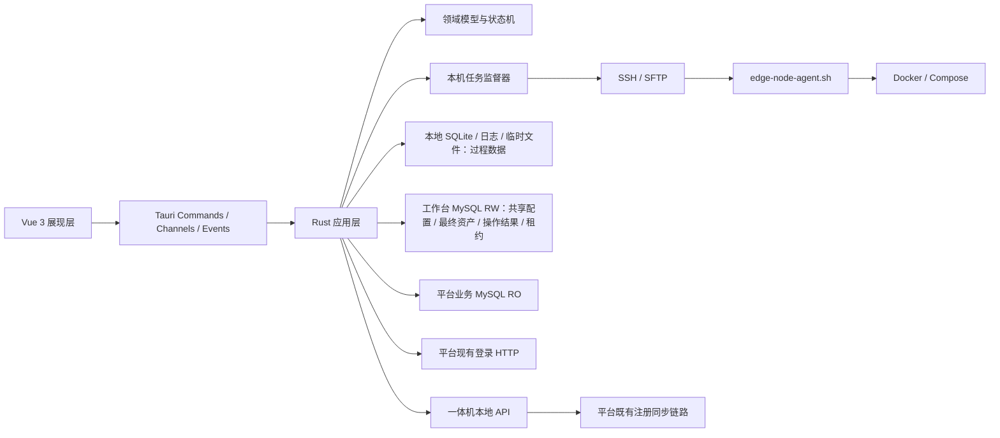
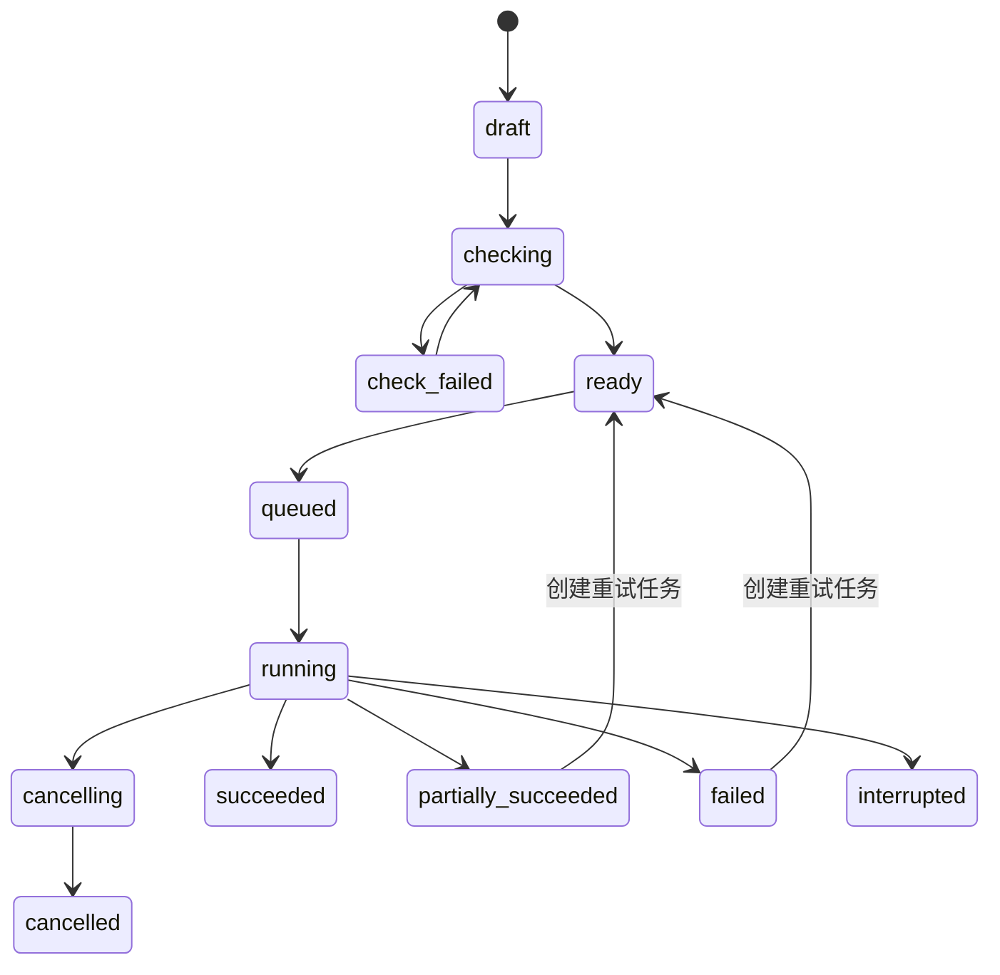

# INX 实施工作台（重构版）技术方案设计

| 属性    | 内容                                  |
| ----- | ----------------------------------- |
| 适用项目  | `inxaiot-desk-buddy`                |
| 文档版本 | v1.3 |
| 文档状态  | 阶段7.5技术实施已完成，阶段8验收基线 |
| 产品基线  | `02-产品设计文档.md` v0.4 |
| 界面基线  | `01-桌面工作台界面设计规范.md` v0.1            |
| 目标技术栈 | Rust + Tauri 2 + Vue 3 + TypeScript |
| 首期平台  | Windows 10/11 x64，远端目标为 Linux 一体机   |
| 更新日期 | 2026-08-31 |

## 1. 文档目的

本文档定义重构版实施工作台的目标技术架构、模块边界、数据模型、平台数据库直连方式、登录会话、并发控制、任务状态机、SSH/SFTP、Shell Agent、发布包处理、日志、安全、测试和实施阶段。

本文档不是对原 Go/Wails 代码的逐行翻译。原工作台已经验证的业务行为、Agent 协议、测试样本和远端目录作为事实参考；新实现按 Rust/Tauri 的异步模型、分层架构和多实例共享数据重新设计。

界面 Demo 评审后若产品设计调整，应先更新产品设计和界面规范，再同步修订本文档，不在代码中静默改变产品边界。

## 2. 输入依据与冲突处理

### 2.1 主要依据

- `doc/重构背景.md`：重构原因、数据平台化方向和技术更新方向。
- `doc/01-桌面工作台界面设计规范.md`：界面布局、组件、主题、密度和验收基线。
- `doc/02-产品设计文档.md`：产品范围、数据职责、资产生命周期、并发和验收标准。
- 原 `inxaiot-edge-workbench`：一体机清单、Release 包、模板渲染、SSH、远端 Agent 和三类部署流程。
- `inxvision-platform` 当前代码：MySQL 数据源、平台登录流程和 `op_edge_aio_server` 一体机表。
- `vibe-session-manager`：Tauri 2、Vue 3、Naive UI、UnoCSS、Pinia、分层 Rust 和任务日志面板。
- `inxaiot-device-simulator`：Tauri 2、SQLx 同时访问 SQLite/MySQL、Tokio 任务和 Naive UI 组件。

### 2.2 已确认的新结论

以下新结论替代原工作台旧设计：

- 项目共享数据进入项目侧固定工作台数据库，不再保存在每个实例的本地 JSON/SQLite 状态中。
- 工作台直接连接 MySQL，不要求项目平台新增工作台业务接口。
- 平台业务库原则上只读；工作台共享数据只写工作台专属库。
- 一体机按规范化 MAC 唯一识别。
- 发布包和镜像文件只在本机使用，远端数据库只保存镜像名和版本号。
- 配置编辑使用乐观版本控制；远端执行使用按 MAC 的租约锁。
- 取消报告生成，保留共享操作记录和本机完整日志。
- 技术栈从 Go/Wails 转为 Rust/Tauri。

## 3. 当前实现实证

### 3.1 原工作台已验证能力

| 能力        | 当前实现                                    | 重构策略                         |
| --------- | --------------------------------------- | ---------------------------- |
| CSV 清单    | Go `encoding/csv`，校验必填和重复 MAC           | 按行为重写并移植黄金样本                 |
| Release 包 | `manifest.json`、Compose、模板、镜像 tar、指纹    | 保留格式，Rust 重写解析校验             |
| 模板渲染      | `.env`、`host-info.json`、Compose Preview | 保留未知占位符阻断等规则                 |
| SSH       | `golang.org/x/crypto/ssh`               | 以异步 Rust SSH 适配器替代           |
| 文件上传      | 当前实际通过 SSH stdin 上传临时文件并原子改名            | 目标改为真正 SFTP，并保留临时文件和原子发布语义   |
| 远端执行      | `edge-node-agent.sh` JSON Lines 事件      | 首期复用协议，逐步升级 Agent 版本         |
| 首次部署      | 完整包、配置、镜像、Compose、注册与检查                 | 保留远端行为，合并界面步骤                |
| 整包升级      | 备份、完整包、强制重建、版本检查                        | 保留并增加任务/锁恢复约束                |
| 单服升级      | 单镜像、更新 `.env`、只重建目标服务                   | 保留并增加真实版本读取                  |
| 批量并发      | 一批台数和并发数                                | Tokio 任务监督器 + Semaphore      |
| 日志        | 页面日志和独立窗口                               | 结构化日志 + Tauri Channel + 底部面板 |

### 3.2 平台事实

- 项目平台使用 MySQL。
- 一体机实体表为 `op_edge_aio_server`。
- 已确认字段包括 `id`、`name`、`ip`、`mac`、`building_id`、`addr_alias`、`status`、`last_beat_time`、`last_sync_time` 等。
- 平台一体机状态 `0` 表示离线、`1` 表示在线；展示时必须同时返回状态时间。
- 平台管理后台登录使用现有 `/rsa/public/key`、验证码和 `/login` 流程，密码由 RSA 公钥加密，成功后获得访问令牌。
- 原工作台已经通过一体机本地 `/api/aio/server/*` 接口完成注册或更新，并由一体机同步到平台。

### 3.3 必须避免的误区

- 不直接读取并比对平台用户密码表；认证继续复用平台现有登录协议。
- 不因为采用数据库直连就直接修改 `op_edge_aio_server` 等平台核心业务表。
- 不把平台在线状态当作 SSH 实时可达状态。
- 不把工作台历史版本当作一体机当前实际版本。
- 不把原 Go 单文件状态模型原样迁移到新的共享数据库。

## 4. 技术目标与非目标

### 4.1 技术目标

1. 建立清晰的 Vue → Tauri 接口 → 应用层 → 领域层 → 适配器依赖方向。
2. 同时可靠访问本地 SQLite、工作台 MySQL 和平台业务 MySQL。
3. 支持多项目独立连接和登录会话。
4. 支持多个工作台实例共享配置并安全处理写冲突。
5. 支持跨实例的一体机执行互斥和异常过期恢复。
6. 支持大文件 SFTP 上传、进度、取消、临时文件和校验。
7. 支持三类部署任务的有序事件、状态恢复和节点级诊断。
8. 前端可以先使用确定性 Demo 数据完成视觉评审，随后无缝切换真实后端。
9. 保持 Windows 桌面构建、安装和现场运行简单，不引入额外服务或 Sidecar。

### 4.2 非目标

- 不把工作台拆成微服务。
- 不把 Go 后端作为长期 Sidecar 保留。
- 不让 Vue 直接连接 MySQL、SSH、文件系统或平台 HTTP。
- 不通过 `tauri-plugin-sql` 将 SQL 权限暴露给 WebView。
- 不实现平台制品库或大文件共享服务。
- 不实现长期在线监控、告警服务或后台常驻守护进程。
- 不在首期实现智能屏和网关业务模块。
- 不迁移旧工作台的本地项目和历史数据。

## 5. 核心架构决策

| 编号      | 决策                                    | 原因                                |
| ------- | ------------------------------------- | --------------------------------- |
| ADR-001 | Rust 模块化单体，不创建多进程或 Sidecar            | 降低部署和故障面，适合桌面工具                   |
| ADR-002 | Tauri 2 + Vue 3，界面与系统能力通过受控 IPC 连接    | 复用现有 Rust/Tauri 工程经验              |
| ADR-003 | Tokio 作为统一异步运行时                       | 数据库、SSH、SFTP、HTTP 和任务调度都需要异步并发    |
| ADR-004 | SQLx 同时访问 SQLite 和 MySQL              | 已在设备模拟器验证，统一连接池、事务和 Migration 模型  |
| ADR-005 | 每项目建立工作台库 RW Pool 和平台业务库 RO Pool      | 避免动态跨库 SQL，隔离权限和职责                |
| ADR-006 | 平台业务表只读，平台注册沿用一体机既有同步链路               | 避免绕过平台业务校验和关联逻辑                   |
| ADR-007 | 配置采用版本号，远端任务采用租约锁 + fencing token     | 同时解决编辑覆盖、永久死锁和过期执行者回写问题           |
| ADR-008 | Rust 后台任务及全部过程数据由本机负责，MySQL 只保存操作摘要和节点最终结果 | 远端执行依赖本机文件和网络，中心库不承担任务引擎职责 |
| ADR-009 | 原 Shell Agent 作为版本化远端协议继续复用           | 远端 Docker/Compose 行为已经验证，降低同时重写风险 |
| ADR-010 | 导入预览、实时任务、步骤、进度、完整日志和临时文件只保存在本地 | 项目侧只保留共享配置、最终资产、操作摘要和节点最终结果 |
| ADR-011 | 前端使用统一设计令牌、Naive UI 和 UnoCSS          | 落实界面规范，避免重新形成全局 CSS 堆叠            |
| ADR-012 | UI Demo 使用开发期 Fixture Adapter，不进入生产构建 | 支持先评审界面，不用伪数据污染真实运行               |
| ADR-013 | SSH、文件传输、任务调度、日志、进度、锁等作为跨业务通用能力       | 后续智能屏和网关可以组合复用，不依赖一体机模块           |
| ADR-014 | 本地 SQLite 自动 Migration，项目侧工作台 MySQL 仅显式初始化/升级 | 本机库由应用独占；项目库 DDL 必须由用户明确触发 |
| ADR-015 | 平台业务库连接强制只读，任何数据变更须在用户逐次确认后单独执行 | 防止开发、测试和日常工具路径误改平台业务事实 |
| ADR-016 | 浏览器 Fixture 与 Tauri Real Adapter 必须物理隔离，生产业务页面禁止直接依赖 Demo Store | 防止视觉 Demo 状态进入桌面真实路径并伪造连接、检查或结果 |
| ADR-017 | 所有长任务统一通过生产 TaskQueue 提交，由 JobSupervisor 持有真实执行句柄 | 保证跨业务并发、取消、安全退出和后续智能屏/网关扩展一致 |
| ADR-018 | 功能完成必须同时通过能力、集成和用户三层门禁 | 防止 Repository/Service 测试通过后过早认定产品闭环完成 |
| ADR-019 | 默认应用目录只保存稳定启动选择器，SQLite/日志/任务路径由Rust在打开资源前解析实际数据根目录 | 数据目录切换可重启生效、迁移失败回滚，避免前端localStorage与真实路径分裂 |
| ADR-020 | 任务日志与临时制品物理分目录，终态立即删除制品，日志用保留标记按结果超期清理 | 防止Release副本、Agent、payload和明文渲染凭据长期残留 |
| ADR-021 | Shell Agent作为当前工程版本化资源内嵌，启动校验版本、协议和SHA-256 | 单独检出可构建，远端协议资产可追溯 |

## 6. 技术栈

### 6.1 桌面与前端

| 层    | 选型                                 | 约束                                             |
| ---- | ---------------------------------- | ---------------------------------------------- |
| 桌面壳  | Tauri 2.x                          | 创建工程时固定精确版本，提交锁文件                              |
| Rust | stable，Edition 2024                | 通过 `rust-toolchain.toml` 固定                    |
| 前端   | Vue 3 + `<script setup lang="ts">` | TypeScript strict                              |
| 构建   | Vite                               | 不使用远程运行时资源                                     |
| 组件   | Naive UI                           | 负责 Button、Input、Form、Table、Modal、Drawer、Tabs 等 |
| 样式   | CSS Variables + UnoCSS             | Token 是唯一视觉事实来源                                |
| 状态   | Pinia                              | 只保存 UI 状态和少量查询缓存                               |
| 路由   | Vue Router                         | 路由携带当前项目和业务页面身份                                |
| 国际化  | Vue I18n                           | 首期至少维护中文资源，错误码不在页面硬编码                          |
| 图标   | Lucide Vue                         | 全应用统一线性图标                                      |
| 前端测试 | Vitest + Vue Test Utils            | 组件、主题、密度和关键交互                                  |
| 包管理  | pnpm                               | 提交 `pnpm-lock.yaml`，不使用浮动 `latest`             |

### 6.2 Rust 核心

| 能力    | 候选依赖                                  | 使用方式                                                |
| ----- | ------------------------------------- | --------------------------------------------------- |
| 异步运行时 | Tokio                                 | 多线程 runtime、任务、同步和时间                                |
| 取消    | `tokio-util::sync::CancellationToken` | 任务树传播取消信号                                           |
| 数据库   | SQLx                                  | `mysql`、`sqlite`、`migrate`、`uuid`、`time`、Rustls TLS |
| HTTP  | Reqwest + Rustls                      | 平台登录和必要的既有 API                                      |
| SSH   | Russh                                 | 密码、公钥、主机密钥校验、命令流                                    |
| SFTP  | Russh SFTP                            | 大文件上传、临时文件、重命名和远端属性                                 |
| 序列化   | Serde + `serde_json`                  | DTO、manifest、Agent 事件                               |
| CSV   | `csv`                                 | 流式读取、字段定位和校验                                        |
| 压缩归档  | `tar` + `flate2`                      | 构建和检查 `.tar/.tar.gz`                                |
| 哈希    | `sha2` + `hex`                        | Agent、文件和发布包本地校验                                    |
| ID    | UUID v7                               | 项目、任务、批次和事件 ID                                      |
| 时间    | `time`                                | UTC 存储和 RFC3339 事件时间                                |
| 错误    | `thiserror`                           | 领域、应用和适配器结构化错误                                      |
| 日志    | `tracing` + `tracing-appender`        | 结构化字段、滚动文件和测试捕获                                     |
| 敏感值   | `secrecy`/`zeroize` 或等价封装             | 限制 Debug 和内存驻留                                      |
| 本地秘密  | `SecretStore` 端口 + OS 凭据存储适配器         | 本地数据库密码和平台令牌不写明文 SQLite                             |

依赖版本在建立工程骨架时集中评审并精确锁定。技术方案只固定能力和边界，不在文档中长期维护每个 Patch 版本。

## 7. 总体架构



### 7.1 依赖方向

```text
interface/tauri
    → application
        → domain
        → application/ports
            ← infrastructure/mysql
            ← infrastructure/sqlite
            ← infrastructure/platform_auth
            ← infrastructure/ssh
            ← infrastructure/sftp
            ← infrastructure/release
            ← infrastructure/logging
```

强制规则：

- Tauri Command 只做 DTO 校验、调用用例和错误转换。
- 领域层不能依赖 Tauri、SQLx、Reqwest、Russh、文件路径或前端类型。
- 应用层只能依赖领域模型和应用端口；不得直接执行 SQL 或自行创建具体 SQLx、SSH、HTTP 适配器。
- 静态架构契约扫描整个`src/application`，禁止出现`crate::formal`、`crate::infrastructure`或`sqlx`；具体项目上下文、部署控制/执行、AIO资产和Release文件服务全部在Infrastructure实现Application Port。
- SQL 行、第三方错误和 SSH 句柄不得泄漏到应用层之外。
- Vue 不能直接调用任意 Shell、SQL、HTTP 或文件系统。
- 所有对外副作用必须通过应用层端口。

## 8. 建议工程结构

```text
inxaiot-desk-buddy/
├─ package.json
├─ pnpm-lock.yaml
├─ src/
│  ├─ app/
│  │  ├─ design-tokens.css
│  │  ├─ theme.ts
│  │  ├─ router.ts
│  │  └─ i18n.ts
│  ├─ shell/
│  │  ├─ DesktopShell.vue
│  │  ├─ ApplicationBar.vue
│  │  ├─ BusinessNavigation.vue
│  │  ├─ StatusBar.vue
│  │  ├─ ActivityPanel.vue
│  │  └─ PreferencesDialog.vue
│  ├─ features/
│  │  ├─ projects/
│  │  └─ aio/
│  │     ├─ nodes/
│  │     ├─ release_profile/
│  │     └─ operations/
│  ├─ shared/
│  │  ├─ api/
│  │  ├─ components/
│  │  ├─ formatters/
│  │  └─ model/
│  └─ dev-fixtures/
├─ src-tauri/
│  ├─ Cargo.toml
│  ├─ migrations/
│  │  ├─ local/
│  │  └─ mysql/
│  ├─ agent/
│  │  └─ edge-node-agent.sh
│  └─ src/
│     ├─ interface/
│     │  ├─ commands/
│     │  ├─ dto/
│     │  └─ error.rs
│     ├─ application/
│     │  ├─ ports/
│     │  │  ├─ remote_session.rs
│     │  │  ├─ file_transfer.rs
│     │  │  ├─ task_queue.rs
│     │  │  ├─ progress_sink.rs
│     │  │  └─ log_sink.rs
│     │  ├─ common/
│     │  │  ├─ project_service.rs
│     │  │  └─ task_service.rs
│     │  └─ aio/
│     │     ├─ inventory_service.rs
│     │     ├─ release_service.rs
│     │     └─ operation_service.rs
│     ├─ domain/
│     │  ├─ common/
│     │  │  ├─ project.rs
│     │  │  ├─ operation.rs
│     │  │  ├─ lease.rs
│     │  │  └─ error.rs
│     │  └─ aio/
│     │     ├─ edge_node.rs
│     │     └─ release.rs
│     ├─ infrastructure/
│     │  ├─ local_sqlite/
│     │  ├─ workbench_mysql/
│     │  ├─ platform_mysql/
│     │  ├─ platform_auth/
│     │  ├─ secret_store/
│     │  ├─ remote/
│     │  │  ├─ ssh_connector.rs
│     │  │  ├─ command_executor.rs
│     │  │  └─ sftp_transfer.rs
│     │  ├─ file_processing/
│     │  ├─ aio/
│     │  └─ logging/
│     ├─ runtime/
│     │  ├─ project_registry.rs
│     │  ├─ task_queue.rs
│     │  ├─ job_supervisor.rs
│     │  ├─ scheduler.rs
│     │  └─ event_bus.rs
│     ├─ lib.rs
│     └─ main.rs
└─ tests/
   ├─ fixtures/
   └─ integration/
```

首期保持一个 Rust crate，通过 module 建立边界。只有出现独立发布、编译时间或复用需求时再评估拆 crate。智能屏和网关首期只有菜单，不提前创建空业务模块；开始开发对应功能时再增加 `features/smart_screen`、`features/gateway` 和相应 Rust 领域模块。

### 8.1 跨业务通用能力

通用能力不是随意堆放函数的 `utils` 目录，而是具有明确端口、输入、输出、错误和生命周期的基础能力。它们不能依赖一体机、智能屏或网关领域模型。

| 通用能力                    | 统一职责                     | 一体机首期用途        | 后续复用方向             |
| ----------------------- | ------------------------ | -------------- | ------------------ |
| `RemoteSession`         | 建立、复用和关闭 SSH 会话，校验主机密钥   | 连接一体机          | 连接支持 SSH 的智能屏或网关   |
| `RemoteCommandExecutor` | 执行受控命令、流式读取输出、超时和取消      | 调用 Shell Agent | 调用其他业务 Agent 或诊断命令 |
| `FileTransferService`   | 上传、下载、进度、临时文件、校验和原子发布    | SFTP 上传发布包和镜像  | 上传屏端安装包、网关固件和配置    |
| `FileProcessingService` | 文件选择后的路径校验、哈希、归档和临时目录    | Release 包和镜像处理 | 其他业务发布物处理          |
| `TaskQueue`             | 排队、任务类型路由、并发限制和取消        | 部署升级任务         | 屏端升级、网关批处理         |
| `JobSupervisor`         | 任务树、JoinHandle、异常捕获和安全停机 | 一体机节点执行        | 所有长任务              |
| `ProgressSink`          | 标准化进度、阶段和有序事件            | 上传与部署进度        | 所有后台任务进度           |
| `LogSink`               | 结构化日志、脱敏和本地落盘            | Agent 和远端日志    | 所有模块诊断             |
| `ResourceLeaseService`  | 跨实例租约、心跳和 fencing token  | 按 MAC 锁定一体机    | 按屏 ID、网关 ID 锁定资源   |

业务模块通过组合这些能力完成用例：

```text
aio::FirstDeployHandler
  → TaskQueue
  → ResourceLeaseService
  → FileProcessingService
  → RemoteSession
  → FileTransferService
  → RemoteCommandExecutor
  → ProgressSink / LogSink
```

未来智能屏和网关只能依赖通用端口，不能反向调用 `aio::*` 实现。若协议不同，应新增通用端口适配器或各自的业务 Handler，而不是复制任务队列、日志和上传代码。

## 9. 应用运行时与多项目上下文

### 9.1 AppState

Tauri 只托管一个轻量 `AppState`：

- 本地 SQLite Pool。
- 本地 SecretStore。
- `ProjectRuntimeRegistry`。
- `JobSupervisor`。
- 全局事件总线。
- TaskHandlerRegistry：正式注册aio三类Handler，后续screen/gateway通过同一契约按需注册。
- TaskQueue：全局容量100、worker 4；容量覆盖运行中和排队任务，统一优先级、取消和跨业务并发。
- 应用目录和日志目录。

`AppState` 不保存整个项目业务数据集合，不把 MySQL 数据镜像进内存。

### 9.2 ProjectRuntime

每个已打开项目建立独立运行上下文：

```text
ProjectRuntime
├─ local_project_id
├─ workbench_mysql_pool   RW
├─ platform_mysql_pool    RO
├─ platform_auth_session
├─ schema_capabilities
└─ connection_health
```

当前 UI 项目只是“活动上下文”。后台任务持有自己的 `Arc<ProjectRuntime>`，切换项目不会让正在执行的任务失去连接或被错误取消。本地 SQLite 通过 `local_project_id` 区分多个项目；每个本地项目配置指向自己的一组平台业务库和固定工作台库，远端工作台库内部不再保存项目 ID。

### 9.3 连接生命周期

- 进入项目时惰性建立两个 MySQL Pool。
- 每个 Pool 首期最多 5 个连接，空闲连接按 SQLx 配置回收。
- 没有活动页面或任务的项目上下文可以关闭 Pool。
- 切换项目不会复用其他项目的 Pool、令牌或缓存。
- 数据库连接串不输出到普通日志。

## 10. 前端架构

### 10.1 Shell 与 Feature 分离

- Shell 只负责顶部项目区、导航、内容槽、状态栏和活动面板。
- Feature 按项目、一体机、发布参数和部署升级拆分。
- 页面不得直接 `invoke()`；全部调用集中在 `src/shared/api`。
- 页面只消费 DTO 和查询状态，不理解 MySQL、SSH 或 Agent 细节。

### 10.2 状态边界

Pinia 保存：

- 当前项目 ID。
- 导航展开状态。
- 主题、字号、密度和减少动画。
- 当前页面筛选、选中行和活动面板状态。
- 少量带失效时间的页面缓存。

Pinia 不保存：

- 完整项目表。
- 远端数据库副本。
- 大型发布文件内容。
- 完整日志。
- SSH 私钥、数据库密码和平台访问令牌。

### 10.3 Demo 数据模式

为了先评审界面，建立开发期 Fixture Adapter：

- DTO 与真实 Tauri API 完全相同。
- Fixture 数据固定、可重复，不使用随机数据。
- 页面通过同一个 API 门面切换 `tauri` 或 `fixture` 实现。
- Fixture 只能在开发构建显式启用。
- Release 构建检测到 Fixture 开关时直接失败。
- 正式界面无真实数据时显示空状态，不回退到 Demo 数据。
- Tauri Real Adapter 与浏览器 Fixture Adapter 分别实现相同接口；页面和业务 Store 不允许导入 `DemoStore`。
- 前端测试必须同时覆盖 Fixture DTO 一致性和 Real Adapter 的 Tauri IPC 契约。

## 11. Tauri IPC 设计

### 11.1 使用边界

| 机制      | 用途       | 示例                  |
| ------- | -------- | ------------------- |
| Command | 查询和短操作   | 列出项目、保存配置、预览导入、提交任务并立即返回 Task ID |
| Channel | 有序进度和日志流 | 部署节点事件、上传进度、实时日志    |
| Event   | 低频全局失效通知 | 项目状态变化、任务列表刷新、会话过期  |

### 11.2 Command 分类

```text
project_*
  list_local_projects
  create_local_project
  update_local_project
  delete_local_project
  test_project_connection
  switch_project

auth_*
  create_project_login_challenge
  login_project
  logout_project
  get_project_session
  check_project_session

edge_node_*
  list_edge_nodes
  get_edge_node_detail
  preview_inventory_import
  apply_inventory_import
  inspect_node_versions

release_*
  get_release_profile
  validate_release_profile
  save_release_profile
  export_release_master_key
  import_release_master_key
  rotate_release_master_key
  validate_release_package
  inspect_service_image

operation_*
  create_operation
  check_operation
  start_operation
  cancel_operation
  list_operations
  get_operation_detail
  subscribe_operation
```

### 11.3 DTO 规则

- Rust DTO 是 IPC 契约来源，通过工具生成或集中维护 TypeScript 类型。
- 所有 DTO 使用稳定 ID、明确枚举和可空字段，不返回自由形态大 JSON。
- 用户可见错误返回 `code + message_key + params + trace_id`。
- 原始适配器错误只进入本机诊断日志。
- 分页统一使用 `page_size` 和稳定游标或页码，最大值由 Rust 校验。
- 大日志不通过单次 Command 返回。

## 12. 数据存储边界与本地数据设计

### 12.1 最终数据边界

技术实现必须遵守以下约束：

> 项目侧保存“共享配置、最终资产、操作摘要、节点最终结果和跨实例锁”；本地保存“导入预览、实时任务、步骤、进度、完整日志和临时文件”。

| 数据 | 项目侧 `inxaiot_desk_buddy` | 本地 SQLite/文件 |
| --- | --- | --- |
| 发布参数和模板 | 保存当前共享版本 | 可短期缓存，不作为事实源 |
| 最终一体机资产 | 保存 | 不复制完整主数据 |
| 一体机服务版本 | 保存期望版本和最近观测结果 | 保存本次检查过程 |
| 操作记录 | 保存操作对象、时间、用户、发布物和最终结果 | 保存完整执行上下文 |
| 节点结果 | 保存每个目标的最终状态和失败摘要 | 保存实时阶段、进度和步骤 |
| 资源锁 | 保存租约、心跳和 fencing token | 保存当前租约引用 |
| 导入预览和逐行明细 | 不保存 | 保存 |
| 实时任务队列 | 不保存 | 保存 |
| 任务步骤和进度事件 | 不保存 | 保存 |
| Agent/SSH/SFTP 完整日志 | 不保存 | 保存 |
| Release 包、镜像、渲染文件 | 不保存 | 保存或引用本机文件 |

项目侧只允许两个过程性例外：

1. `resource_lease`：多个实例必须共享的短期协调状态。
2. `operation_record` 的最小运行中摘要：让其他实例知道谁正在执行什么，并能在实例崩溃后识别中断；不得扩展成中心任务队列或步骤日志。

### 12.2 本地目录

通过 Tauri 平台目录 API 获取，不硬编码用户目录：

```text
app_data/
├─ local.db
├─ known_hosts
├─ logs/
│  ├─ app.log
│  └─ app.log.*
├─ projects/{localProjectId}/
│  ├─ tasks/{localTaskId}/events.jsonl
│  ├─ imports/{localImportId}/preview.jsonl
│  ├─ rendered/{localTaskId}/{mac}/
│  └─ temp/
└─ runtime/
   └─ agent/{sha256}/edge-node-agent.sh
```

### 12.3 本地 SQLite 表命名与目录

本地表遵循与项目侧相同的职责原则：

- 项目、会话、偏好、任务、目标、步骤、发布物路径和主机密钥属于通用生命周期数据，不增加业务前缀。
- 通用任务通过 `domain_type` 区分 `aio/screen/gateway`，通过 `resource_type/resource_key` 区分具体资源。
- 包含 MAC、平台一体机匹配和一体机冲突规则的导入数据属于一体机业务，使用 `local_aio_` 前缀。
- 后续智能屏或网关确实需要导入过程表时，再分别增加 `local_screen_`、`local_gw_` 前缀表，不提前创建空表。
- 不使用无约束 JSON 把明显不同的业务模型强行塞进一张所谓通用表。

| 表名 | 表描述 | 主要字段 |
| --- | --- | --- |
| `local_project` | 保存当前电脑可访问的多个项目连接入口 | id、name、platform_url、db_host、db_port、db_user、business_db、workbench_db、secret_refs、last_opened_at |
| `local_project_session` | 保存每个本地项目独立的平台登录会话引用 | local_project_id、username、token_secret_ref、expires_at、updated_at |
| `local_project_master_key` | 登记当前本机已保存的项目主密钥引用，供轮换和项目删除精确清理 | local_project_id、key_version、secret_ref、created_at |
| `local_secret_cleanup` | SecretStore删除失败Outbox；启动时幂等重试，不保存秘密原文 | secret_ref、reason、retry_count、last_error_code、created_at、updated_at |
| `local_preference` | 保存主题、字号、密度、列表条数和导航等本机偏好 | key、value_json、version |
| `local_task` | 通用：保存本机任务队列和实时任务主状态 | id、local_project_id、remote_operation_record_id、domain_type、operation_type、name、priority、batch_size、concurrency、payload_ref、state、sequence、log_path、error_code、message、started_at、ended_at |
| `local_task_target` | 通用：保存任务中每个资源的实时阶段、进度和当前结果 | local_task_id、resource_type、resource_key、state、stage、progress_current、progress_total、fencing_token、message_code、message_params_json、updated_at |
| `local_task_step` | 通用：保存检查、上传、备份、安装、注册、验证等步骤状态 | local_task_id、resource_type、resource_key、step_code、state、error_code、message、started_at、ended_at |
| `local_aio_import_session` | 一体机：保存一次清单导入预览的文件、状态和统计 | id、local_project_id、file_name、file_path、state、counts_json、created_at |
| `local_aio_import_item` | 一体机：保存逐行解析、MAC匹配、冲突和用户选择 | import_session_id、row_number、mac_normalized、parsed_data_json、classification、conflict_json、selected、error |
| `local_recent_artifact` | 通用：保存各项目、各业务域最近使用的本机发布物路径 | local_project_id、domain_type、artifact_type、service、path、used_at |
| `local_host_key` | 保存 SSH 主机密钥确认结果 | local_project_id、host、port、algorithm、fingerprint、accepted_at |

本地数据库结构版本不再设计自定义 `local_schema_migration` 表，统一由 SQLx 内部 `_sqlx_migrations` 管理。

### 12.4 本地任务表职责

- `local_task` 是真正的任务队列事实源，承担排队、检查、运行、取消、中断和本机恢复。
- `local_task_target` 可以高频更新实时进度，不同步项目侧。
- `local_task_step` 保存详细过程，供任务与日志面板展示。
- 完整事件继续追加写入 JSONL，SQLite 只保存可查询的最新状态和索引。
- 项目侧 `operation_record` 不是任务队列，不能反向驱动远端执行。

### 12.5 本地一体机导入表职责

- 选择一体机 CSV 后先创建 `local_aio_import_session`。
- 解析结果、平台一体机匹配、MAC冲突和用户勾选保存在 `local_aio_import_item`。
- 用户确认前不写项目侧数据库。
- 应用成功后只把最终资产写入 `aio_node`，并在 `operation_record` 写一条导入摘要。
- 本地导入会话按保留策略清理，不要求其他实例继续编辑同一个预览。

### 12.6 本地数据库策略

- SQLite 开启 WAL、foreign keys 和 busy timeout。
- SQLx Migration 只能向前追加。
- 本地库高于当前应用支持版本时，应用进入本地安全模式，不执行写操作。
- 数据库密码、平台访问令牌和项目主密钥只保存版本化SecretStore引用，不以明文进入SQLite；SQLite写失败只删除未引用的新版本，不覆盖或删除旧有效值。
- 旧引用和项目删除后的凭据若无法从SecretStore删除，写入`local_secret_cleanup`；应用启动幂等重试，About诊断显示待清理数量。Outbox重试成功时同步清理主密钥注册表。
- 数据库行映射对ID、MAC、名称、IP、状态、版本、迁移计数和时间等事实字段严格`try_get`并传播错误；只有数据库契约明确可空的位置、备注、关联ID等展示字段保留`Option`。禁止用空字符串或0掩盖类型不兼容/损坏数据。
- 完整任务日志写 JSONL 滚动文件，不写入 SQLite 大文本。

## 13. 工作台 MySQL 数据设计

### 13.1 一个工作台库只对应一个项目

- 固定工作台库名建议为 `inxaiot_desk_buddy`，最终在实施前确认一次后冻结。
- 一个本地项目配置包含一组独立数据库连接信息，并指向该项目的业务库和 `inxaiot_desk_buddy` 库。
- 不同项目配置不同数据库连接；一个 `inxaiot_desk_buddy` 库只保存当前连接项目的数据。
- 工作台 MySQL 表不保存 `project_id`，Repository 也不接受远端项目 ID 作为查询条件。
- 本地多项目隔离只由本地 SQLite 的 `local_project_id` 完成。
- 字符集使用 `utf8mb4`，排序规则选择目标 MySQL 版本共同支持的规则。
- 时间统一存 UTC `DATETIME(6)`，前端按本地时区显示。
- 业务状态使用 `VARCHAR` + Rust 枚举，不使用难迁移的 MySQL ENUM。

### 13.2 表命名与业务前缀

- 项目通用表不增加业务前缀，例如 `operation_record`、`resource_lease`、`audit_event`。
- 一体机业务表统一增加 `aio_` 前缀。
- 智能屏功能开发时使用 `screen_` 前缀。
- 网关功能开发时使用 `gw_` 前缀。
- 操作记录通过 `domain_type`、`resource_type` 和 `operation_type` 区分业务，不复制多套历史与锁表。

### 13.3 项目侧保留表

| 表名 | 分类 | 表描述 |
| --- | --- | --- |
| `operation_record` | 项目通用 | 保存谁在何时对什么对象执行了什么操作、使用什么版本以及最终总体结果 |
| `operation_target_result` | 项目通用 | 保存一次操作中每个目标资源的最终结果和失败摘要，不保存实时步骤和进度 |
| `resource_lease` | 项目通用 | 保存多个工作台实例之间的资源租约、心跳和 fencing token |
| `audit_event` | 项目通用 | 保存共享配置和最终资产写操作的版本审计，不保存敏感值原文 |
| `aio_release_profile` | 一体机 | 保存一体机部署使用的共享模板、MQTT、SSH、AuthKey 和远端目录配置 |
| `aio_node` | 一体机 | 保存按 MAC 唯一的一体机最终工作台资产、平台关联和管理状态 |
| `aio_node_service_version` | 一体机 | 保存每台一体机各服务的期望镜像版本和最近远端观测版本 |

SQLx 自动创建的 `_sqlx_migrations` 是技术内部表，不属于业务表设计，不再额外创建 `schema_migration`。

明确删除以下项目侧表设计：

- `workspace_meta`：项目连接信息已经在本地按项目保存，一项目一库前提下没有独立价值。
- `aio_import_batch`、`aio_import_item`：导入预览和逐行明细属于本地过程数据。
- `aio_operation_detail`：操作了什么合并到精简操作记录的受控摘要字段。
- `operation_target`、`operation_step`：实时目标状态、步骤和进度属于本地任务数据。

### 13.4 表结构明细

#### `operation_record`：共享操作记录表

表说明：保存跨实例可见的最小操作历史。记录可以在任务开始时写入 `running` 和心跳，用于显示占用；任务结束后只保留总体最终结果，不承载任务队列、步骤或完整日志。

| 字段 | 说明 |
| --- | --- |
| `id` | UUID v7，主键，同时作为跨实例操作编号 |
| `domain_type` | aio、screen、gateway 等业务域 |
| `operation_type` | inventory_import、first_deploy、full_upgrade、service_upgrade 等 |
| `operation_name` | 用户可识别的批次或操作名 |
| `operator/instance_id` | 操作用户和发起工作台实例 |
| `state` | running、succeeded、partially_succeeded、failed、cancelled、interrupted |
| `target_count` | 目标资源数量 |
| `success_count/failure_count/cancelled_count` | 最终聚合数量；运行中只允许保存已完成计数 |
| `artifact_name/artifact_version` | 发布物、Release 或镜像的展示名称和版本，可空 |
| `operation_summary_json` | 受 Schema 约束的非敏感摘要，例如服务名、发布模式、导入分类统计和发布配置版本 |
| `started_at/ended_at/heartbeat_at` | 开始、结束和最小活动心跳时间 |
| `result_summary/error_code/error_summary` | 总体结果、稳定错误码和脱敏摘要 |
| `retry_of_operation_id` | 来源重试操作，可空 |
| `version` | 状态 CAS 版本 |

`operation_summary_json` 只能保存“操作了什么”，不能写入实时步骤、百分比、SSH输出、本机路径、密码或完整模板。

#### `operation_target_result`：共享节点最终结果表

表说明：保存批量操作中每个资源对象的目标身份和最终结果。任务开始时可以先写目标身份和 `pending`，完成后只更新一次最终状态；不得把它当作实时进度表。

| 字段 | 说明 |
| --- | --- |
| `operation_id/resource_type/resource_key` | 联合主键；一体机的 resource_key 为规范化 MAC |
| `result_state` | pending、succeeded、failed、cancelled、interrupted、unknown |
| `before_version/after_version` | 操作前后可展示版本，可空 |
| `result_summary/error_code/error_summary` | 节点最终结果和脱敏失败摘要 |
| `completed_at` | 节点形成最终结果的时间，可空 |

表中不保存 `stage`、`progress_current`、`progress_total` 和步骤列表。实时数据只更新本地 `local_task_target/local_task_step`。

#### `resource_lease`：通用资源租约表

表说明：保存跨实例执行锁，是项目侧必须保留的短期协调数据。它只描述资源、持有人和租约，不理解一体机部署、屏端升级或网关配置业务。

| 字段 | 说明 |
| --- | --- |
| `resource_type/resource_key` | 联合主键；一体机 key 为规范化 MAC |
| `domain_type/operation_id` | 当前业务域和共享操作记录 ID |
| `owner_instance_id/owner_user` | 持有人 |
| `lease_token` | 本次租约随机令牌 |
| `fencing_token` | 每次重新获得锁时单调递增 |
| `lease_state` | `active` 或 `released`；释放后保留计数行 |
| `acquired_at/heartbeat_at/expires_at` | 租约时间 |

完成、取消或确认中断后把租约标记为 `released`，清空活动令牌并立即过期，但保留资源行和 `fencing_token`。下次获取在同一行递增 token，不能删除计数行后从 1 重新开始。异常退出仍依靠 `expires_at` 失效；维护任务只清理无业务价值的活动字段，不删除 fencing 计数行。

#### `audit_event`：共享数据审计表

表说明：记录共享配置和最终资产被谁创建或修改、版本如何变化。它不是任务步骤日志。

| 字段 | 说明 |
| --- | --- |
| `id` | UUID v7，主键 |
| `domain_type/object_type/object_key` | 业务域和对象定位 |
| `action` | create、update、apply_import、claim 等 |
| `operator/instance_id` | 用户和工作台实例 |
| `old_version/new_version` | 版本变化 |
| `changed_fields_json` | 只记录字段名和是否变化 |
| `created_at` | 时间 |

不得记录密码、AuthKey、私钥原文、导入逐行数据或任务步骤。

#### `aio_release_profile`：一体机发布配置表

表说明：保存当前项目唯一的一体机共享发布配置。多个桌面实例读取同一行，通过 `version` 防止模板和凭据相互覆盖。

| 字段 | 说明 |
| --- | --- |
| `profile_key` | 固定值 `default`，主键 |
| `env_template` | `.env` 模板全文 |
| `compose_template` | `docker-compose.yml` 全文 |
| `platform_host/api_port` | 平台接入参数 |
| `credential_scheme` | 凭据密文格式；当前为 `argon2id-aes256gcm-project-key` |
| `credential_key_version` | 当前项目主密钥版本，不是发布配置乐观锁版本 |
| `credential_salt/nonce/ciphertext` | AuthKey、MQTT及SSH凭据的随机盐、随机数和AES-GCM认证密文 |
| `ssh_port/timeout_seconds` | SSH 参数 |
| `aio_data_root/aio_deploy_root` | 一体机受控远端目录 |
| `version` | 乐观锁版本 |
| `updated_by/updated_at` | 修改人和时间 |

项目主密钥是与数据库连接密码解耦的32字节随机值，按`project/{localProjectId}/release-master-key/{version}`保存到Windows Credential Manager；MySQL只保存带版本的认证密文。旧`argon2id-aes256gcm`格式首次读取时在行锁事务内用旧数据库密码解密并重加密，发布配置语义版本不递增，但写入独立审计事件。

轮换顺序固定为“先保存新版本本机主密钥，再在MySQL事务内锁行、解密、重加密并记录审计，提交后删除旧版本”；事务或审计失败时删除新版本并保留旧密文/旧密钥。数据库密码修改前会先完成旧格式迁移，因此数据库密码轮换不再改变发布凭据的可解密性。

跨电脑分发只允许使用`.inxkey`口令保护包：Argon2id从12字节以上用户口令派生包裹密钥，AES-256-GCM加密项目主密钥；AAD绑定平台URL、数据库主机/端口、工作台Schema指纹和主密钥版本。导入时先校验项目绑定和版本，再用候选密钥实际解密当前发布配置，验证成功后才写入本机安全存储。明文主密钥和口令不得进入日志、SQLite、MySQL或前端持久化。

首期所有已登录用户仍可通过应用查看完整项目共享凭据；加密解决静态存储、数据库密码轮换和跨电脑分发问题，不提供用户级字段权限隔离。凭据仍禁止进入普通日志、审计差异和错误文本。

#### `aio_node`：一体机最终资产表

表说明：保存工作台侧最终确认的一体机资产。导入预览不会进入此表，只有用户确认应用或平台既有资产接管后才写入。

| 字段 | 说明 |
| --- | --- |
| `mac_normalized` | 12 位大写十六进制，主键 |
| `name/ip/display_mac` | 工作台名称、管理 IP 和显示 MAC |
| `building_id/region_id/addr_alias/floor/location/remark` | 确认后的业务字段 |
| `platform_aio_id` | 平台 `op_edge_aio_server.id` 的软关联 |
| `management_state` | pending、platform_existing、managed、conflict 等 |
| `source` | import、platform、merged |
| `last_operation_id` | 最近部署或升级操作记录 |
| `version` | 乐观锁版本 |
| `created_at/updated_at` | 时间 |

#### `aio_node_service_version`：一体机服务版本表

表说明：保存每台一体机各服务的最终共享版本事实，用于跨实例查看记录版本、远端观测版本和版本偏差。

| 字段 | 说明 |
| --- | --- |
| `mac_normalized/service_name` | 联合主键 |
| `expected_image_name/version` | 最近成功操作记录 |
| `observed_image_name/version` | 最近远端实际检查 |
| `observed_at` | 检查时间 |
| `source_operation_id` | 产生期望版本的操作记录 |

### 13.5 项目侧写入时机

#### 导入

```text
本地解析和预览
→ 用户确认
→ 事务写入 aio_node
→ 写 audit_event
→ 写一条 operation_record 导入摘要
```

不写导入批次和逐行明细。

#### 部署与升级

```text
本地创建 local_task
→ 项目侧创建 operation_record(running) 和 operation_target_result(pending)
→ 获取 resource_lease
→ 本地执行并持续写 local_task_target/local_task_step/JSONL
→ 每个目标完成时写 operation_target_result 最终结果
→ 全部结束后写 operation_record 最终摘要
→ 更新 aio_node/aio_node_service_version
→ 释放 resource_lease
```

### 13.6 索引原则

- 一体机：`mac_normalized` 主键，`platform_aio_id`、`ip`、`management_state` 辅助索引。
- 操作记录：`(started_at DESC, id)`、`(state, heartbeat_at)`、`(domain_type, operation_type, started_at DESC)`。
- 节点结果：`(resource_type, resource_key, operation_id)`，支持查询单个资产历史。
- 锁：`(resource_type, resource_key)` 主键覆盖获取和心跳，`(lease_state, expires_at)` 支持状态维护。
- 审计：`(object_type, object_key, created_at DESC)`。
- 所有分页查询必须有确定性次序，时间相同时追加 ID。

## 14. 双 MySQL 连接与权限

### 14.1 两个连接池

每个本地项目使用自己的数据库连接信息建立两个逻辑 Pool。一个 Workbench Pool 对应的 `inxaiot_desk_buddy` 库只保存该项目数据，不承载其他本地项目：

| Pool           | Database                | 权限                                         | 用途                            |
| -------------- | ----------------------- | ------------------------------------------ | ----------------------------- |
| Workbench Pool | 固定 `inxaiot_desk_buddy` | SELECT/INSERT/UPDATE/DELETE，初始化账号另有 DDL 权限 | 工作台共享数据                       |
| Platform Pool  | 用户指定业务库                 | SELECT                                     | 读取 `op_edge_aio_server` 等已批准表 |

禁止通过字符串拼接 `database.table` 动态跨库查询。业务库名只用于创建 Platform Pool，并经过标识符校验。

### 14.2 最小权限

推荐把初始化账号和日常运行账号分开：

- 初始化账号：创建固定工作台库、执行 Migration。
- 运行账号：工作台库 DML + 已批准平台表 SELECT。

若项目现场只提供一个账号，连接检查必须展示其实际能力，但应用仍不得调用未设计的写平台表路径。

### 14.3 平台 Schema 兼容检查

打开项目时执行：

1. 读取 MySQL 版本。
2. 通过 SQLx `_sqlx_migrations` 检查工作台库 Schema 版本。
3. 检查精简后的工作台业务表是否完整。
4. 检查平台业务库是否存在 `op_edge_aio_server`。
5. 检查需要的列及类型是否兼容。
6. 记录 `PlatformSchemaCapabilities`。

查询必须显式列名，不使用 `SELECT *`。缺列或类型不兼容时 fail-closed，显示“不支持当前平台数据库版本”，不得用空值伪装成功。

### 14.4 平台数据只读适配器

`PlatformEdgeNodeReader` 只提供：

- 按 MAC 查询。
- 分页列出一体机。
- 读取平台 ID、名称、IP、MAC、位置、在线状态和状态时间。
- 后续经评审增加的智能屏/网关只读查询。

禁止提供通用 SQL 执行接口和平台业务表 Repository 写方法。

平台 MySQL Pool 在每条连接建立后执行只读会话设置。即使后续代码误拿到 Pool，也不能通过普通事务或自动提交语句修改平台业务表。开发和测试默认只允许 SELECT 与 Schema Capability 探测；确需修改平台注册数据时，必须在说明精确表、条件和清理方式后取得用户当次确认，不得把授权扩展到其他平台数据。

## 15. 平台认证与项目会话

### 15.1 认证路径

工作台复用平台当前登录协议：

```text
获取 RSA 公钥和 key
→ 获取验证码及 session UUID
→ 用户输入平台账号、密码和验证码
→ Rust 使用公钥按现有协议加密密码
→ POST /login?grant_type=edge&client_id=0&key=...
→ 保存 token_type + access_token
```

不直接读取 `sys_user` 或其他用户表验证密码。

### 15.2 登录 Challenge

Rust `PlatformAuthAdapter` 返回：

- challenge ID。
- 验证码图片数据。
- 是否必须输入验证码。
- 过期时间。

公钥、key、UUID 和验证码响应只保存在短生命周期 Challenge 中。前端提交 challenge ID、账号、密码和验证码，不自行实现 RSA 和 HTTP。

### 15.3 会话保存

- 每项目独立保存访问令牌。
- 每次登录生成新的版本化令牌引用；令牌先进入OS SecretStore，再以单条SQLite upsert切换引用。SQLite失败时核对当前事实，只回收未提交的新令牌，原会话保持有效。
- SQLite提交成功后删除旧令牌；删除失败进入本地Outbox并在启动重试。
- 会话缺失、过期字段缺失/非法或时间已到均fail-closed；Shell每60秒调用真实Token校验。项目列表按项目隔离会话读取故障，一个Credential Manager条目异常不阻断其他项目。
- 项目列表首次读取失败不置为已初始化，项目切换器显示错误和“重新读取”入口；重试成功后才进入initialized状态。
- 前端不长期持有访问令牌。
- Rust 发起平台请求时从 SessionStore 读取令牌。
- 收到 401 或明确失效响应时清除该项目会话并广播 `project_session_expired`。
- 项目切换不覆盖其他项目令牌。

### 15.4 会话用途

首期会话用于：

- 确认用户使用的是项目平台有效账号。
- 记录操作用户。
- 调用现有且无法由只读数据库替代的必要平台接口。

工作台新增业务数据仍直接读写工作台 MySQL，不要求平台增加接口。

## 16. 一体机资产对账与导入应用

### 16.1 MAC 规范化

Rust 领域类型 `MacAddress` 在构造时：

- 去除 `:`、`-` 和空格。
- 转为大写。
- 校验恰好 12 位十六进制字符。
- 提供数据库格式和显示格式。

任何 Repository 和用例不得接受未验证的裸 MAC 字符串作为身份键。

### 16.2 对账算法

```text
workbench_nodes = 项目侧 aio_node 最终资产
platform_nodes  = 平台业务库节点
import_rows     = 本地 local_aio_import_item 预览

按 normalized_mac 建立索引：
  只有 import             → NEW_PENDING
  workbench + import      → EXISTING / CHANGED / CONFLICT
  只有 platform           → PLATFORM_EXISTING
  workbench + platform    → MANAGED / CONFLICT
  三者都有                → MERGED / CONFLICT
```

名称、IP和位置差异不会自动改变身份。字段合并使用显式来源优先级并保留冲突：

- 平台 ID、在线状态、心跳时间：平台优先。
- 待实施名称、IP：工作台/导入可编辑值优先，注册后显示与平台差异。
- 实际服务和镜像：远端实时检查优先。

### 16.3 导入应用事务

导入预览、逐行校验、匹配和用户选择全部留在本地。用户确认后：

1. 再次读取 `aio_node` 和平台业务表，避免预览期间数据已经变化。
2. 对选中且无冲突的最终资产执行版本校验。
3. 在一个 MySQL 事务内插入或更新 `aio_node`。
4. 写 `audit_event`，只记录资产变化。
5. 写一条 `operation_record`，类型为 `inventory_import`，记录文件名、数量和最终结果摘要。
6. 提交成功后把本地导入会话标记为 applied。

项目侧不保存导入文件、批次、逐行数据和冲突草稿。

### 16.4 平台既有资产接管

接管平台既有资产只写最终数据：

1. 再次读取平台记录并确认 MAC 未变化。
2. 插入或更新 `aio_node`，保存 `platform_aio_id`。
3. 状态设为 `platform_existing` 或检查通过后的 `managed`。
4. 写审计事件和接管操作摘要。

不更新平台业务表，不补造历史部署步骤。

### 16.5 阶段 5 已落地实现

- domain/aio/mac.rs 是 MAC 领域身份的唯一正式实现；旧 formal/mac.rs 仅保留兼容入口并委托领域类型。
- infrastructure/csv_inventory.rs 使用 Rust csv 解析器，支持 UTF-8 BOM、引号字段、空行和 10 MiB 文件上限；表头缺失是文件级错误，字段/IP/MAC/重复项是逐行错误。
- infrastructure/platform_aio.rs 只包含 SELECT 和 information_schema 能力探测；平台空 MAC、非法 MAC 和规范化后重复 MAC 不被静默忽略。
- infrastructure/local_sqlite/aio_import_repository.rs 使用既有 local_aio_import_session/item 保存可恢复预览、分类、冲突和选择；应用或放弃后禁止继续编辑。
- application/aio_assets.rs 在确认时重新读取两侧数据，并校验工作台版本、平台对象 ID 和平台记录指纹；预览期间任何变化都会要求重新预览。
- infrastructure/workbench_aio.rs 在单个 MySQL 事务中写 aio_node、audit_event 和一条已完成 inventory_import 摘要；任一资产版本/唯一键冲突会回滚全部写入。
- 每个本地项目的双 MySQL Pool 由 ProjectRuntime 延迟创建并缓存，关闭项目或退出应用时显式关闭。
- Tauri 注册列表、详情、预览、恢复、更新选择、应用和放弃命令；Vue 桌面模式使用真实 DTO，浏览器模式保留同 DTO Fixture。

本地 SQLite 与工作台 MySQL 无法组成分布式事务。项目侧提交成功后再封存本地会话；若本地封存失败，返回 localSessionFinalized=false 并保留诊断日志。重新应用时，重新对账会阻止把已经落库的行再次按旧预览写入。

## 17. 配置版本与审计

### 17.1 乐观锁 SQL 语义

配置更新必须采用：

```text
UPDATE aio_release_profile
SET ..., version = version + 1, updated_by = ?, updated_at = UTC_TIMESTAMP(6)
WHERE profile_key = 'default' AND version = ?
```

影响行数为 0 时返回 `CONFIG_VERSION_CONFLICT`，前端提示重新加载。禁止随后自动重试覆盖。

### 17.2 模板校验后保存

保存发布配置前依次执行：

- 字段范围和端口校验。
- `.env` 模板占位符语法校验。
- Compose YAML 基础结构校验。
- Compose 环境变量引用与 `.env` 变量定义一致性校验。
- 受控远端目录校验。
- 敏感字段日志审查。

只有全部通过才提交新版本。

### 17.3 审计

审计保存字段级“是否变化”，但敏感字段只记录 `changed: true`，不保存旧值和新值。

## 18. 租约锁与 fencing token

### 18.1 为什么不能只使用普通锁字段

桌面实例可能崩溃、断网或休眠。没有过期时间的锁会永久阻塞；仅有过期时间又可能出现旧实例恢复后继续回写。因此目标方案使用租约和 fencing token。

### 18.2 获取锁

- 资源类型首期为 `aio`；后续智能屏、网关使用独立资源类型。
- 资源键为规范化 MAC。
- 批量任务把 MAC 排序后在一个事务中依次 `SELECT ... FOR UPDATE`。
- 无锁、`released` 或锁已过期时写入新租约，并在同一资源行将 `fencing_token` 加一。
- 任一目标存在有效锁时整个任务获取失败并回滚，避免只锁住部分目标。
- 阶段7真实门禁后冻结为租约 90 秒、心跳 15 秒；心跳定时器采用延迟补偿，不在阻塞后密集补发。

### 18.3 心跳与释放

- 任务运行期间定时更新 `heartbeat_at/expires_at`，条件必须包含 `lease_token`。
- 同一心跳周期先续全部资源租约，再使用乐观版本更新操作心跳；任一失败立即取消任务根 Token。
- 正常完成、取消或检查失败时把租约标记为 `released` 并立即过期，保留 fencing 计数行。
- 应用崩溃后由过期时间使活动租约失效；后续实例在同一行接管并递增 token。
- 未过期锁不允许其他实例强制抢占。

### 18.4 fencing token

- 每次新租约获得更大的 fencing token。
- 本地 `local_task_target` 保存本次 token，用于步骤前验证。
- 写项目侧 `operation_target_result`、`operation_record` 和最终资产时，事务必须确认 token 仍是当前有效值。
- 数据库拒绝已失去租约的旧执行者写入最终结果。
- 每个远端步骤开始前再次验证租约。
- 首期部署执行器在连接、建目录、每个上传、权限调整、每个 Agent action 和平台注册前设置 fencing 检查点。

fencing token 无法撤回已经发给远端 Linux 的命令，因此 Agent 操作仍必须幂等，任务在数据库断连后必须停止派发新步骤。

## 19. 本地任务队列与共享操作摘要

### 19.1 TaskQueue 与 JobSupervisor

`TaskQueue` 是本地能力，接收与业务无关的 `TaskEnvelope`，其中包含 `local_project_id`、`domain_type`、`operation_type`、资源键集合、优先级和本地业务 payload 引用。`TaskHandlerRegistry` 将任务路由到 `aio::*`，后续再注册 `screen::*`、`gateway::*` Handler。

`JobSupervisor` 负责：

- 创建任务根 `CancellationToken`。
- 管理运行任务和子任务 JoinHandle。
- 限制全局和每任务并发。
- 更新本地任务、目标和步骤表。
- 推送有序事件并写本地 JSONL。
- 定时续租和更新项目侧最小操作心跳。
- 捕获 panic、取消和异常退出。
- 在应用关闭时完成安全停机。

项目侧 `operation_record` 不参与任务排队和调度，只提供跨实例可见的操作摘要、最小活动状态和最终结果。

### 19.2 本地任务状态机



完整状态保存在 `local_task`。项目侧只映射为 `running` 或最终状态。重试创建新的本地任务和新的 `operation_record`，并记录来源操作 ID，不覆盖旧结果。

### 19.3 批次调度

- `batch_size` 决定每一波包含多少节点。
- `concurrency` 由 Tokio Semaphore 限制同时执行节点数。
- 一波完成后再进入下一波，便于弱网和现场观察。
- 节点内部步骤串行执行。
- 节点之间错误隔离，单节点失败不取消其他节点，除非发生项目级错误或用户取消。
- 每个节点形成最终状态后才写一次 `operation_target_result`；阶段和百分比不写项目侧。

### 19.4 本地事件序列

事件至少包含：

```text
event_id
local_task_id
operation_record_id
sequence
local_project_id
domain_type
resource_type/resource_key
stage
status
progress_current/progress_total
message_code/message_params
timestamp
```

同一 `local_task_id` 的 sequence 单调递增。前端收到断序时重新查询本地任务快照，不从项目侧重建实时过程。

JSONL 默认从最新一页读取；加载更早记录时以“从末尾已跳过数量”为游标。后端采用两遍流式扫描：第一遍只统计匹配行，第二遍只收集目标页，内存占用受页大小限制，不把完整日志载入内存。

### 19.5 项目侧最终化

任务结束时执行一个项目侧最终化事务：

1. 验证资源租约和 fencing token。
2. 写入或确认所有 `operation_target_result` 最终状态。
3. 更新 `operation_record` 的最终状态、数量和摘要。
4. 更新 `aio_node` 和 `aio_node_service_version` 等最终资产。
5. 将 `resource_lease` 标记为 `released` 并保留 fencing token 计数行。

若最终化事务失败，本地任务进入 `finalizing_failed`，保留完整结果并在连接恢复后重试最终化；不得重新执行远端命令。

## 20. SSH 与 SFTP

### 20.1 通用端口抽象

SSH 会话、命令执行和文件传输拆成三个可组合端口：

```text
RemoteConnector
└─ connect(target, auth, host_key_policy) -> RemoteSession

RemoteCommandExecutor
├─ run(session, exec_request, cancellation)
└─ stream(session, exec_request, stdin, output_sink, cancellation)

FileTransferService
├─ upload(session, transfer_request, progress_sink, cancellation)
├─ download(session, transfer_request, progress_sink, cancellation)
├─ stat(session, remote_path)
├─ rename(session, remote_temp, remote_final)
└─ remove_temp(session, remote_temp)
```

Russh 和 Russh SFTP 只是这些端口的首个适配器。未来业务可以复用同一能力，或在不修改任务队列和业务用例的情况下增加其他传输实现。

业务 Handler 只能构造受控 `ExecRequest` 和 `TransferRequest`；前端没有通用命令执行或任意文件上传入口。一体机 Agent action 由 `aio` 模块白名单生成，不拼接用户提供的任意 Shell 命令。

### 20.2 认证

支持：

- 用户名 + 密码。
- 用户名 + 项目共享私钥内容。
- 后续可增加本机 SSH Agent，但不作为 P0 阻塞项。

私钥解析在内存完成，不为共享私钥创建长期明文临时文件。错误信息不回显私钥或密码。

### 20.3 主机密钥

原 Go 实现使用 `InsecureIgnoreHostKey`，新实现不继续沿用：

- 首次连接显示主机指纹，由用户确认后写入本地 known_hosts。
- 已记录主机密钥变化时阻止连接并显示安全警告。
- 可按项目/IP 查看和重新确认指纹。
- 自动化测试使用固定测试主机密钥。

### 20.4 SFTP 大文件上传

- 本地文件流式读取，不整体加载进内存。
- 上传到目标同目录的 `.part-{operationId}` 临时文件。
- 以固定大小块写入，并按时间/字节阈值节流进度事件。
- 上传完成后比较本地大小与远端大小。
- 条件允许时执行远端 SHA-256 校验。
- 校验通过后原子 rename 为最终文件。
- 取消或失败时尽力清理本次临时文件，不删除其他任务文件。
- 首期支持完整重试；断点续传在大文件 PoC 证明必要后再加入。

### 20.5 超时

分层设置：

- TCP/SSH 握手超时。
- 单次命令无输出超时。
- 命令总超时。
- 上传空闲超时。
- 上传总超时按文件大小和最低带宽预算计算。

不得用一个固定 10 秒超时覆盖 GB 级镜像上传。

## 21. Shell Agent

### 21.1 复用策略

现有 `edge-node-agent.sh` 已验证以下能力：

- Docker/Compose 检测。
- 远端目录创建。
- 平台 API/MQTT 端口检查。
- 完整包解压和镜像加载。
- Compose 启停和强制重建。
- 升级前备份。
- 单服镜像替换和服务检查。
- JSON Lines 步骤事件。

Rust 首期不把这些行为全部重写为远端 Rust 二进制。脚本通过 `include_bytes!` 编译进桌面应用，并以内容 SHA-256 管理本地缓存。

### 21.2 协议版本

版本维度：

- `agentVersion`：脚本实现版本。
- `protocolVersion`：输入输出契约版本。
- `releaseManifestVersion`：发布包格式版本。

每次远端任务先调用 `version`：

- 支持协议时继续。
- 远端缺失或版本不同则上传当前 Agent。
- 协议高于客户端支持范围时阻止执行。

### 21.3 Agent v2 目标

在不改变产品流程的前提下，Agent v2 建议增加：

- `operationId`、MAC 和稳定 `eventCode`。
- 明确的开始/完成事件。
- 版本与镜像查询命令。
- 安装目录使用 `version + fingerprint 前缀`，避免同版本不同内容覆盖。
- 幂等步骤和已完成标识。
- `.part` 文件清理边界。
- 结构化退出码表。

Rust 客户端在迁移期兼容 v1/v2；v1 原始英文或脚本文案只进入日志，主界面根据步骤和退出码映射中文错误。

### 21.4 命令安全

- Agent action 使用固定白名单。
- 环境变量名使用白名单，值统一安全引用。
- `DATA_ROOT`、`DEPLOY_ROOT` 不允许空、根目录、相对路径和路径穿越。
- 服务名必须来自 manifest 或远端 Compose 服务列表。
- 前端不能传入任意 Shell 命令。

## 22. Release 包与镜像处理

### 22.1 保留格式

```text
release/
├─ manifest.json
├─ docker-compose.yml
├─ templates/
│  ├─ env.template
│  └─ host-info.json.template
└─ images/
   └─ *.tar
```

`manifest.json` 至少包含格式版本、发布版本、Compose 路径、模板路径、服务、镜像名和镜像 tar 相对路径。

### 22.2 本地校验

完整 Release 包校验：

- 路径必须位于所选目录内，拒绝 `..`、绝对路径和链接逃逸。
- manifest、Compose、模板和镜像文件存在。
- 服务名唯一。
- 镜像 tar 中 Docker `manifest.json` 的 RepoTags 与声明匹配。
- Compose 引用的变量可由模板或默认值提供。
- 模板未知占位符直接失败。
- 文件读取和哈希流式执行。
- 归档构建防止超大文件和循环链接。

单镜像校验：

- 文件可读且大小大于 0。
- Docker tar 结构可识别。
- 至少包含一个 RepoTag。
- 用户填写的镜像名/版本与实际 RepoTag 不一致时阻止或要求明确修正，不静默接受。

### 22.3 模板渲染

渲染使用类型化上下文：

```text
ProjectContext
ReleaseContext
EdgeNodeContext
ImageContext
RuntimePathContext
```

输出：

- `.env`。
- `host-info.json`。
- `docker-compose.preview.yml`。

规则：

- 未知模板变量失败。
- JSON 字段按 JSON 规则转义。
- `.env` 值按目标格式处理，不使用不受控字符串替换。
- Compose Preview 中仍存在无默认值变量时失败。
- 渲染产物写入 operation 专属临时目录。
- 任务完成后按保留策略清理；失败任务可短期保留供诊断。

### 22.4 项目侧记录边界

项目侧只保存操作摘要需要的发布版本、服务名、镜像名、镜像版本、发布配置版本以及最终结果。发布包内容、镜像 tar、本机绝对路径、完整指纹、校验过程、上传进度和渲染产物全部留在本地。

### 22.5 阶段 6 已落地实现

- domain/aio/release.rs 实现 Release manifest、路径边界、Compose变量、镜像RepoTag和目录指纹校验。
- infrastructure/release_template.rs 实现类型化 env、host-info JSON 和 Compose Preview 渲染。
- domain/aio/deployment.rs 固化三类模式的步骤、权重、批次并发和 Agent action 白名单。
- Release和镜像大文件检查通过阻塞线程执行，不占用Tauri异步运行时。
- 部署页面在进入检查阶段前先执行真实本地发布物校验。
- 远端写操作必须在后续接入租约、任务、目标最终结果后启用，不能从前端直接调用任意Agent action。

## 23. 三类操作内部流程

### 23.1 首次部署

```text
本地创建 local_task
→ 项目侧创建 operation_record(running) 和目标结果占位
→ 获取全部目标 MAC 租约
→ 读取固定 aio_release_profile 版本
→ 本地校验 Release 包并渲染每节点配置
→ SSH/Agent 预检
→ SFTP 上传 Agent、Release 包和配置
→ Agent install
→ 一体机本地 API 注册
→ 平台业务库按 MAC 确认对象
→ 服务与版本检查
→ 本地记录全部步骤和日志
→ 项目侧写节点最终结果、最终资产和操作摘要
→ 释放租约
```

平台确认允许短时重试，因为一体机到平台的同步可能不是瞬时完成。达到超时后操作可标记“部署成功但平台确认待处理”，不能把远端成功直接改为整体失败。

### 23.2 整包升级

```text
本地创建 local_task
→ 项目侧创建 operation_record(running) 和目标结果占位
→ 获取租约
→ 本地校验完整包和配置
→ 远端预检
→ Agent backup
→ 上传完整包和渲染配置
→ Agent install/upgrade
→ 健康与版本检查
→ 本地保存步骤、进度和完整日志
→ 项目侧写节点最终结果、版本资产和操作摘要
→ 释放租约
```

升级失败后，本地记录 Agent 备份路径和失败阶段。自动回滚不在产品范围内，不应在未验证前自动执行；备份路径不写项目侧。

### 23.3 单服升级

```text
本地创建 local_task
→ 项目侧创建 operation_record(running) 和目标结果占位
→ 获取租约
→ 本地校验镜像 tar/RepoTag
→ Agent service-check
→ SFTP 上传单镜像
→ Agent service-upgrade
→ Agent service-health
→ 本地保存步骤、进度和完整日志
→ 项目侧写节点最终结果、目标服务版本和操作摘要
→ 释放租约
```

单服升级不要求原工作台历史。平台已有一体机在完成接管、SSH 检查和目标服务检查后即可进入此流程。

## 24. 注册与平台集成

### 24.1 写入原则

- 工作台不直接 INSERT/UPDATE `op_edge_aio_server`。
- 首次部署和需要更新注册信息时调用一体机本地已有 API。
- 一体机负责按现有协议写本地配置并同步平台。
- 工作台随后通过平台只读 Pool 按 MAC 查询并关联平台 ID。

### 24.2 平台既有 API

平台登录、必要查询或已有同步触发接口可以继续调用，但必须满足：

- 接口已经存在，不为工作台新功能要求平台开发新接口。
- HTTP 调用集中在 Platform API Adapter。
- Token、超时、错误码和重试统一处理。
- 数据库已经能可靠读取的列表和状态不再绕回 API。

### 24.3 状态口径

- 平台在线/离线：平台表 `status`，同时展示 `last_beat_time`。
- SSH 可达：工作台最近主动检查结果。
- 服务正常：Agent/Compose 最近检查结果。
- 注册关联：平台表存在同规范化 MAC 且保存平台 ID。

三个状态独立保存和展示，不能压缩成一个“在线”布尔值。

## 25. 日志、错误和可观测性

### 25.1 日志分类

| 日志   | 保存位置               | 内容                         |
| ---- | ------------------ | -------------------------- |
| 应用日志 | 本地滚动文件             | 启动、连接、适配器错误、任务摘要           |
| 任务事件 | 本地 JSONL + Channel | 阶段、进度、节点和用户可见事件            |
| 远端输出 | 本地任务日志             | Agent stdout/stderr，带节点和步骤 |
| 项目侧记录 | 工作台 MySQL          | 操作摘要、节点最终结果、操作人和时间；不含实时步骤和进度 |
| 审计事件 | 工作台 MySQL          | 配置和资产写操作版本变化               |

### 25.2 结构化字段

至少包含：

- `event_code`。
- `trace_id`。
- `local_project_id`。
- `operation_id`。
- `mac`。
- `stage`。
- `adapter`。
- `duration_ms`。

### 25.3 敏感信息

日志默认拒绝字段名包含：

- password。
- secret。
- token。
- authKey。
- privateKey。
- authorization。

数据库 URL、HTTP Authorization、完整 `.env`、私钥和平台登录请求不得输出。错误返回前经过 `SensitiveValueRedactor`。

### 25.4 错误模型

稳定错误类别：

```text
PROJECT_CONNECTION_*
PROJECT_SESSION_*
PLATFORM_SCHEMA_*
CONFIG_VALIDATION_*
CONFIG_VERSION_CONFLICT
INVENTORY_*
RESOURCE_LOCKED
LEASE_LOST
RELEASE_PACKAGE_*
SSH_*
SFTP_*
AGENT_*
REMOTE_RUNTIME_*
REGISTRATION_*
OPERATION_*
```

前端根据错误码和参数显示中文文案，技术详情通过 trace ID 在日志中定位。

## 26. 安全边界

### 26.1 Tauri 权限

- 使用严格 CSP，生产 WebView 不允许任意外部 `connect-src`。
- 不启用通用 Shell 插件。
- 不启用向前端暴露 SQL 的插件。
- 文件选择使用 Dialog 插件，但选中路径仍由 Rust 校验。
- Capability 只授予主窗口需要的窗口控制和对话框权限。
- 前端不能读取任意本地文件。

### 26.2 数据库

- SQL 全部参数化。
- 数据库名经过严格标识符校验，只用于连接选项。
- 平台 Pool 使用只读账号或启动后执行只读能力检查。
- 不提供原始 SQL 输入框。
- Migration 与日常连接权限分离。
- TLS 可用时优先使用 MySQL TLS；未启用时界面明确显示连接未加密。

### 26.3 SSH

- 主机密钥 TOFU + 变更阻断。
- `russh`关闭默认RSA Feature，只编译AWS-LC、压缩及Ed25519/ECDSA所需链路；RSA/DSA私钥在保存和连接前双重拒绝。
- `chacha20`锁定为非撤回的0.10.2；依赖契约测试阻止重新启用`russh` RSA、`rsa 0.10.0-rc.18`或`chacha20 0.10.1`。
- 不允许任意命令 Tauri API。
- 远端路径限定在发布根目录和本次临时目录。
- 上传使用临时文件和原子改名。
- 任务取消不删除未知文件或共享目录。

### 26.4 已接受风险

根据产品确认，首期所有登录用户均可查看项目共享 SSH、MQTT 和 AuthKey，工作台库需要可逆保存这些内容。这属于明确接受的产品风险：

- 已实现随机项目主密钥下的字段级认证加密，但不声称具备按登录用户隔离的字段权限。
- 技术上仍禁止其进入日志、审计差异和前端持久缓存。
- 本机Credential Manager、密钥包口令、数据库账号和网络访问控制共同构成首期保护边界。
- 后续增加角色授权、企业密钥托管或集中轮换时必须通过产品和数据迁移评审。

## 27. 断连、取消和恢复

### 27.1 数据库断连

- 查询失败进入项目连接异常状态。
- 禁止新建和派发新的远端步骤。
- 已开始的单个远端命令允许到当前安全边界结束。
- 本地持续保存任务、目标、步骤、进度和日志。
- 任务监督器尝试恢复数据库和租约。
- 租约无法续期时标记 `lease_lost`，旧实例不得继续执行新步骤或写项目侧最终结果。
- 心跳失败时使当前项目缓存 Pool 失效；下一次项目访问重新创建双 Pool 并重新探测连接。

### 27.2 应用退出

- 没有任务时正常关闭。
- 有运行任务时显示项目、任务和节点影响。
- 确认退出后触发取消，停止派发，等待有限的安全收尾时间。
- 超时退出前刷新本地 SQLite 和 JSONL。
- 项目侧 `operation_record` 可能暂时保持 `running`；其他实例根据操作心跳和过期租约将其识别为中断候选。

### 27.3 启动恢复

启动时：

1. 读取 `local_task/local_task_target/local_task_step` 中未完成任务。
2. 查询项目侧 `operation_record` 和 `resource_lease`。
3. 检查租约是否仍属于本实例且有效。
4. 将异常退出的本地任务标记为 `interrupted` 或“需要对账”。
5. 按需远程检查实际版本和服务状态。
6. 使用本地结果补写 `operation_target_result` 和操作摘要，或由用户显式创建重试任务。

不从项目侧操作记录重建实时任务，也不自动重放远端部署命令。

项目重新打开时扫描心跳超过 120 秒且已无有效租约的 `running` 操作；使用操作版本再次校验后才执行中断收敛，扫描与更新之间发生状态变化时放弃本次处理。

### 27.4 发起实例永久不可恢复

其他实例发现 `operation_record=running` 且心跳、全部租约均已过期时：

- 将操作标记为 `interrupted`，不得推断成功或失败。
- 已有节点最终结果继续保留。
- 没有最终结果的目标标记为 `unknown`。
- 用户执行远端检查后再创建新的重试操作。

## 28. 性能与资源预算

### 28.1 目标规模

- 单项目 300 台一体机列表和筛选流畅。
- 默认每页 50，支持 20/50/100。
- 一体机列表直接跟随工作台统一“每页条数”设置，切换后回到第一页并重新查询。
- 部署目标使用独立完整选择集，按100条读取、MAC去重并校验后端total；搜索、全部匹配和匹配在线作用于整个项目而不是当前页。
- 镜像版本分布打开时读取完整项目节点集；共享操作历史使用后端page/pageSize/total分页，不固定前20条。
- 并发执行默认 1，常用 2～3；技术上支持更高但需现场验证后开放。
- 任务事件 UI 更新节流到每节点每 100～250ms 一次，避免日志洪水阻塞 WebView。
- Activity Store保存最新Task事件；部署页仅对当前任务做80ms合并详情刷新，任务/日志列表由Activity统一120ms合并，5秒轮询只作为事件丢失兜底。
- 部署页重入时按Activity任务的domainType/operationType恢复queued、running、cancelling或finalizing_failed任务，不依赖组件内存或任务名称猜测。
- 完整日志按需虚拟化和分页读取。

### 28.2 资源规则

- 文件、归档、哈希和上传全部流式处理。
- MySQL 列表使用分页和显式字段。
- 不一次把 300 台全部日志加载到前端。
- 后台任务使用有界队列，不使用无界 Channel。
- 长期空闲时关闭无任务项目 Pool。
- Release 构建启用 LTO、strip，并记录实际包体和启动时间。

## 29. Migration 与兼容性

### 29.1 SQLx 内部迁移表

本地 SQLite 和工作台 MySQL 均使用 SQLx Migration。SQLx 自动维护 `_sqlx_migrations`，不创建自定义 `schema_migration` 或 `local_schema_migration` 业务表。

`_sqlx_migrations` 只用于软件升级时识别已经执行的结构版本、校验值和执行状态，不在普通页面展示，也不进入业务 Repository。

### 29.2 工作台 MySQL 初始化

首次连接分两种模式：

- 工作台库及结构已存在：只检查 Migration 版本和必要业务表，结构就绪后打开。
- 工作台库已存在但没有业务表：用户在项目设置中显式执行“初始化/升级”，SQLx 创建最终工作台表。
- 工作台库不存在：先由开发命令、实施脚本或管理员创建空库，再执行显式表结构初始化；普通项目打开不创建数据库。
- 结构版本落后：显示当前版本和可用版本，由用户显式执行升级。
- 存在人工表但没有 SQLx 版本记录、存在失败版本或数据库版本高于应用：标记为不兼容，不自动接管或覆盖。

普通项目打开只检查，不执行 CREATE TABLE、ALTER TABLE 或 CREATE INDEX。

### 29.3 并发 Migration

- Migration 前获取 MySQL 全局迁移锁。
- 由 SQLx 记录版本和 checksum。
- 检测到同版本 checksum 不一致时停止。
- 数据库版本高于应用支持版本时拒绝项目写入。
- MySQL DDL 可能隐式提交，破坏性迁移必须拆成可恢复步骤并在实施计划中单独评审。

### 29.4 兼容版本维度

| 维度 | 处理方式 |
| --- | --- |
| 应用版本 | SemVer |
| 本地 SQLite Schema | SQLx `_sqlx_migrations` |
| 工作台 MySQL Schema | SQLx `_sqlx_migrations` |
| 平台 Schema Capability | 启动时探测，不由工作台迁移 |
| Agent 协议 | version + protocolVersion |
| Release manifest | schemaVersion |

Release manifest当前只接受`schemaVersion=1`。`runtime`必须声明`os=linux`、`arch=x86_64`以及形如`>=20.10`/`>=2.0`的Docker、Compose最低版本；真实预检对每台节点执行`uname -s`、`uname -m`、`docker --version`和`docker compose version`并按manifest约束阻断。

Release目录最多10000个文件、总大小50GiB；Docker镜像tar文件、声明总量分别最多20GiB，条目最多100000，`manifest.json`最多1MiB且只能出现一次。目录遍历、tar条目或元数据读取错误一律失败，不静默跳过。

### 29.5 旧工作台数据

不读取旧 `workbench.db`，不自动扫描旧项目目录，不导入旧报告。已部署一体机通过平台业务库 + MAC + 远端检查重新接管。

### 29.6 开发期与正式启用后的 Schema 策略

开发阶段尚未形成生产兼容承诺：

- 本地 SQLite 和项目侧工作台库可以按最终开发结果重建、调整或合并脚本。
- 不要求为每次试验性字段变化保留 Migration 历史。
- 开发基线允许通过人工 SQL、开发命令或脚本重置，但必须限制在明确的本地库或工作台开发库。
- 正式启用前整理并冻结最终基线，确保新安装和开发库重建结果一致。

项目正式上线启用后开始执行兼容约束：

- 已发布 Migration 只向前追加，不修改已执行脚本。
- 常规升级采用“只加不减”：优先增加可空字段、默认值、表和索引，不删除已使用结构。
- 破坏性结构调整必须进入独立升级评审、备份和回滚流程。

上述开发期自由调整不适用于平台业务库。inxvision_iot_dev 的表结构和数据默认都不得修改；若一体机注册等联调确需变更平台数据，必须取得用户针对本次精确操作的确认。

## 30. 测试策略

### 30.1 Rust 单元测试

- MAC 规范化和重复判断。
- 资产三方对账分类。
- 配置版本冲突。
- 租约状态、过期和 fencing token。
- 任务状态机和取消边界。
- Release manifest、Compose 变量和未知占位符。
- Docker 镜像 tar RepoTag 解析。
- 模板 JSON 转义和 Compose Preview。
- Agent JSON Lines 解析和退出码映射。
- 路径校验和 Shell 参数安全引用。

### 30.2 原 Go 行为回归

把原测试和 `test_data` 转为 Rust 黄金样本，至少覆盖：

- CSV 必填、空清单和重复 MAC。
- 发布包缺文件、缺服务、未定义 Compose 变量。
- 同版本不同内容本地指纹变化。
- 镜像 tar RepoTags。
- `.env`、host-info 和 Preview 渲染。
- 未知占位符拒绝。
- Agent 预检参数和服务升级行为。
- 注册 payload 字段。

### 30.3 数据库集成测试

使用隔离 MySQL 容器和临时 SQLite：

- 空库初始化、SQLx `_sqlx_migrations` 和并发迁移锁。
- MySQL 只存在精简项目侧表，不出现导入明细、任务步骤和实时进度表。
- 通用本地任务表通过 domain/resource 字段支持不同业务，不包含一体机专属列。
- 一体机导入过程只写 `local_aio_import_session/local_aio_import_item`；应用后项目侧只写最终 `aio_node` 和操作摘要。
- 后续增加屏端或网关导入时使用各自业务前缀表，不修改一体机导入表语义。
- 多实例同时保存同一配置。
- 两实例争抢相同 MAC 锁。
- 多 MAC 排序加锁无死锁。
- 租约过期、续租和旧 fencing token 回写拒绝。
- 平台表只读账号不能写。
- 平台 Schema 缺列时拒绝打开。
- 分页、排序和 300 节点数据。

目标 MySQL 实际版本确认前，集成测试避免使用仅 MySQL 8 支持的核心 SQL；条件允许时同时验证项目实际版本和 MySQL 8。

### 30.4 SSH/SFTP 集成测试

- Docker 中启动固定主机密钥的 OpenSSH/SFTP 服务。
- 密码和私钥认证。
- 首次主机密钥确认和密钥变化阻断。
- 小文件和大文件上传。
- 上传中断、取消、`.part` 清理和重试。
- 命令 stdout/stderr、非零退出码、无输出超时。
- Agent v1/v2 版本协商和 JSON Lines。

### 30.5 前端测试

- 项目切换、需要登录和连接失败。
- 一体机列表、导入分类、冲突提示。
- 配置版本冲突。
- 对象锁定信息。
- 三种部署模式和四阶段流程。
- 活动面板、任务和日志虚拟列表。
- 浅色/深色、三档字号、两档密度、减少动画。
- 1024×640、1280×800 和 Windows 高 DPI。
- Demo Adapter 与真实 API DTO 一致性。
- 项目、会话、发布参数、HostKey、任务和操作历史的 Real Adapter IPC 契约。
- Tauri 模式页面不得读取 Demo Store；构建和测试对该依赖设置失败门禁。
- 部分成功、连接失败、会话过期、主机密钥变化和最终化失败的真实 DTO 渲染。

### 30.6 真实环境验收

- 已部署项目接管后完成一次单服升级。
- 新一体机完成首次部署。
- 两台一体机并发整包升级。
- VPN/弱网环境大镜像上传。
- 执行中数据库短时断开。
- 执行中关闭应用后重新启动对账。
- 两台电脑同时编辑配置和争抢同一节点。

## 31. 构建、发布与运行

### 31.1 标准检查

```powershell
cargo fmt --manifest-path .\src-tauri\Cargo.toml --check
cargo clippy --manifest-path .\src-tauri\Cargo.toml --all-targets --all-features -- -D warnings
cargo test --manifest-path .\src-tauri\Cargo.toml --all-targets
pnpm lint
pnpm typecheck
pnpm test
pnpm build
pnpm tauri build --no-bundle
```

发布候选再执行正式安装包构建。不能使用普通 `cargo build --release` 代替 Tauri 构建产物。

### 31.2 Windows 发布

- P0 支持 Windows 10/11 x64。
- 生成签名后的安装包和可验证哈希。
- 安装包包含 Agent、前端资源和 SQLite 运行依赖，不要求安装 Go、Node 或 Rust。
- MySQL、SSH 和平台地址由项目配置提供。
- 更新前必须确认没有运行中任务。

### 31.3 配置与诊断

- 应用版本、Schema 版本、Agent 版本和运行平台在关于/诊断中可见。
- 数据目录状态区分加载中、未加载、读取失败、维护异常、待重启和已生效；缺少状态不得默认显示成功。
- 关于页诊断请求失败时显示错误和重新读取入口，异步拒绝必须捕获；工作台版本显示迁移器实际支持版本，本地版本读取真实`_sqlx_migrations`。
- 支持导出脱敏诊断包，只包含应用日志、错误码、版本和连接摘要。
- 诊断包不包含数据库密码、平台 Token、SSH 私钥、AuthKey、完整 `.env` 和发布文件。

## 32. 原能力复用与重写矩阵

| 原资产                    | 处理方式       | 说明                        |
| ---------------------- | ---------- | ------------------------- |
| `edge-node-agent.sh`   | 直接复用并版本化演进 | 最大化保留已验证远端行为              |
| Release manifest 格式    | 兼容复用       | 增加 schemaVersion 后保持旧包可读  |
| CSV 模板和测试数据            | 复用         | 作为 Rust 黄金样本              |
| Go inventory 逻辑        | 行为重写       | 不通过 FFI 调用 Go             |
| Go releasepkg/template | 行为重写       | 用测试保证兼容                   |
| Go SSH 实现              | 不复用代码      | 改用异步 Rust SSH/SFTP        |
| Go SQLite 状态           | 不迁移        | 新产品数据模型不同                 |
| Wails API              | 不兼容        | 建立新的 Tauri DTO 和 Command  |
| Vue 单体 App.vue/CSS     | 不复用结构      | 按 Shell/Feature/Shared 重建 |
| 旧报告模块                  | 删除         | 产品已取消报告                   |
| 平台 API Client          | 只参考协议      | 登录和必要接口由 Rust 重写          |

## 33. 分阶段实施建议

### 阶段 0：技术 PoC

必须先验证最有风险的基础链路：

1. Tauri/Rust 双 MySQL Pool 连接和平台 Schema 探测。
2. 平台 RSA + 验证码登录和每项目会话。
3. Russh 密码/私钥认证、主机密钥确认。
4. Russh SFTP 大文件上传、进度和取消。
5. Rust 调用现有 Agent 完成 `version/precheck/service-check`。
6. 两实例租约锁和 fencing token。

PoC 未通过前不全面铺开业务页面。

### 阶段 1：工程与界面 Demo

- 建立 Tauri/Vue 工程、严格 CSP 和最小权限。
- 实现设计令牌、Shell、项目选择、导航、状态栏和活动面板。
- 使用 Fixture Adapter 完成一体机列表、发布参数和部署升级视觉 Demo。
- 根据 Demo 评审同步调整产品和界面文档。

### 阶段 2：本地基础设施

- 本地 SQLite、SecretStore、项目入口和每项目会话。
- 结构化错误、日志、诊断和应用生命周期。
- ProjectRuntimeRegistry。

### 阶段 3：工作台数据库

- 工作台库初始化和 SQLx Migration。
- 共享配置、最终资产、操作摘要、节点最终结果、审计和租约表。
- 验证项目侧不存在导入明细、任务步骤、实时进度和完整日志表。
- 乐观锁、操作最终化和租约锁。

### 阶段 4：资产与配置

- 平台业务库只读适配器。
- 本地导入会话、逐行预览、MAC 对账、追加导入和最终资产应用。
- 平台既有资产接管。
- 发布参数、模板校验和版本冲突 UI。

### 阶段 5：发布包与远端执行

- Release 包、镜像 tar、渲染和临时目录。
- SSH/SFTP、Agent 协议和版本检查。
- 任务监督器、并发、取消和日志 Channel。

### 阶段 6：三类部署闭环

- 首次部署。
- 整包升级。
- 单服升级。
- 平台关联、版本检查和共享历史。

### 阶段 7：真实环境验收与替换决策

- 已完成后端已有项目接管能力、首次部署、整包升级和单服升级双节点真实回归。
- 已完成配置乐观锁、并发租约争抢、fencing 单调性、数据库断连停止派发和失联操作恢复。
- 已完成 300 节点导入/批次调度、Release 构建和启动烟测等技术门禁。
- 代码级 Review 发现项目/登录/发布参数/HostKey/部署进度结果等桌面真实接入尚未闭环，替换决策延期。

### 阶段 7.5：产品闭环与执行内核收敛

按 `14-架构与产品闭环Review问题及整改计划.md` 分四批实施：

1. 7.5-A：接通真实项目 CRUD、平台登录与会话、发布参数和 HostKey 确认。
2. 7.5-B：接通真实目标、预检、Task ID、进度、日志、节点结果和操作历史。
3. 7.5-C：生产接入 TaskQueue/HandlerRegistry/JobSupervisor，抽取通用 ExecutionCoordinator。
4. 7.5-D：完成数据目录、临时文件、Agent资产、脱敏、状态守卫和真实模式测试。

7.5-C已落地实现：

- submit_deployment在真实预检后原子写入本地deployment-input.json，将Task推进到Queued并提交全局TaskQueue；队列满立即返回明确冲突。
- TaskEnvelope只携带任务、项目、领域、操作、资源键、优先级和本地payload引用；AIO Handler验证payload位于本任务目录，且操作类型与目标集合一致。
- TaskHandlerRegistry正式注册aio的first_deploy、full_upgrade和service_upgrade；screen/gateway测试Handler可独立注册并共享全局worker，不依赖aio模块。
- JobSupervisor持有实际JoinHandle和CancellationToken。Queue worker先安全等待句柄完成再join；关闭路径由Supervisor先取消、等待或强制中断真实句柄，再回收worker，避免句柄丢失。
- ExecutionCoordinator只依赖ExecutionLifecyclePort，统一编排start、heartbeat、execute、stop heartbeat、finalize、interrupted和finalizing_failed；AIO Lifecycle保留MAC、Release、Agent、本地注册和版本资产策略。
- 排队任务取消不创建共享Operation、租约或远端命令；运行任务取消进入Cancelling并由业务最终化。应用关闭前Running统一进入Cancelling，未形成最终结果时持久化Interrupted。
- 窗口关闭遇到活动任务时在WindowEvent层阻止关闭，并展示排队/运行数量和5秒安全等待说明；用户确认后才进入TaskQueue shutdown。
- 真实两节点集成已通过TaskQueue→AIO Handler→JobSupervisor→ExecutionCoordinator路径；Tauri门禁同时覆盖关闭影响弹窗、继续执行、成功结果和排队取消零共享副作用。

7.5-D已落地实现：

- `DataDirectoryManager`在打开SQLite和日志前读取默认应用目录下的`.bootstrap/data-directory.json`；待处理切换在启动期执行。迁移复制失败、目标非空或配置发布失败时保持原目录，成功后记录上一目录并支持明确回滚。
- 实际数据根目录固定分为`local.db`、`logs/`、`task-logs/`、`task-artifacts/`、`projects/`和`runtime/agent/`。任务终态立即精确删除`task-artifacts/{projectId}/{taskId}`；成功/部分成功/取消日志保留30天，失败/中断/最终化失败日志保留90天。
- Agent迁入`src-tauri/resources/agent/edge-node-agent.sh`，当前版本0.1.2、协议1、SHA-256 `b49eb802e3c31a1dfdc48e31630820d057e8f6d38a2e4dadff314697a3e0b678`；兼容Linux x86_64、Docker 20.10+、Compose v1/v2及POSIX sh/tar/awk。0.1.2新增真实Compose覆盖、Release版本路径双校验、整包/单服失败回滚和严格备份。
- `ProjectAccessGuard`端口统一守卫一体机列表、导入、部署任务和共享历史；未登录或会话过期时后端阻断，前端不挂载业务路由内容。数据目录和诊断分别使用Real Adapter，浏览器Fixture物理隔离。
- 发布凭据已切换为版本化随机项目主密钥；旧数据库密码密文自动事务迁移，轮换失败回滚，数据库密码可独立修改；发布参数页面通过Real Adapter提供口令保护密钥包导出、验证导入和显式轮换，缺少本机密钥时仍保留恢复入口。
- 进程级`SensitiveValueRedactor`动态注册数据库、平台登录、AuthKey、MQTT和SSH凭据；Task事件、JSONL、Command错误DTO和错误日志摘要使用同一注册表。
- 全部生产Rust日志的底层错误改为`SafeError`类型摘要，不再记录SQLx、Keyring、RSA解析、CSV、设备响应或文件/任务错误原文；静态契约扫描禁止`error = ?error`、`error = %error`、设备响应正文和CSV原始列名回归。
- 关于页显示应用、两类Schema、Agent版本/协议/哈希、平台和实际目录；生产模式测试扫描Demo/Fixture误接和全部可见按钮动作归属。

阶段7.5深度Review整改结论：

- 不开始智能屏和网关具体业务功能。
- 不复制一体机任务编排代码。
- P0-13稳定项目主密钥的能力、隔离MySQL集成和自动用户门禁已完成；非RSA双节点、正式桌面故障场景、外部发布与签名门禁仍未齐全，阶段8继续暂停。
- 不执行原 Go/Wails 工作台退役。

### 阶段 8：全量用户验收与替换决策

- 使用全新数据目录，从界面完成项目创建、登录、发布参数、导入、HostKey确认、三类部署、取消/恢复和历史查询。
- 在两个工作台实例验证配置冲突、资源锁、共享结果和项目会话隔离。
- 核对Windows安装、数据目录、磁盘清理、升级兼容、现场网络和实施人员操作体验。
- 只有产品、技术和用户三层验收全部签字后，才决定原Go/Wails工作台的退役时间和回退窗口。

## 34. 风险与应对

| 风险                | 影响           | 应对                                  |
| ----------------- | ------------ | ----------------------------------- |
| 平台业务 Schema 变化    | 查询失败或字段误读    | 显式列、Capability 探测、版本适配器、fail-closed |
| 数据库直连权限过大         | 误写平台业务表      | 双 Pool、平台只读账号、无写 Repository、集成测试验证  |
| 平台登录协议变化          | 项目无法登录       | 独立 Auth Adapter、真实协议测试、错误可见         |
| 多实例租约分裂           | 重复部署或旧状态回写   | fencing token、步骤前验租约、Agent 幂等       |
| 数据库断连但远端命令继续      | 中心状态和实际状态不一致 | 停止派发、原子边界、启动对账、显式重试                 |
| Rust SSH/SFTP 兼容性 | 某些私钥、算法或弱网失败 | 阶段 0 PoC、固定兼容矩阵、保留 Transport 抽象     |
| 主机密钥管理增加操作        | 首次连接多一步      | 清晰指纹确认、项目级记录和变更警告                   |
| 项目共享凭据可见          | 凭据泄漏风险       | 接受产品风险、限制 DB 网络、禁止日志、后续演进           |
| 发布文件不共享           | 其他实例不能直接重试   | UI 明确“本机未选择文件”，按版本重新选择校验            |
| 平台在线状态滞后          | 误判可执行        | 执行前始终做 SSH/Agent 实时检查               |
| Agent v2 改造破坏旧环境  | 部署风险         | v1/v2 协商、黄金样本、真实一体机回归               |
| 同时重做产品、UI和后端      | 范围失控         | Demo 先评审、纵向闭环、阶段门禁                  |
| Fixture 状态进入 Tauri 生产路径 | 界面显示伪连接、伪检查或伪结果 | Real/Fixture Adapter隔离、Release依赖扫描、IPC契约测试 |
| 底层组件通过但产品未接通 | 阶段状态失真、用户无法完成主流程 | 需求追踪矩阵、能力/集成/用户三层完成门禁 |
| 各业务域复制任务编排 | 智能屏和网关扩展后行为分裂 | 阶段7.5先收敛ExecutionCoordinator和生产TaskQueue |

## 35. 技术评审门禁

正式开始全面重构前必须确认：

- 工作台固定数据库名称。
- 项目实际 MySQL 版本和账号权限。
- 平台登录生产环境的验证码、RSA 和 Token 行为。
- `op_edge_aio_server` 在目标项目中的真实字段和 MAC 格式。
- Rust SSH/SFTP 对现场私钥、密码、算法和大镜像的 PoC 结果。
- 租约时长、心跳和应用休眠时的行为。
- Agent v1 继续使用还是同步进入 v2。
- 项目共享私钥采用正文还是只支持密码；当前方案按正文可共享设计。
- Demo 评审后的产品需求变更。

这些事项不否定总体架构，但会影响具体 DDL、依赖 Feature、协议和实施顺序。

### 35.1 功能与阶段完成门禁

每项需求必须形成以下可追踪链路：

```text
产品需求
→ 页面/交互
→ Store/Real Adapter
→ Tauri Command
→ 应用用例
→ Repository/外部适配器
→ 自动化测试
→ 空白安装用户验收
```

完成状态分三层：

- 能力完成：领域、Repository和外部适配器可独立工作。
- 集成完成：真实Store、Command、应用用例和生产运行时已经连接。
- 用户完成：从空白数据目录开始，只通过界面完成主流程和关键失败流程。

只有三层全部通过，功能和阶段才允许标记“已完成”。真实后端测试绕过界面时，只能作为能力或集成证据，不能单独作为产品完成证据。

## 36. 外部技术参考

- [Tauri：从前端调用 Rust，包含 Command、Channel 和 Event](https://v2.tauri.app/develop/calling-rust/)
- [SQLx：异步 Rust SQL，支持 MySQL、SQLite、连接池和 Migration](https://github.com/transact-rs/sqlx)
- [Russh：Tokio SSH 客户端/服务端实现](https://github.com/Eugeny/russh)
- [Russh SFTP：Russh 的客户端与服务端 SFTP 子系统](https://github.com/AspectUnk/russh-sftp)
- [Rust Keyring：跨平台凭据存储参考](https://docs.rs/keyring/latest/keyring/)

## 37. 版本记录

| 版本   | 日期         | 说明                                                                                                 |
| ---- | ---------- | -------------------------------------------------------------------------------------------------- |
| v0.1 | 2026-08-26 | 基于产品设计、原 Go/Wails 实现、平台真实代码和现有 Rust/Tauri 工程，形成数据库直连、双 Pool、Rust 任务、租约锁、SSH/SFTP 和 Agent 复用的首版技术方案 |
| v0.2 | 2026-08-26 | 明确本地多项目、远端一库一项目，移除远端 project_id；按业务域增加表前缀和表描述；抽取 SSH、文件传输、任务队列、日志、进度和锁等通用能力                        |
| v0.3 | 2026-08-26 | 固化项目侧与本地数据边界；删除 workspace、导入过程、任务扩展和步骤类项目侧表；改为精简操作记录、节点最终结果和本地任务/导入表；使用 SQLx 内部迁移表 |
| v0.4 | 2026-08-27 | 明确本地通用表通过 domain/resource 字段复用；将包含MAC和一体机匹配规则的导入过程表改为 local_aio_ 前缀，并预留按需新增 local_screen_/local_gw_ 业务表 |
| v0.5 | 2026-08-27 | 落实阶段4通用执行基础设施：内存私钥/密码SSH、TOFU主机密钥、SFTP双向传输、任务Migration、有界队列、批次并发、单调事件、脱敏JSONL最新/历史分页、Tauri活动面板和安全退出 |
| v0.6 | 2026-08-28 | 落实阶段5一体机资产与导入：平台只读适配、CSV黄金样本、MAC对账、本地预览、确认时重新校验、最终资产原子写入、列表/详情/导入Tauri命令和Vue真实DTO |
| v0.7 | 2026-08-28 | 调整 Migration 执行边界：本地SQLite自动升级，工作台MySQL只检查并显式初始化/升级；开发期以最终结构为准，正式启用后开始只加不减；平台Pool强制只读且数据变更须逐次确认 |
| v0.8 | 2026-08-28 | 启动阶段6：落地Release/镜像真实校验、类型化模板预览、三类部署固定计划、Agent action白名单及部署页面发布物检查 |
| v0.9 | 2026-08-28 | 完成阶段6：任务/操作/租约控制面、Release归档与节点渲染、SSH/SFTP/Agent三类闭环、幂等注册、版本资产更新、双节点真实门禁和精确清理 |
| v1.0 | 2026-08-29 | 完成阶段7：90秒租约/15秒心跳、逐远端步骤fencing检查、数据库失联停止与Pool重建、120秒失联操作收敛、300目标有界并发、双实例冲突和三类部署双节点综合回归 |
| v1.1 | 2026-08-29 | 根据代码级Review纠正阶段7结论，新增阶段7.5；固化Real/Fixture隔离、生产TaskQueue、通用ExecutionCoordinator、需求追踪矩阵和能力/集成/用户三层完成门禁 |
| v1.2 | 2026-08-30 | 完成阶段7.5-C：TaskQueue/HandlerRegistry进入正式AppState，AIO提交使用安全payload和生产Handler，ExecutionCoordinator统一生命周期，关闭影响提示和安全等待通过真实Tauri门禁 |
| v1.3 | 2026-08-31 | 完成阶段7.5-D与阶段7.5收口：Rust启动数据目录迁移/回滚、任务日志/制品生命周期、工程内Agent、统一脱敏/ProjectAccessGuard、真实桌面重启和独立检出Release门禁 |
| v1.4 | 2026-08-31 | 根据全仓深度Review关闭P0-13：随机版本化项目主密钥进入Windows Credential Manager，旧数据库密码密文自动事务迁移，轮换失败回滚，跨电脑口令保护包和缺钥界面恢复入口通过自动与隔离MySQL真实门禁 |
| v1.5 | 2026-08-31 | 关闭P0-15代码根因：russh移除RSA Feature、chacha20升级0.10.2、内置SSH测试改用Ed25519，生产日志底层错误统一SafeError并加入源码与依赖回归契约；真实双节点非RSA门禁仍待外部密钥条件 |
| v1.6 | 2026-08-31 | 关闭P1-10：数据库密码/平台Token版本化引用，SQLite失败保留旧值；SecretStore删除失败进入启动重试Outbox；项目主密钥本地登记并随项目精确清理；About显示待清理数量，工作台支持版本改读实际迁移器 |
| v1.7 | 2026-08-31 | 关闭P1-06：Release schema/runtime语义校验、镜像tar文件/条目/声明大小上限和重复manifest阻断；runtime要求传播到每台节点的OS、架构、Docker及Compose真实预检 |
| v1.8 | 2026-08-31 | 关闭P1-12：平台/工作台MySQL、SQLite导入、本机检查和操作历史事实字段全部严格映射；TLS/Schema探测失败不再伪装为空状态，真实平台只读与隔离工作台写入/清理门禁通过 |
| v1.9 | 2026-08-31 | 关闭P1-14：60秒Token校验保留；缺失/非法过期fail-closed；项目列表按项目隔离会话错误；初始化失败不锁死并提供显式重试入口 |
| v1.10 | 2026-08-31 | 关闭P1-15：部署页按100条分页读取完整项目节点集，支持全项目搜索/匹配全选；版本分布改为项目级；共享操作历史接入真实分页，250节点跨页测试通过 |
| v1.11 | 2026-08-31 | 关闭P1-01：项目上下文、部署控制/执行物理迁入Infrastructure；AIO资产和Release文件建立Application Port；DTO迁入Domain；Application对formal/infrastructure/sqlx依赖由45降为0并有静态门禁 |
| v1.12 | 2026-08-31 | 关闭P1-19：Task事件80ms合并详情刷新、Activity 120ms统一拉取、5秒安全兜底；页面重入按domain/operation恢复活动与finalizing_failed部署任务，真实App挂载测试通过 |
| v1.13 | 2026-08-31 | 关闭P1-13：状态栏区分数据目录未加载/失败/异常/待重启/已生效；About诊断失败可见可重试且无unhandled rejection，App级故障测试通过 |
