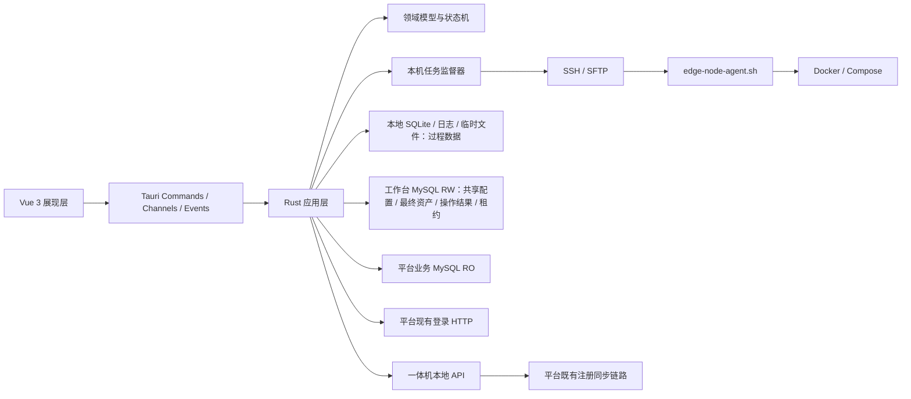
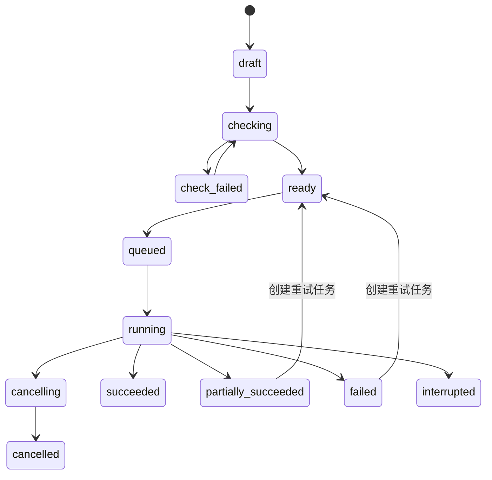

# INX 实施工作台（重构版）技术方案设计

| 属性    | 内容                                  |
| ----- | ----------------------------------- |
| 适用项目  | `inxaiot-desk-buddy`                |
| 文档版本 | v1.44 |
| 文档状态  | 阶段7.5-D整改完成，阶段8执行中、尚未通过 |
| 产品基线  | `02-产品设计文档.md` v0.22 |
| 界面基线  | `01-桌面工作台界面设计规范.md` v0.1            |
| 目标技术栈 | Rust + Tauri 2 + Vue 3 + TypeScript |
| 桌面平台  | Windows、macOS、Linux；远端目标为 Linux 一体机   |
| 更新日期 | 2026-09-06 |

## 1. 文档目的

本文档定义重构版实施工作台的目标技术架构、模块边界、数据模型、平台数据库直连方式、登录会话、并发控制、任务状态机、SSH/SFTP、Shell Agent、发布包处理、日志、安全、测试和实施阶段。

本文档不是对原 Go/Wails 代码的逐行翻译。原工作台已经验证的业务行为、Agent 协议、测试样本和远端目录作为事实参考；新实现按 Rust/Tauri 的异步模型、分层架构和多实例共享数据重新设计。

界面 Demo 评审后若产品设计调整，应先更新产品设计和界面规范，再同步修订本文档，不在代码中静默改变产品边界。

## 2. 输入依据与冲突处理

### 2.1 主要依据

- `doc/重构背景.md`：重构原因、数据平台化方向和技术更新方向。
- `doc/01-桌面工作台界面设计规范.md`：界面布局、组件、主题、密度和验收基线。
- `doc/02-产品设计文档.md`：产品范围、数据职责、资产生命周期、并发和验收标准。
- 原 `inxaiot-edge-workbench`：一体机清单、Release 包、模板渲染、SSH、远端 Agent 和三类部署流程。
- `inxvision-platform` 当前代码：MySQL 数据源、平台登录流程和 `op_edge_aio_server` 一体机表。
- `vibe-session-manager`：Tauri 2、Vue 3、Naive UI、UnoCSS、Pinia、分层 Rust 和任务日志面板。
- `inxaiot-device-simulator`：Tauri 2、SQLx 同时访问 SQLite/MySQL、Tokio 任务和 Naive UI 组件。

### 2.2 已确认的新结论

以下新结论替代原工作台旧设计：

- 项目共享数据进入项目侧固定工作台数据库，不再保存在每个实例的本地 JSON/SQLite 状态中。
- 工作台直接连接 MySQL，不要求项目平台新增工作台业务接口。
- 平台业务库原则上只读；工作台共享数据只写工作台专属库。
- 一体机按规范化 MAC 唯一识别。
- 三个部署模板和参数保存到工作台项目库；镜像文件只在本机使用，远端数据库只保存镜像名和版本号。
- 配置编辑使用乐观版本控制；远端执行使用按 MAC 的租约锁。
- 取消报告生成，保留共享操作记录和本机完整日志。
- 技术栈从 Go/Wails 转为 Rust/Tauri。

## 3. 当前实现实证

### 3.1 原工作台已验证能力

| 能力        | 当前实现                                    | 重构策略                         |
| --------- | --------------------------------------- | ---------------------------- |
| CSV 清单    | Go `encoding/csv`，校验必填和重复 MAC           | 按行为重写并移植黄金样本                 |
| 项目部署模板 | `.env`、Compose、host-info及版本 | 保存到`inxaiot_desk_buddy`并在保存时完整校验 |
| 镜像输入 | 按Compose服务选择镜像tar和RepoTag | Rust逐文件解析并在上传前匹配 |
| SSH       | `golang.org/x/crypto/ssh`               | 以异步 Rust SSH 适配器替代           |
| 文件上传      | 当前实际通过 SSH stdin 上传临时文件并原子改名            | 目标改为真正 SFTP，并保留临时文件和原子发布语义   |
| 远端执行      | `edge-node-agent.sh` JSON Lines 事件      | 首期复用协议，逐步升级 Agent 版本         |
| 首次部署      | 完整包、配置、镜像、Compose、注册与检查                 | 保留远端行为，合并界面步骤                |
| 整包升级      | 备份、完整包、强制重建、版本检查                        | 保留并增加任务/锁恢复约束                |
| 单服升级      | 单镜像、更新 `.env`、只重建目标服务                   | 保留并增加真实版本读取                  |
| 批量并发      | 一批台数和并发数                                | Tokio 任务监督器 + Semaphore      |
| 日志        | 页面日志和独立窗口                               | 结构化日志 + Tauri Channel + 底部面板 |

### 3.2 平台事实

- 项目平台使用 MySQL。
- 一体机实体表为 `op_edge_aio_server`。
- 已确认字段包括 `id`、`name`、`ip`、`mac`、`building_id`、`addr_alias`、`status`、`last_beat_time`、`last_sync_time` 等。
- 平台一体机状态 `0` 表示离线、`1` 表示在线；展示时必须同时返回状态时间。
- 平台管理后台登录使用现有 `/rsa/public/key`、验证码和 `/login` 流程，密码由 RSA 公钥加密，成功后获得访问令牌。
- 原工作台已经通过一体机本地 `/api/aio/server/*` 接口完成注册或更新，并由一体机同步到平台。

### 3.3 必须避免的误区

- 不直接读取并比对平台用户密码表；认证继续复用平台现有登录协议。
- 不因为采用数据库直连就直接修改 `op_edge_aio_server` 等平台核心业务表。
- 不把平台在线状态当作 SSH 实时可达状态。
- 不把工作台历史版本当作一体机当前实际版本。
- 不把原 Go 单文件状态模型原样迁移到新的共享数据库。

## 4. 技术目标与非目标

### 4.1 技术目标

1. 建立清晰的 Vue → Tauri 接口 → 应用层 → 领域层 → 适配器依赖方向。
2. 同时可靠访问本地 SQLite、工作台 MySQL 和平台业务 MySQL。
3. 支持多项目独立连接和登录会话。
4. 支持多个工作台实例共享配置并安全处理写冲突。
5. 支持跨实例的一体机执行互斥和异常过期恢复。
6. 支持大文件 SFTP 上传、进度、取消、临时文件和校验。
7. 支持三类部署任务的有序事件、状态恢复和节点级诊断。
8. 前端可以先使用确定性 Demo 数据完成视觉评审，随后无缝切换真实后端。
9. Windows采用免安装Release EXE，macOS采用可复制的`.app`，Linux生成当前架构的独立可执行文件，不引入额外服务或Sidecar；Mac和Linux原生验收分别记录。

### 4.2 非目标

- 不把工作台拆成微服务。
- 不把 Go 后端作为长期 Sidecar 保留。
- 不让 Vue 直接连接 MySQL、SSH、文件系统或平台 HTTP。
- 不通过 `tauri-plugin-sql` 将 SQL 权限暴露给 WebView。
- 不实现平台制品库或大文件共享服务。
- 不实现长期在线监控、告警服务或后台常驻守护进程。
- 不在首期实现智能屏和网关业务模块。
- 不迁移旧工作台的本地项目和历史数据。

## 5. 核心架构决策

| 编号      | 决策                                    | 原因                                |
| ------- | ------------------------------------- | --------------------------------- |
| ADR-001 | Rust 模块化单体，不创建多进程或 Sidecar            | 降低部署和故障面，适合桌面工具                   |
| ADR-002 | Tauri 2 + Vue 3，界面与系统能力通过受控 IPC 连接    | 复用现有 Rust/Tauri 工程经验              |
| ADR-003 | Tokio 作为统一异步运行时                       | 数据库、SSH、SFTP、HTTP 和任务调度都需要异步并发    |
| ADR-004 | SQLx 同时访问 SQLite 和 MySQL              | 已在设备模拟器验证，统一连接池、事务和 Migration 模型  |
| ADR-005 | 每项目建立工作台库 RW Pool 和平台业务库 RO Pool      | 避免动态跨库 SQL，隔离权限和职责                |
| ADR-006 | 平台业务表只读，平台注册沿用一体机既有同步链路               | 避免绕过平台业务校验和关联逻辑                   |
| ADR-007 | 配置采用版本号，远端任务采用租约锁 + fencing token     | 同时解决编辑覆盖、永久死锁和过期执行者回写问题           |
| ADR-008 | Rust 后台任务及全部过程数据由本机负责，MySQL 只保存操作摘要和节点最终结果 | 远端执行依赖本机文件和网络，中心库不承担任务引擎职责 |
| ADR-009 | 原 Shell Agent 作为版本化远端协议继续复用           | 远端 Docker/Compose 行为已经验证，降低同时重写风险 |
| ADR-010 | 导入预览、实时任务、步骤、进度、完整日志和临时文件只保存在本地 | 项目侧只保留共享配置、最终资产、操作摘要和节点最终结果 |
| ADR-011 | 前端使用统一设计令牌、Naive UI 和 UnoCSS          | 落实界面规范，避免重新形成全局 CSS 堆叠            |
| ADR-012 | UI Demo 使用开发期 Fixture Adapter，不进入生产构建 | 支持先评审界面，不用伪数据污染真实运行               |
| ADR-013 | SSH、文件传输、任务调度、日志、进度、锁等作为跨业务通用能力       | 后续智能屏和网关可以组合复用，不依赖一体机模块           |
| ADR-014 | 本地 SQLite 自动 Migration，项目侧工作台 MySQL 仅显式初始化/升级 | 本机库由应用独占；项目库 DDL 必须由用户明确触发 |
| ADR-015 | 平台业务库连接强制只读，任何数据变更须在用户逐次确认后单独执行 | 防止开发、测试和日常工具路径误改平台业务事实 |
| ADR-016 | 浏览器 Fixture 与 Tauri Real Adapter 必须物理隔离，生产业务页面禁止直接依赖 Demo Store | 防止视觉 Demo 状态进入桌面真实路径并伪造连接、检查或结果 |
| ADR-017 | 所有长任务统一通过生产 TaskQueue 提交，由 JobSupervisor 持有真实执行句柄 | 保证跨业务并发、取消、安全退出和后续智能屏/网关扩展一致 |
| ADR-018 | 功能完成必须同时通过能力、集成和用户三层门禁 | 防止 Repository/Service 测试通过后过早认定产品闭环完成 |
| ADR-019 | 默认应用目录只保存稳定启动选择器，SQLite/日志/任务路径由Rust在打开资源前解析实际数据根目录 | 数据目录切换可重启生效、迁移失败回滚，避免前端localStorage与真实路径分裂 |
| ADR-020 | 任务日志与临时制品物理分目录，终态立即删除制品，日志用保留标记按结果超期清理 | 防止Release副本、Agent、payload和明文渲染凭据长期残留 |
| ADR-021 | Shell Agent作为当前工程版本化资源内嵌，启动校验版本、协议和SHA-256 | 单独检出可构建，远端协议资产可追溯 |

## 6. 技术栈

### 6.1 桌面与前端

| 层    | 选型                                 | 约束                                             |
| ---- | ---------------------------------- | ---------------------------------------------- |
| 桌面壳  | Tauri 2.x                          | 创建工程时固定精确版本，提交锁文件                              |
| Rust | stable，Edition 2024                | 通过 `rust-toolchain.toml` 固定                    |
| 前端   | Vue 3 + `<script setup lang="ts">` | TypeScript strict                              |
| 构建   | Vite                               | 不使用远程运行时资源                                     |
| 组件   | Naive UI                           | 负责 Button、Input、Form、Table、Modal、Drawer、Tabs 等 |
| 样式   | CSS Variables + UnoCSS             | Token 是唯一视觉事实来源                                |
| 状态   | Pinia                              | 只保存 UI 状态和少量查询缓存                               |
| 路由   | Vue Router                         | 路由携带当前项目和业务页面身份                                |
| 国际化  | Vue I18n                           | 首期至少维护中文资源，错误码不在页面硬编码                          |
| 图标   | Lucide Vue                         | 全应用统一线性图标                                      |
| 前端测试 | Vitest + Vue Test Utils            | 组件、主题、密度和关键交互                                  |
| 包管理  | pnpm                               | 提交 `pnpm-lock.yaml`，不使用浮动 `latest`             |

### 6.2 Rust 核心

| 能力    | 候选依赖                                  | 使用方式                                                |
| ----- | ------------------------------------- | --------------------------------------------------- |
| 异步运行时 | Tokio                                 | 多线程 runtime、任务、同步和时间                                |
| 取消    | `tokio-util::sync::CancellationToken` | 任务树传播取消信号                                           |
| 数据库   | SQLx                                  | `mysql`、`sqlite`、`migrate`、`uuid`、`time`、Rustls TLS |
| HTTP  | Reqwest + Rustls                      | 平台登录和必要的既有 API                                      |
| SSH   | Russh                                 | 密码、公钥、主机密钥校验、命令流                                    |
| SFTP  | Russh SFTP                            | 大文件上传、临时文件、重命名和远端属性                                 |
| 序列化   | Serde + `serde_json`                  | DTO、manifest、Agent 事件                               |
| CSV   | `csv`                                 | 流式读取、字段定位和校验                                        |
| 压缩归档  | `tar` + `flate2`                      | 构建和检查 `.tar/.tar.gz`                                |
| 哈希    | `sha2` + `hex`                        | Agent、文件和发布包本地校验                                    |
| ID    | UUID v7                               | 项目、任务、批次和事件 ID                                      |
| 时间    | `time`                                | UTC 存储和 RFC3339 事件时间                                |
| 错误    | `thiserror`                           | 领域、应用和适配器结构化错误                                      |
| 日志    | `tracing` + `tracing-appender`        | 结构化字段、滚动文件和测试捕获                                     |
| 敏感值   | `secrecy`/`zeroize` 或等价封装             | 限制 Debug 和内存驻留                                      |
| 本地秘密  | `SecretStore` 端口 + OS 凭据存储适配器         | 本地数据库密码和平台令牌不写明文 SQLite                             |

依赖版本在建立工程骨架时集中评审并精确锁定。技术方案只固定能力和边界，不在文档中长期维护每个 Patch 版本。

## 7. 总体架构



### 7.1 依赖方向

```text
interface/tauri
    → application
        → domain
        → application/ports
            ← infrastructure/mysql
            ← infrastructure/sqlite
            ← infrastructure/platform_auth
            ← infrastructure/ssh
            ← infrastructure/sftp
            ← infrastructure/release
            ← infrastructure/logging
```

强制规则：

- Tauri Command 只做 DTO 校验、调用用例和错误转换。
- 领域层不能依赖 Tauri、SQLx、Reqwest、Russh、文件路径或前端类型。
- 应用层只能依赖领域模型和应用端口；不得直接执行 SQL 或自行创建具体 SQLx、SSH、HTTP 适配器。
- 静态架构契约扫描整个`src/application`，禁止出现`crate::formal`、`crate::infrastructure`或`sqlx`；具体项目上下文、部署控制/执行、AIO资产和Release文件服务全部在Infrastructure实现Application Port。
- SQL 行、第三方错误和 SSH 句柄不得泄漏到应用层之外。
- Vue 不能直接调用任意 Shell、SQL、HTTP 或文件系统。
- 所有对外副作用必须通过应用层端口。

## 8. 建议工程结构

```text
inxaiot-desk-buddy/
├─ package.json
├─ pnpm-lock.yaml
├─ src/
│  ├─ app/
│  │  ├─ design-tokens.css
│  │  ├─ theme.ts
│  │  ├─ router.ts
│  │  └─ i18n.ts
│  ├─ shell/
│  │  ├─ DesktopShell.vue
│  │  ├─ ApplicationBar.vue
│  │  ├─ BusinessNavigation.vue
│  │  ├─ StatusBar.vue
│  │  ├─ ActivityPanel.vue
│  │  └─ PreferencesDialog.vue
│  ├─ features/
│  │  ├─ projects/
│  │  └─ aio/
│  │     ├─ nodes/
│  │     ├─ release_profile/
│  │     └─ operations/
│  ├─ shared/
│  │  ├─ api/
│  │  ├─ components/
│  │  ├─ formatters/
│  │  └─ model/
│  └─ dev-fixtures/
├─ src-tauri/
│  ├─ Cargo.toml
│  ├─ migrations/
│  │  ├─ local/
│  │  └─ mysql/
│  ├─ resources/
│  │  └─ agent/edge-node-agent.sh
│  └─ src/
│     ├─ interface/
│     │  ├─ commands/
│     │  ├─ dto/
│     │  └─ error.rs
│     ├─ application/
│     │  ├─ ports/
│     │  │  ├─ remote_session.rs
│     │  │  ├─ file_transfer.rs
│     │  │  ├─ task_queue.rs
│     │  │  ├─ progress_sink.rs
│     │  │  └─ log_sink.rs
│     │  ├─ common/
│     │  │  ├─ project_service.rs
│     │  │  └─ task_service.rs
│     │  └─ aio/
│     │     ├─ inventory_service.rs
│     │     ├─ release_service.rs
│     │     └─ operation_service.rs
│     ├─ domain/
│     │  ├─ common/
│     │  │  ├─ project.rs
│     │  │  ├─ operation.rs
│     │  │  ├─ lease.rs
│     │  │  └─ error.rs
│     │  └─ aio/
│     │     ├─ edge_node.rs
│     │     └─ release.rs
│     ├─ infrastructure/
│     │  ├─ local_sqlite/
│     │  ├─ workbench_mysql/
│     │  ├─ platform_mysql/
│     │  ├─ platform_auth/
│     │  ├─ secret_store/
│     │  ├─ remote/
│     │  │  ├─ ssh_connector.rs
│     │  │  ├─ command_executor.rs
│     │  │  └─ sftp_transfer.rs
│     │  ├─ file_processing/
│     │  ├─ aio/
│     │  └─ logging/
│     ├─ runtime/
│     │  ├─ project_registry.rs
│     │  ├─ task_queue.rs
│     │  ├─ job_supervisor.rs
│     │  ├─ scheduler.rs
│     │  └─ event_bus.rs
│     ├─ lib.rs
│     └─ main.rs
└─ tests/
   ├─ fixtures/
   └─ integration/
```

首期保持一个 Rust crate，通过 module 建立边界。只有出现独立发布、编译时间或复用需求时再评估拆 crate。智能屏和网关首期只有菜单，不提前创建空业务模块；开始开发对应功能时再增加 `features/smart_screen`、`features/gateway` 和相应 Rust 领域模块。

### 8.1 跨业务通用能力

通用能力不是随意堆放函数的 `utils` 目录，而是具有明确端口、输入、输出、错误和生命周期的基础能力。它们不能依赖一体机、智能屏或网关领域模型。

| 通用能力                    | 统一职责                     | 一体机首期用途        | 后续复用方向             |
| ----------------------- | ------------------------ | -------------- | ------------------ |
| `RemoteSession`         | 建立、复用和关闭 SSH 会话，校验主机密钥   | 连接一体机          | 连接支持 SSH 的智能屏或网关   |
| `RemoteCommandExecutor` | 执行受控命令、流式读取输出、超时和取消      | 调用 Shell Agent | 调用其他业务 Agent 或诊断命令 |
| `FileTransferService`   | 上传、下载、进度、临时文件、校验和原子发布    | SFTP 上传发布包和镜像  | 上传屏端安装包、网关固件和配置    |
| `FileProcessingService` | 文件选择后的路径校验、哈希、归档和临时目录    | Release 包和镜像处理 | 其他业务发布物处理          |
| `TaskQueue`             | 排队、任务类型路由、并发限制和取消        | 部署升级任务         | 屏端升级、网关批处理         |
| `JobSupervisor`         | 任务树、JoinHandle、异常捕获和安全停机 | 一体机节点执行        | 所有长任务              |
| `ProgressSink`          | 标准化进度、阶段和有序事件            | 上传与部署进度        | 所有后台任务进度           |
| `LogSink`               | 结构化日志、脱敏和本地落盘            | Agent 和远端日志    | 所有模块诊断             |
| `ResourceLeaseService`  | 跨实例租约、心跳和 fencing token  | 按 MAC 锁定一体机    | 按屏 ID、网关 ID 锁定资源   |

业务模块通过组合这些能力完成用例：

```text
aio::FirstDeployHandler
  → TaskQueue
  → ResourceLeaseService
  → FileProcessingService
  → RemoteSession
  → FileTransferService
  → RemoteCommandExecutor
  → ProgressSink / LogSink
```

未来智能屏和网关只能依赖通用端口，不能反向调用 `aio::*` 实现。若协议不同，应新增通用端口适配器或各自的业务 Handler，而不是复制任务队列、日志和上传代码。

## 9. 应用运行时与多项目上下文

### 9.1 AppState

Tauri 只托管一个轻量 `AppState`：

- 本地 SQLite Pool。
- 本地 SecretStore。
- `ProjectRuntimeRegistry`。
- `JobSupervisor`。
- 全局事件总线。
- TaskHandlerRegistry：正式注册aio三类Handler，后续screen/gateway通过同一契约按需注册。
- TaskQueue：全局容量100、worker 4；容量覆盖运行中和排队任务，统一优先级、取消和跨业务并发。
- 应用目录和日志目录。

`AppState` 不保存整个项目业务数据集合，不把 MySQL 数据镜像进内存。

### 9.2 ProjectRuntime

每个已打开项目建立独立运行上下文：

```text
ProjectRuntime
├─ local_project_id
├─ workbench_mysql_pool   RW
├─ platform_mysql_pool    RO
├─ platform_auth_session
├─ schema_capabilities
└─ connection_health
```

当前 UI 项目只是“活动上下文”。后台任务持有自己的 `Arc<ProjectRuntime>`，切换项目不会让正在执行的任务失去连接或被错误取消。本地 SQLite 通过 `local_project_id` 区分多个项目；每个本地项目配置指向自己的一组平台业务库和固定工作台库，远端工作台库内部不再保存项目 ID。

### 9.3 连接生命周期

- 进入项目时惰性建立两个 MySQL Pool；`db_tls_enabled=false`为默认值并使用`Disabled`，显式启用时使用`Required`。
- 每个 Pool 首期最多 5 个连接，空闲连接按 SQLx 配置回收。
- 没有活动页面或任务的项目上下文可以关闭 Pool。
- 切换项目不会复用其他项目的 Pool、令牌或缓存。
- 数据库连接串不输出到普通日志。

## 10. 前端架构

### 10.1 Shell 与 Feature 分离

- Shell 只负责顶部项目区、导航、内容槽、状态栏和活动面板。
- Feature 按项目、一体机、发布参数和部署升级拆分。
- 页面不得直接 `invoke()`；全部调用集中在 `src/shared/api`。
- 页面只消费 DTO 和查询状态，不理解 MySQL、SSH 或 Agent 细节。

### 10.2 状态边界

Pinia 保存：

- 当前项目 ID。
- 导航展开状态。
- 主题、字号、密度和减少动画。
- 当前页面筛选、选中行和活动面板状态。
- 少量带失效时间的页面缓存。

Pinia 不保存：

- 完整项目表。
- 远端数据库副本。
- 大型发布文件内容。
- 完整日志。
- SSH 私钥、数据库密码和平台访问令牌。

### 10.3 Demo 数据模式

为了先评审界面，建立开发期 Fixture Adapter：

- DTO 与真实 Tauri API 完全相同。
- Fixture 数据固定、可重复，不使用随机数据。
- 页面通过同一个 API 门面切换 `tauri` 或 `fixture` 实现。
- Fixture 只能在开发构建显式启用。
- Release 构建检测到 Fixture 开关时直接失败。
- 正式界面无真实数据时显示空状态，不回退到 Demo 数据。
- Tauri Real Adapter 与浏览器 Fixture Adapter 分别实现相同接口；页面和业务 Store 不允许导入 `DemoStore`。
- 前端测试必须同时覆盖 Fixture DTO 一致性和 Real Adapter 的 Tauri IPC 契约。

## 11. Tauri IPC 设计

### 11.1 使用边界

| 机制      | 用途       | 示例                  |
| ------- | -------- | ------------------- |
| Command | 查询和短操作   | 列出项目、保存配置、预览导入、提交任务并立即返回 Task ID |
| Channel | 有序进度和日志流 | 部署节点事件、上传进度、实时日志    |
| Event   | 低频全局失效通知 | 项目状态变化、任务列表刷新、会话过期  |

### 11.2 Command 分类

```text
project_*
  list_local_projects
  create_local_project
  update_local_project
  delete_local_project
  test_project_connection
  switch_project

auth_*
  create_project_login_challenge
  login_project
  logout_project
  get_project_session
  check_project_session

edge_node_*
  list_edge_nodes
  get_edge_node_detail
  preview_inventory_import
  apply_inventory_import
  inspect_node_versions

release_*
  get_release_profile
  validate_release_profile
  save_release_profile
  replace_release_agent_script
  open_release_agent_script
  inspect_service_image

operation_*
  create_operation
  check_operation
  start_operation
  cancel_operation
  list_operations
  get_operation_detail
  subscribe_operation
```

### 11.3 DTO 规则

- Rust DTO 是 IPC 契约来源，通过工具生成或集中维护 TypeScript 类型。
- 所有 DTO 使用稳定 ID、明确枚举和可空字段，不返回自由形态大 JSON。
- 用户可见错误返回 `code + message_key + params + trace_id`。
- 参数字段错误可附加`fieldErrors`，以`values.platformHost`、`credentials.platformAuthKey`等DTO字段路径关联输入框，值为经过统一脱敏的中文原因；无字段错误时省略。发布参数领域校验聚合错误，错误码仍为`CONFIG_VALIDATION_FAILED`，保存继续由后端校验阻止无效写入。前端提前检查端口/超时的必填、整数及范围约束，避免空值或非法数字先触发IPC反序列化错误；展示层不解析总提示来猜测错误字段。
- 原始适配器错误只进入本机诊断日志。
- 分页统一使用 `page_size` 和稳定游标或页码，最大值由 Rust 校验。
- 大日志不通过单次 Command 返回。

## 12. 数据存储边界与本地数据设计

### 12.1 最终数据边界

技术实现必须遵守以下约束：

> 项目侧保存“共享配置、最终资产、操作摘要、节点最终结果和跨实例锁”；本地保存“导入预览、实时任务、步骤、进度、完整日志和临时文件”。

| 数据 | 项目侧 `inxaiot_desk_buddy` | 本地 SQLite/文件 |
| --- | --- | --- |
| 发布参数和模板 | 保存当前共享版本 | 可短期缓存，不作为事实源 |
| 最终一体机资产 | 保存 | 不复制完整主数据 |
| 一体机服务版本 | 保存最近成功部署的镜像版本 | 保存实际运行观测、逐服务检查结果、时间与检查过程 |
| 操作记录 | 保存操作对象、时间、用户、发布物和最终结果 | 保存完整执行上下文 |
| 节点结果 | 保存每个目标的最终状态和失败摘要 | 保存实时阶段、进度和步骤 |
| 资源锁 | 保存租约、心跳和 fencing token | 保存当前租约引用 |
| 导入预览和逐行明细 | 不保存 | 保存 |
| 实时任务队列 | 不保存 | 保存 |
| 任务步骤和进度事件 | 不保存 | 保存 |
| Agent/SSH/SFTP 完整日志 | 不保存 | 保存 |
| Release 包、镜像、渲染文件 | 不保存 | 保存或引用本机文件 |

项目侧只允许两个过程性例外：

1. `resource_lease`：多个实例必须共享的短期协调状态。
2. `operation_record` 的最小运行中摘要：让其他实例知道谁正在执行什么，并能在实例崩溃后识别中断；不得扩展成中心任务队列或步骤日志。

### 12.2 本地目录

通过 Tauri 平台目录 API 获取，不硬编码用户目录：

```text
app_data/
├─ local.db
├─ known_hosts
├─ logs/
│  ├─ app.log
│  └─ app.log.*
├─ projects/{localProjectId}/
│  ├─ tasks/{localTaskId}/events.jsonl
│  ├─ imports/{localImportId}/preview.jsonl
│  ├─ rendered/{localTaskId}/{mac}/
│  └─ temp/
└─ runtime/
   └─ agent/{sha256}/edge-node-agent.sh
```

### 12.3 本地 SQLite 表命名与目录

本地表遵循与项目侧相同的职责原则：

- 项目、会话、偏好、任务、目标、步骤、发布物路径和主机密钥属于通用生命周期数据，不增加业务前缀。
- 通用任务通过 `domain_type` 区分 `aio/screen/gateway`，通过 `resource_type/resource_key` 区分具体资源。
- 包含 MAC、平台一体机匹配和一体机冲突规则的导入数据属于一体机业务，使用 `local_aio_` 前缀。
- 后续智能屏或网关确实需要导入过程表时，再分别增加 `local_screen_`、`local_gw_` 前缀表，不提前创建空表。
- 不使用无约束 JSON 把明显不同的业务模型强行塞进一张所谓通用表。

| 表名 | 表描述 | 主要字段 |
| --- | --- | --- |
| `local_project` | 保存当前电脑可访问的多个项目连接入口 | id、name、platform_url、db_host、db_port、db_user、db_tls_enabled、business_db、workbench_db、secret_refs、last_opened_at |
| `local_project_session` | 保存每个本地项目独立的平台登录会话引用 | local_project_id、username、token_secret_ref、expires_at、updated_at |
| `local_secret_cleanup` | SecretStore删除失败Outbox；启动时幂等重试，不保存秘密原文 | secret_ref、reason、retry_count、last_error_code、created_at、updated_at |
| `local_preference` | 保存主题、字号、密度、列表条数和导航等本机偏好 | key、value_json、version |
| `local_task` | 通用：保存本机任务队列和实时任务主状态 | id、local_project_id、remote_operation_record_id、domain_type、operation_type、name、priority、batch_size、concurrency、payload_ref、state、sequence、log_path、error_code、message、started_at、ended_at |
| `local_task_target` | 通用：保存任务中每个资源的实时阶段、进度和当前结果 | local_task_id、resource_type、resource_key、state、stage、progress_current、progress_total、fencing_token、message_code、message_params_json、updated_at |
| `local_task_step` | 通用：保存检查、上传、备份、安装、注册、验证等步骤状态 | local_task_id、resource_type、resource_key、step_code、state、error_code、message、started_at、ended_at |
| `local_aio_import_session` | 一体机：保存一次清单导入预览的文件、状态和统计 | id、local_project_id、file_name、file_path、state、counts_json、created_at |
| `local_aio_import_item` | 一体机：保存逐行解析、MAC匹配、冲突和用户选择 | import_session_id、row_number、mac_normalized、parsed_data_json、classification、conflict_json、selected、error |
| `local_recent_artifact` | 通用：保存各项目、各业务域最近使用的本机发布物路径 | local_project_id、domain_type、artifact_type、service、path、used_at |
| `local_host_key` | 保存 SSH 主机密钥确认结果 | local_project_id、host、port、algorithm、fingerprint、accepted_at |

本地数据库结构版本不再设计自定义 `local_schema_migration` 表，统一由 SQLx 内部 `_sqlx_migrations` 管理。

### 12.4 本地任务表职责

- `local_task` 是真正的任务队列事实源，承担排队、检查、运行、取消、中断和本机恢复。
- `local_task_target` 可以高频更新实时进度，不同步项目侧。
- `local_task_step` 保存详细过程，供任务与日志面板展示。
- 完整事件继续追加写入 JSONL，SQLite 只保存可查询的最新状态和索引。
- 项目侧 `operation_record` 不是任务队列，不能反向驱动远端执行。

### 12.5 本地一体机导入表职责

- 选择一体机 CSV 后先创建 `local_aio_import_session`。
- 解析结果、平台一体机匹配、MAC冲突和用户勾选保存在 `local_aio_import_item`。
- 用户确认前不写项目侧数据库。
- 应用成功后只把最终资产写入 `aio_node`，并在 `operation_record` 写一条导入摘要。
- 本地导入会话按保留策略清理，不要求其他实例继续编辑同一个预览。

### 12.6 本地数据库策略

- SQLite 开启 WAL、foreign keys 和 busy timeout。
- SQLx Migration 只能向前追加。
- 本地库高于当前应用支持版本时，应用进入本地安全模式，不执行写操作。
- 数据库密码和平台访问令牌只保存版本化SecretStore引用，不以明文进入SQLite；SQLite写失败只删除未引用的新版本，不覆盖或删除旧有效值。发布参数凭据只保存在工作台项目库的认证密文中。
- 旧引用和项目删除后的凭据若无法从SecretStore删除，写入`local_secret_cleanup`；应用启动幂等重试，About诊断显示待清理数量。
- 数据库行映射对ID、MAC、名称、IP、状态、版本、迁移计数和时间等事实字段严格`try_get`并传播错误；只有数据库契约明确可空的位置、备注、关联ID等展示字段保留`Option`。禁止用空字符串或0掩盖类型不兼容/损坏数据。
- 完整任务日志写 JSONL 滚动文件，不写入 SQLite 大文本。

## 13. 工作台 MySQL 数据设计

### 13.1 一个工作台库只对应一个项目

- 固定工作台库名建议为 `inxaiot_desk_buddy`，最终在实施前确认一次后冻结。
- 一个本地项目配置包含一组独立数据库连接信息，并指向该项目的业务库和 `inxaiot_desk_buddy` 库。
- 不同项目配置不同数据库连接；一个 `inxaiot_desk_buddy` 库只保存当前连接项目的数据。
- 工作台 MySQL 表不保存 `project_id`，Repository 也不接受远端项目 ID 作为查询条件。
- 本地多项目隔离只由本地 SQLite 的 `local_project_id` 完成。
- 字符集使用 `utf8mb4`，排序规则选择目标 MySQL 版本共同支持的规则。
- 时间统一存 UTC `DATETIME(6)`，前端按本地时区显示。
- 业务状态使用 `VARCHAR` + Rust 枚举，不使用难迁移的 MySQL ENUM。

### 13.2 表命名与业务前缀

- 项目通用表不增加业务前缀，例如 `operation_record`、`resource_lease`、`audit_event`。
- 一体机业务表统一增加 `aio_` 前缀。
- 智能屏功能开发时使用 `screen_` 前缀。
- 网关功能开发时使用 `gw_` 前缀。
- 操作记录通过 `domain_type`、`resource_type` 和 `operation_type` 区分业务，不复制多套历史与锁表。

### 13.3 项目侧保留表

| 表名 | 分类 | 表描述 |
| --- | --- | --- |
| `operation_record` | 项目通用 | 保存谁在何时对什么对象执行了什么操作、使用什么版本以及最终总体结果 |
| `operation_target_result` | 项目通用 | 保存一次操作中每个目标资源的最终结果和失败摘要，不保存实时步骤和进度 |
| `resource_lease` | 项目通用 | 保存多个工作台实例之间的资源租约、心跳和 fencing token |
| `audit_event` | 项目通用 | 保存共享配置和最终资产写操作的版本审计，不保存敏感值原文 |
| `aio_release_profile` | 一体机 | 保存一体机部署使用的共享模板、MQTT、SSH、AuthKey 和远端目录配置 |
| `aio_node` | 一体机 | 保存按 MAC 唯一的一体机最终工作台资产、平台关联和管理状态 |
| `aio_node_service_version` | 一体机 | 共享每台一体机最近成功部署的镜像版本；服务观测改由本机local_aio_service_check保存 |

SQLx 自动创建的 `_sqlx_migrations` 是技术内部表，不属于业务表设计，不再额外创建 `schema_migration`。

明确删除以下项目侧表设计：

- `workspace_meta`：项目连接信息已经在本地按项目保存，一项目一库前提下没有独立价值。
- `aio_import_batch`、`aio_import_item`：导入预览和逐行明细属于本地过程数据。
- `aio_operation_detail`：操作了什么合并到精简操作记录的受控摘要字段。
- `operation_target`、`operation_step`：实时目标状态、步骤和进度属于本地任务数据。

### 13.4 表结构明细

#### `operation_record`：共享操作记录表

表说明：保存跨实例可见的最小操作历史。记录可以在任务开始时写入 `running` 和心跳，用于显示占用；任务结束后只保留总体最终结果，不承载任务队列、步骤或完整日志。

| 字段 | 说明 |
| --- | --- |
| `id` | UUID v7，主键，同时作为跨实例操作编号 |
| `domain_type` | aio、screen、gateway 等业务域 |
| `operation_type` | inventory_import、first_deploy、full_upgrade、service_upgrade 等 |
| `operation_name` | 用户可识别的批次或操作名 |
| `operator/instance_id` | 操作用户和发起工作台实例 |
| `state` | running、succeeded、partially_succeeded、failed、cancelled、interrupted |
| `target_count` | 目标资源数量 |
| `success_count/failure_count/cancelled_count` | 最终聚合数量；运行中只允许保存已完成计数 |
| `artifact_name/artifact_version` | 发布物、Release 或镜像的展示名称和版本，可空 |
| `operation_summary_json` | 受 Schema 约束的非敏感摘要，例如服务名、发布模式、导入分类统计和发布配置版本 |
| `started_at/ended_at/heartbeat_at` | 开始、结束和最小活动心跳时间 |
| `result_summary/error_code/error_summary` | 总体结果、稳定错误码和脱敏摘要 |
| `retry_of_operation_id` | 来源重试操作，可空 |
| `version` | 状态 CAS 版本 |

`operation_summary_json` 只能保存“操作了什么”，不能写入实时步骤、百分比、SSH输出、本机路径、密码或完整模板。

#### `operation_target_result`：共享节点最终结果表

表说明：保存批量操作中每个资源对象的目标身份和最终结果。任务开始时可以先写目标身份和 `pending`，完成后只更新一次最终状态；不得把它当作实时进度表。

| 字段 | 说明 |
| --- | --- |
| `operation_id/resource_type/resource_key` | 联合主键；一体机的 resource_key 为规范化 MAC |
| `result_state` | pending、succeeded、failed、cancelled、interrupted、unknown |
| `before_version/after_version` | 操作前后可展示版本，可空 |
| `result_summary/error_code/error_summary` | 节点最终结果和脱敏失败摘要 |
| `completed_at` | 节点形成最终结果的时间，可空 |

表中不保存 `stage`、`progress_current`、`progress_total` 和步骤列表。实时数据只更新本地 `local_task_target/local_task_step`。

#### `resource_lease`：通用资源租约表

表说明：保存跨实例执行锁，是项目侧必须保留的短期协调数据。它只描述资源、持有人和租约，不理解一体机部署、屏端升级或网关配置业务。

| 字段 | 说明 |
| --- | --- |
| `resource_type/resource_key` | 联合主键；一体机 key 为规范化 MAC |
| `domain_type/operation_id` | 当前业务域和共享操作记录 ID |
| `owner_instance_id/owner_user` | 持有人 |
| `lease_token` | 本次租约随机令牌 |
| `fencing_token` | 每次重新获得锁时单调递增 |
| `lease_state` | `active` 或 `released`；释放后保留计数行 |
| `acquired_at/heartbeat_at/expires_at` | 租约时间 |

完成、取消或确认中断后把租约标记为 `released`，清空活动令牌并立即过期，但保留资源行和 `fencing_token`。下次获取在同一行递增 token，不能删除计数行后从 1 重新开始。异常退出仍依靠 `expires_at` 失效；维护任务只清理无业务价值的活动字段，不删除 fencing 计数行。

#### `audit_event`：共享数据审计表

表说明：记录共享配置和最终资产被谁创建或修改、版本如何变化。它不是任务步骤日志。

| 字段 | 说明 |
| --- | --- |
| `id` | UUID v7，主键 |
| `domain_type/object_type/object_key` | 业务域和对象定位 |
| `action` | create、update、apply_import、claim 等 |
| `operator/instance_id` | 用户和工作台实例 |
| `old_version/new_version` | 版本变化 |
| `changed_fields_json` | 只记录字段名和是否变化 |
| `created_at` | 时间 |

不得记录密码、AuthKey、私钥原文、导入逐行数据或任务步骤。

客户端来源标识统一由基础设施函数`client_instance::application_instance_id()`生成，格式为`完整电脑名-MAC12位-IP`，在进程启动时采集并复用，无独立身份模型或持久化身份对象。`hostname`读取完整系统电脑名，`netdev`读取本机网卡；MAC和IP始终取自同一网卡，优先在线且信息完整的物理网卡，再按默认路由排序，排除回环，优先IPv4并支持IPv6。Windows通过GetIfEntry2的HardwareInterface标记识别真实硬件，避免ZeroTier/VPN被误认为现场网卡。系统信息缺失时标明未知/未联网，不生成随机替代值。导入、部署和参数修改三个入口共用此函数；诊断DTO仅新增同一字符串`clientInstanceId`供关于页展示，启动日志记录同一来源。

未上线阶段已经把实例列直接固化在最终`0001_initial.sql`：`operation_record.instance_id`、`audit_event.instance_id`及`resource_lease.owner_instance_id`均为`VARCHAR(512)`，容纳完整电脑名及IPv6，不新建身份表。实例字符串用于来源定位，租约互斥继续依靠活动状态、operation_id、lease_token和fencing_token，不能因实例字符串相同而放行第二个操作。

#### `aio_release_profile`：一体机发布配置表

表说明：保存当前项目唯一的一体机共享发布配置。多个桌面实例读取同一行，通过 `version` 防止模板和凭据相互覆盖。

| 字段 | 说明 |
| --- | --- |
| `profile_key` | 固定值 `default`，主键 |
| `env_template` | `.env` 模板全文 |
| `compose_template` | `docker-compose.yml` 全文 |
| `host_info_template` | `host-info.json`模板全文；与前两者使用同一配置版本 |
| `agent_script/version/protocol_version/sha256` | 用户更换后保存的项目共享Agent脚本及校验信息；全部为空表示使用应用内置脚本 |
| `platform_host/api_port` | 平台接入参数 |
| `credential_scheme` | 凭据密文格式；当前为 `inxvision-aes256gcm-v1` |
| `credential_key_version` | 固定加密格式版本 `1`，不是发布配置乐观锁版本 |
| `credential_salt/nonce/ciphertext` | AuthKey、MQTT及SSH凭据的随机盐、随机数和AES-GCM认证密文 |
| `ssh_port/timeout_seconds` | SSH 参数 |
| `aio_data_root/aio_deploy_root` | 一体机受控远端目录 |
| `version` | 乐观锁版本 |
| `updated_by/updated_at` | 修改人和时间 |

发布凭据使用内置固定材料`inxvision`进行对称加密：每次保存由系统随机生成16字节盐和12字节随机数，Argon2id从固定材料和盐派生AES-256-GCM密钥，关联数据固定绑定当前凭据格式。MySQL只保存格式、格式版本、盐、随机数和认证密文；数据库连接密码不参与凭据加解密，也不在本机安全存储保存项目主密钥。

该设计不提供用户配置的加解密密钥、项目主密钥、密钥轮换、`.inxkey`口令包或跨电脑导入导出流程。新电脑读取同一工作台库时可直接解密当前格式；旧的项目主密钥格式不兼容，读取时明确要求在发布参数页重新填写。明文凭据和固定材料不得进入日志、SQLite、前端持久化或错误文本。

首期所有已登录用户仍可通过应用查看完整项目共享凭据；固定材料加密用于降低数据库静态明文暴露风险，不提供用户级字段权限隔离，也不能替代数据库账号和可信内网访问控制。凭据仍禁止进入普通日志、审计差异和错误文本。

#### `aio_node`：一体机最终资产表

表说明：保存工作台侧最终确认的一体机资产。导入预览不会进入此表，只有用户确认应用或平台既有资产接管后才写入。

| 字段 | 说明 |
| --- | --- |
| `mac_normalized` | 12 位大写十六进制，主键 |
| `name/ip/display_mac` | 工作台名称、管理 IP 和显示 MAC |
| `building_id/region_id/addr_alias/floor/location/remark` | 确认后的业务字段 |
| `platform_aio_id` | 平台 `op_edge_aio_server.id` 的软关联 |
| `management_state` | pending、platform_existing、managed、conflict 等 |
| `source` | import、platform、merged |
| `last_operation_id` | 最近部署或升级操作记录 |
| `version` | 乐观锁版本 |
| `created_at/updated_at` | 时间 |

#### `aio_node_service_version`：一体机服务版本表

表说明：保存每台一体机各服务的最终共享部署版本事实，用于跨实例查看已部署版本。服务实时观测只写当前电脑，不创建项目侧服务检查表。

| 字段 | 说明 |
| --- | --- |
| `mac_normalized/service_name` | 联合主键 |
| `expected_image_name/version` | 最近成功操作记录 |
| `observed_image_name/version` | 既有字段不再用作服务检查来源，成功部署不再把计划值复制到这些字段 |
| `observed_at` | 既有字段不再驱动服务状态或15分钟告警 |
| `source_operation_id` | 产生期望版本的操作记录 |

#### `local_aio_service_check`：本机服务检查快照

本表属于SQLite，复合主键为`(local_project_id, mac_normalized)`；`snapshot_json`保存`NodeServiceCheckSnapshot`，`revision`记录本地更新次数，`updated_at`为本机保存时间。新表直接纳入开发期完整`local/0001_initial.sql`，不添加迁移回放链路。项目侧MySQL表结构不变。

快照包含远端生效服务集合`expectedServices`、逐服务`ServiceObservation`、最近完整检查时间和最近一次`ServiceCheckReport`。观测包含运行状态、Docker健康状态、配置期望镜像、实际镜像名、镜像ID、检查时间、来源和原因；不得用部署计划构造实际字段。全量成功报告必须覆盖完整生效服务集合，单服成功报告只合并该服务，失败报告保留上次有效结果。事务在读旧快照前取得SQLite写锁，以检查开始时间拒绝迟到的旧结果，项目间相同MAC互不覆盖。

`check_edge_node_services(localProjectId, mac)`通过Application Port提交`aio/service_inspection`本机任务，使用现有TaskQueue/JobSupervisor和任务事件管线。该任务不创建MySQL操作记录或租约，发起与保存前检查当前目标没有部署活动；任务结束通过SQLite事务同时收敛任务和目标，避免取消竞态。普通列表刷新只读取记录。

Agent 0.1.10新增`inspect-services`只读动作，工作台通过SSH标准输入执行内嵌脚本，无需上传、创建目录、清理、加载镜像或启动容器。健康步骤在原状态读取时同步取得状态、健康、实际镜像和ID，报告复用该次内存观测，回滚开始清除旧缓存。Agent 0.1.11进一步在加载镜像前记录旧容器的镜像名和实际ID；回滚先恢复标签指向，再启动旧服务并核对容器ID。Agent 0.1.12把整包host-info改为同目录候选文件，镜像准备和旧服务停止成功后才原子生效，回滚时先恢复旧配置再启动旧服务。Agent 0.1.13把Docker Healthcheck纳入部署成功条件：未配置时仍检查running，已配置时starting有限等待、healthy通过、持续unhealthy失败；新服务和回滚旧服务共用同一等待规则。报告时间在Rust解析时统一替换为工作台采集起止UTC时间，远端时钟不决定结果先后。

部署进度接口通过可选`service_check`回调收集报告，进度管线停止后写入本机仓储。报告错误独立记录为检查失败；解析/缓存/保存失败仅产生警告，不覆盖Agent原退出码和部署任务结果。列表/详情只读取本机快照，旧`observed`字段输出为空，删除详情从本机步骤名猜测“最近服务检查”的重复来源。服务快照无15分钟过期判定；时间仅表明记录新旧。

### 13.5 项目侧写入时机

#### 导入

```text
本地解析和预览
→ 用户确认
→ 事务写入 aio_node
→ 写 audit_event
→ 写一条 operation_record 导入摘要
```

不写导入批次和逐行明细。

#### 部署与升级

```text
本地创建 local_task
→ 项目侧创建 operation_record(running) 和 operation_target_result(pending)
→ 获取 resource_lease
→ 本地执行并持续写 local_task_target/local_task_step/JSONL
→ 每个目标完成时写 operation_target_result 最终结果
→ 全部结束后写 operation_record 最终摘要
→ 更新 aio_node/aio_node_service_version
→ 释放 resource_lease
```

### 13.6 索引原则

- 一体机：`mac_normalized` 主键，`platform_aio_id`、`ip`、`management_state` 辅助索引。
- 操作记录：`(started_at DESC, id)`、`(state, heartbeat_at)`、`(domain_type, operation_type, started_at DESC)`。
- 节点结果：`(resource_type, resource_key, operation_id)`，支持查询单个资产历史。
- 锁：`(resource_type, resource_key)` 主键覆盖获取和心跳，`(lease_state, expires_at)` 支持状态维护。
- 审计：`(object_type, object_key, created_at DESC)`。
- 所有分页查询必须有确定性次序，时间相同时追加 ID。

## 14. 双 MySQL 连接与权限

### 14.1 两个连接池

每个本地项目使用自己的数据库连接信息建立两个逻辑 Pool。一个 Workbench Pool 对应的 `inxaiot_desk_buddy` 库只保存该项目数据，不承载其他本地项目：

| Pool           | Database                | 权限                                         | 用途                            |
| -------------- | ----------------------- | ------------------------------------------ | ----------------------------- |
| Workbench Pool | 固定 `inxaiot_desk_buddy` | SELECT/INSERT/UPDATE/DELETE，初始化账号另有 DDL 权限 | 工作台共享数据                       |
| Platform Pool  | 用户指定业务库                 | SELECT                                     | 读取 `op_edge_aio_server` 等已批准表 |

禁止通过字符串拼接 `database.table` 动态跨库查询。业务库名只用于创建 Platform Pool，并经过标识符校验。

### 14.2 最小权限

推荐把初始化账号和日常运行账号分开：

- 初始化账号：创建固定工作台库、执行 Migration。
- 运行账号：工作台库 DML + 已批准平台表 SELECT。

若项目现场只提供一个账号，连接检查必须展示其实际能力，但应用仍不得调用未设计的写平台表路径。

### 14.3 平台 Schema 兼容检查

打开项目时执行：

1. 读取 MySQL 版本。
2. 通过 SQLx `_sqlx_migrations` 检查工作台库 Schema 版本。
3. 检查精简后的工作台业务表是否完整。
4. 检查平台业务库是否存在 `op_edge_aio_server`。
5. 检查需要的列及类型是否兼容。
6. 记录 `PlatformSchemaCapabilities`。

查询必须显式列名，不使用 `SELECT *`。缺列或类型不兼容时 fail-closed，显示“不支持当前平台数据库版本”，不得用空值伪装成功。

### 14.4 平台数据只读适配器

`PlatformEdgeNodeReader` 只提供：

- 按 MAC 查询。
- 分页列出一体机。
- 读取平台 ID、名称、IP、MAC、位置、在线状态和状态时间。
- 后续经评审增加的智能屏/网关只读查询。

禁止提供通用 SQL 执行接口和平台业务表 Repository 写方法。

平台 MySQL Pool 在每条连接建立后执行只读会话设置。即使后续代码误拿到 Pool，也不能通过普通事务或自动提交语句修改平台业务表。开发和测试默认只允许 SELECT 与 Schema Capability 探测；确需修改平台注册数据时，必须在说明精确表、条件和清理方式后取得用户当次确认，不得把授权扩展到其他平台数据。

## 15. 平台认证与项目会话

### 15.1 认证路径

工作台复用平台当前登录协议：

```text
获取 RSA 公钥和 key
→ 获取验证码及 session UUID
→ 用户输入平台账号、密码和验证码
→ Rust 使用公钥按现有协议加密密码
→ POST /login?grant_type=edge&client_id=0&key=...
→ 保存 token_type + access_token
```

不直接读取 `sys_user` 或其他用户表验证密码。

### 15.2 登录 Challenge

Rust `PlatformAuthAdapter` 返回：

- challenge ID。
- 验证码图片数据。
- 是否必须输入验证码。
- 过期时间。

公钥、key、UUID 和验证码响应只保存在短生命周期 Challenge 中。前端提交 challenge ID、账号、密码和验证码，不自行实现 RSA 和 HTTP。

阶段8现场整改：会话UUID由`openLogin`/`refreshChallenge`获取后在组件内部维护并随登录请求提交，不渲染为表单控件，也不提供人工覆盖入口。刷新验证码同时更新内部UUID并清空旧验证码。应用根`NConfigProvider`统一采用`zhCN`/`dateZhCN`；账号、密码、验证码等关键字段另提供明确中文占位提示。

### 15.3 会话保存

- 每项目独立保存访问令牌。
- 每次登录生成新的版本化令牌引用；令牌先进入OS SecretStore，再以单条SQLite upsert切换引用。SQLite失败时核对当前事实，只回收未提交的新令牌，原会话保持有效。
- SQLite提交成功后删除旧令牌；删除失败进入本地Outbox并在启动重试。
- 会话缺失、过期字段缺失/非法或时间已到均fail-closed；Shell每60秒调用真实Token校验。项目列表按项目隔离会话读取故障，一个Credential Manager条目异常不阻断其他项目。
- 项目列表首次读取失败不置为已初始化，项目切换器显示错误和“重新读取”入口；重试成功后才进入initialized状态。
- 前端不长期持有访问令牌。
- Rust 发起平台请求时从 SessionStore 读取令牌。
- 收到 401 或明确失效响应时清除该项目会话并广播 `project_session_expired`。
- 项目切换不覆盖其他项目令牌。

### 15.4 会话用途

首期会话用于：

- 确认用户使用的是项目平台有效账号。
- 记录操作用户。
- 调用现有且无法由只读数据库替代的必要平台接口。

工作台新增业务数据仍直接读写工作台 MySQL，不要求平台增加接口。

## 16. 一体机资产对账与导入应用

### 16.1 MAC 规范化

Rust 领域类型 `MacAddress` 在构造时：

- 去除 `:`、`-` 和空格。
- 转为大写。
- 校验恰好 12 位十六进制字符。
- 提供数据库格式和显示格式。

任何 Repository 和用例不得接受未验证的裸 MAC 字符串作为身份键。

### 16.2 对账算法

```text
workbench_nodes = 项目侧 aio_node 最终资产
platform_nodes  = 平台业务库节点
import_rows     = 本地 local_aio_import_item 预览

按 normalized_mac 建立索引：
  只有 import             → NEW_PENDING
  workbench + import      → EXISTING / CHANGED / CONFLICT
  只有 platform           → PLATFORM_EXISTING
  workbench + platform    → MANAGED / CONFLICT
  三者都有                → MERGED / CONFLICT
```

名称、IP和位置差异不会自动改变身份。字段合并使用显式来源优先级并保留冲突：

- 平台 ID、在线状态、心跳时间：平台优先。
- 待实施名称、IP：工作台/导入可编辑值优先，注册后显示与平台差异。
- 实际服务和镜像：远端实时检查优先。

### 16.3 导入应用事务

导入预览、逐行校验、匹配和用户选择全部留在本地。用户确认后：

1. 再次读取 `aio_node` 和平台业务表，避免预览期间数据已经变化。
2. 对选中且无冲突的最终资产执行版本校验。
3. 在一个 MySQL 事务内插入或更新 `aio_node`。
4. 写 `audit_event`，只记录资产变化。
5. 写一条 `operation_record`，类型为 `inventory_import`，记录文件名、数量和最终结果摘要。
6. 提交成功后把本地导入会话标记为 applied。

项目侧不保存导入文件、批次、逐行数据和冲突草稿。

### 16.4 平台既有资产接管

接管平台既有资产只写最终数据：

1. 再次读取平台记录并确认 MAC 未变化。
2. 插入或更新 `aio_node`，保存 `platform_aio_id`。
3. 状态设为 `platform_existing` 或检查通过后的 `managed`。
4. 写审计事件和接管操作摘要。

不更新平台业务表，不补造历史部署步骤。

### 16.5 阶段 5 已落地实现

- domain/aio/mac.rs 是 MAC 领域身份的唯一正式实现；旧 formal/mac.rs 仅保留兼容入口并委托领域类型。
- infrastructure/csv_inventory.rs 使用 Rust csv 解析器，支持 UTF-8 BOM、引号字段、空行和 10 MiB 文件上限；表头缺失是文件级错误，字段/IP/MAC/重复项是逐行错误。
- infrastructure/platform_aio.rs 只包含 SELECT 和 information_schema 能力探测；平台空 MAC、非法 MAC 和规范化后重复 MAC 不被静默忽略。空或非法 MAC 记录保留名称、IP、平台编号、原始 MAC 及可处理原因，列表摘要以“平台待处理”计数展示，悬停查看明细、点击筛选下方待处理记录；这些记录不参与资产匹配。
- infrastructure/local_sqlite/aio_import_repository.rs 使用既有 local_aio_import_session/item 保存可恢复预览、分类、冲突和选择；应用或放弃后禁止继续编辑。
- application/aio_assets.rs 在确认时重新读取两侧数据，并校验工作台版本、平台对象 ID 和平台记录指纹；预览期间任何变化都会要求重新预览。
- infrastructure/workbench_aio.rs 在单个 MySQL 事务中写 aio_node、audit_event 和一条已完成 inventory_import 摘要；任一资产版本/唯一键冲突会回滚全部写入。
- 每个本地项目的双 MySQL Pool 由 ProjectRuntime 延迟创建并缓存，关闭项目或退出应用时显式关闭。
- Tauri 注册列表、详情、预览、恢复、更新选择、应用和放弃命令；Vue 桌面模式使用真实 DTO，浏览器模式保留同 DTO Fixture。

本地 SQLite 与工作台 MySQL 无法组成分布式事务。项目侧提交成功后再封存本地会话；若本地封存失败，返回 localSessionFinalized=false 并保留诊断日志。重新应用时，重新对账会阻止把已经落库的行再次按旧预览写入。

## 17. 配置版本与审计

### 17.1 乐观锁 SQL 语义

配置更新必须采用：

```text
UPDATE aio_release_profile
SET ..., version = version + 1, updated_by = ?, updated_at = UTC_TIMESTAMP(6)
WHERE profile_key = 'default' AND version = ?
```

影响行数为 0 时返回 `CONFIG_VERSION_CONFLICT`，前端提示重新加载。禁止随后自动重试覆盖。

### 17.2 模板校验后保存

保存发布配置前依次执行：

- 字段范围和端口校验。
- `.env` 模板占位符语法校验。
- Compose YAML 基础结构校验。
- Compose 环境变量引用与 `.env` 变量定义一致性校验。
- 受控远端目录校验。
- 敏感字段日志审查。

只有全部通过才提交新版本。

### 17.3 审计

审计保存字段级“是否变化”，但敏感字段只记录 `changed: true`，不保存旧值和新值。

## 18. 租约锁与 fencing token

### 18.1 为什么不能只使用普通锁字段

桌面实例可能崩溃、断网或休眠。没有过期时间的锁会永久阻塞；仅有过期时间又可能出现旧实例恢复后继续回写。因此目标方案使用租约和 fencing token。

### 18.2 获取锁

- 资源类型首期为 `aio`；后续智能屏、网关使用独立资源类型。
- 资源键为规范化 MAC。
- 批量任务把 MAC 排序后在一个事务中依次 `SELECT ... FOR UPDATE`。
- 无锁、`released` 或锁已过期时写入新租约，并在同一资源行将 `fencing_token` 加一。
- 任一目标存在有效锁时整个任务获取失败并回滚，避免只锁住部分目标。
- 阶段7真实门禁后冻结为租约 90 秒、心跳 15 秒；心跳定时器采用延迟补偿，不在阻塞后密集补发。

### 18.3 心跳与释放

- 任务运行期间定时更新 `heartbeat_at/expires_at`，条件必须包含 `lease_token`。
- 同一心跳周期先续全部资源租约，再使用乐观版本更新操作心跳；任一失败立即取消任务根 Token。
- 正常完成、取消或检查失败时把租约标记为 `released` 并立即过期，保留 fencing 计数行。
- 应用崩溃后由过期时间使活动租约失效；后续实例在同一行接管并递增 token。
- 未过期锁不允许其他实例强制抢占。

### 18.4 fencing token

- 每次新租约获得更大的 fencing token。
- 本地 `local_task_target` 保存本次 token，用于步骤前验证。
- 写项目侧 `operation_target_result`、`operation_record` 和最终资产时，事务必须确认 token 仍是当前有效值。
- 数据库拒绝已失去租约的旧执行者写入最终结果。
- 每个远端步骤开始前再次验证租约。
- 首期部署执行器在连接、建目录、每个上传、权限调整、每个 Agent action 和平台注册前设置 fencing 检查点。

fencing token 无法撤回已经发给远端 Linux 的命令，因此 Agent 操作仍必须幂等，任务在数据库断连后必须停止派发新步骤。

## 19. 本地任务队列与共享操作摘要

### 19.1 TaskQueue 与 JobSupervisor

`TaskQueue` 是本地能力，接收与业务无关的 `TaskEnvelope`，其中包含 `local_project_id`、`domain_type`、`operation_type`、资源键集合、优先级和本地业务 payload 引用。`TaskHandlerRegistry` 将任务路由到 `aio::*`，后续再注册 `screen::*`、`gateway::*` Handler。

`JobSupervisor` 负责：

- 创建任务根 `CancellationToken`。
- 管理运行任务和子任务 JoinHandle。
- 限制全局和每任务并发。
- 更新本地任务、目标和步骤表。
- 推送有序事件并写本地 JSONL。
- 定时续租和更新项目侧最小操作心跳。
- 捕获 panic、取消和异常退出。
- 在应用关闭时完成安全停机。

项目侧 `operation_record` 不参与任务排队和调度，只提供跨实例可见的操作摘要、最小活动状态和最终结果。

“检查执行条件”使用同一套本地任务仓储和事件管线，但不进入远端执行队列。前端为每次检查生成 UUID，`preflight_deployment` 通过 `Stage75BPreflightAdapter::tracked` 创建 `operation_type=deployment_preflight` 的 `local_task`，并为每个规范化 MAC 建立一条 `local_task_target`。该任务的 `remote_operation_record_id`、`payload_ref`和目标`fencing_token`均为空；预检不创建项目侧`operation_record`，也不申请`resource_lease`。

### 19.2 本地任务状态机



完整状态保存在 `local_task`。项目侧只映射为 `running` 或最终状态。重试创建新的本地任务和新的 `operation_record`，并记录来源操作 ID，不覆盖旧结果。

`deployment_preflight` 使用简化状态路径`draft → checking → succeeded | failed | interrupted`。其中`failed`表示本次检查形成了阻断结果，`interrupted`表示检查过程异常中止；再次检查创建新的本地预检任务，不复用旧任务。部署/升级任务仍按上图进入`ready`和`queued`，两类任务不能混用状态语义。

部署工作线程取得`queued`任务后先将本地任务和目标转为`running / prepare_config`，再读取项目配置和生成本机执行制品；项目侧操作记录和资源租约仍在本地制品准备完成后创建。本地准备使用`0..10`进度区间，配置读取、镜像快照、Release归档和逐节点渲染均通过`TaskProgressReporter`写入目标状态及JSONL日志，镜像复制和归档按真实处理字节报告。远端执行原有`0..100`事件通过进度映射器转换为`10..100`，确保取得租约及SSH开始时不回退。取消、准备失败和异常同样收敛本地任务，不能留下永久`queued`记录。

### 19.3 批次调度

- `batch_size` 决定每一波包含多少节点。
- `concurrency` 由 Tokio Semaphore 限制同时执行节点数。
- 参数必须满足`1 ≤ concurrency ≤ batch_size ≤ target_count`，并继续受产品上限`batch_size ≤ 20`、`concurrency ≤ 5`约束；前端随已选目标动态收紧，领域层再次校验以防IPC绕过。
- 一波完成后再进入下一波，便于弱网和现场观察。
- 节点内部步骤串行执行。
- 节点之间错误隔离，单节点失败不取消其他节点，除非发生项目级错误或用户取消。
- 每个节点形成最终状态后才写一次 `operation_target_result`；阶段和百分比不写项目侧。

### 19.4 本地事件序列

事件至少包含：

```text
event_id
local_task_id
operation_record_id
sequence
local_project_id
domain_type
resource_type/resource_key
stage
status
progress_current/progress_total
message_code/message_params
timestamp
```

同一 `local_task_id` 的 sequence 单调递增。前端收到断序时重新查询本地任务快照，不从项目侧重建实时过程。

JSONL 默认从最新一页读取；加载更早记录时以“从末尾已跳过数量”为游标。后端采用两遍流式扫描：第一遍只统计匹配行，第二遍只收集目标页，内存占用受页大小限制，不把完整日志载入内存。高频传输进度是 transient 事件：持续更新本地目标进度并广播给前端刷新，但不写入 JSONL；上传开始、单文件完成、整体完成与失败仍作为持久任务日志。

预检任务为`N`台实际一体机创建`local_task_target`，并增加一条`resource_type=preflight_internal、resource_key=common`的内部进度行保存公共三项；该行只参与总体进度聚合，Activity DTO必须在目标数量和完成数量中排除它。预检总体进度使用逻辑事项计数：首次部署和整包升级的`progress_total=3 + 2N`，单服升级的`progress_total=3 + N`。固定三项依次为参数、镜像和批次检查；首次部署和整包升级为每台一体机各增加一个远端条件事项和一个模板渲染事项，单服升级不渲染整套模板，因此每台只增加远端条件事项。

事项开始时发送可瞬时消费的`started`事件，保持`progress_current`不变，同时携带当前事项阶段和业务文案，前端据此立即更新文案并显示动态进度条；事项完成后才持久化成功或失败结果、增加`progress_current`并广播确定百分比。失败事件必须携带经过脱敏的具体原因。SSH、Docker、目录、空间、端口等低层探针可在一个远端条件事项内部执行，其结果汇总到该事项，不拆成大量日志。镜像归档读取可能因大文件冷缓存产生长时间磁盘I/O，必须通过当前事项和动态条表达“仍在工作”，不得用定时器增加`progress_current`。

`ActivityTaskDto`对预检汇总公共内部行与实际一体机目标行的`progress_current / progress_total`计算百分比，同时只用实际一体机行计算目标数量和完成数量。部署/升级执行任务继续聚合真实目标和步骤进度；前端接收任务事件后以`80ms`合并查询任务详情，同时每`5秒`查询一次作为事件遗漏和后台恢复兜底。执行概览显示后台真实百分比及“已形成最终结果数 / 目标数”，不另建页面模拟进度。

### 19.5 项目侧最终化

任务结束时执行一个项目侧最终化事务：

1. 验证资源租约和 fencing token。
2. 写入或确认所有 `operation_target_result` 最终状态。
3. 更新 `operation_record` 的最终状态、数量和摘要。
4. 更新 `aio_node` 和 `aio_node_service_version` 等最终资产；首次部署和整包升级成功时先删除该MAC原服务版本集合，再写入本次Compose完整集合，单服升级仍只更新目标服务。
5. 将 `resource_lease` 标记为 `released` 并保留 fencing token 计数行。

共享结果写入和本地任务收尾分成两个阶段。远端执行结束后，工作台先把共享操作结果、节点结果、服务版本、租约快照和本地投影原子写入任务目录，再连接工作台MySQL执行项目侧最终化。共享写入失败时，本地任务进入`finalizing_failed`；应用启动时和用户点击“补写结果”时都可重试，整个过程不重新执行远端命令。

最终化重试仍校验operation_id、owner_instance_id、lease_token和fencing_token。租约只因心跳停止而超时、数据库行没有被改写时，允许使用原fencing完成原子最终化；正常远端步骤的租约校验仍要求租约未过期。若租约已被另一任务改写，普通重试返回当前电脑和操作信息。前端显示这些信息并取得用户确认后，才调用强制接管：在事务中把fencing递增并换发本次补写租约，再执行原子最终化。被接管操作不是`running`时拒绝用旧结果覆盖。项目侧异常操作回收会跳过本机`finalizing_failed`对应的共享操作，避免在补写前把它误记为中断。

## 20. SSH 与 SFTP

### 20.1 通用端口抽象

SSH 会话、命令执行和文件传输拆成三个可组合端口：

```text
RemoteConnector
└─ connect(target, auth, host_key_policy) -> RemoteSession

RemoteCommandExecutor
├─ run(session, exec_request, cancellation)
└─ stream(session, exec_request, stdin, output_sink, cancellation)

FileTransferService
├─ upload(session, transfer_request, progress_sink, cancellation)
├─ download(session, transfer_request, progress_sink, cancellation)
├─ stat(session, remote_path)
├─ rename(session, remote_temp, remote_final)
└─ remove_temp(session, remote_temp)
```

Russh 和 Russh SFTP 只是这些端口的首个适配器。未来业务可以复用同一能力，或在不修改任务队列和业务用例的情况下增加其他传输实现。

业务 Handler 只能构造受控 `ExecRequest` 和 `TransferRequest`；前端没有通用命令执行或任意文件上传入口。一体机 Agent action 由 `aio` 模块白名单生成，不拼接用户提供的任意 Shell 命令。

### 20.2 认证

支持：

- 用户名 + 密码。
- 用户名 + 项目共享私钥内容。
- 后续可增加本机 SSH Agent，但不作为 P0 阻塞项。

预检和正式部署必须调用同一个`ReleaseCredentials → RemoteAuth`转换：非空私钥优先；私钥为空或未填写时回退到非空密码；两者均为空才返回配置错误。保存发布参数时空的可选密码或私钥规范为`None`。私钥解析在内存完成，不为共享私钥创建长期明文临时文件。错误信息不回显私钥或密码。

### 20.3 主机密钥

2026-09-02阶段8现场由用户明确改为自动观测、变化仅提示；此决定替代历史TOFU人工确认与变化阻断策略：

- 发布参数页不提供“主机密钥”“捕获指纹”“确认指纹”等交互入口，也不依赖先加载手工HostKey列表。
- 预检与实际部署统一使用`ObservedConnector<RusshConnector>`，SSH用户认证仍由原密码/RSA/Ed25519/ECDSA链路完成，成功连接后自动读取服务器主机指纹。
- `HostKeyRepository.observe`按本地项目、主机、端口原子读取旧值并更新记录。复用`local_host_key`结构；兼容列`accepted_at`及快照字段`host_key_accepted_at`在新路径中表示观测记录时间，不再代表人工确认，不需要Schema迁移。
- 首次自动记录、相同值不额外打扰。变化保留旧/新算法与指纹的本机警告日志；预检返回`Warning`且`blocking=false`，执行期间发出`SSH_HOST_KEY_CHANGED`警告事件并继续执行。
- 账号/私钥认证、连接、运行时版本、租约、发布物及配置一致性门禁保持不变。必要本地记录/进度持久化故障仍按普通基础设施错误处理，不伪装成功。
- 该指纹记录用于设备重装、替换或地址复用时排查，不宣称已经验证对端可信身份，也不提供严格中间人攻击防护。受控环境风险取舍由用户确认。
- 通用传输层仍保留显式`HostKeyPolicy::Require`和历史技术接口，供独立能力测试或其他调用方使用；本产品预检、部署不走该强制策略。历史接口不再由发布参数界面调用。

#### 部署检查的业务分组与项目入口边界

2026-09-02产品现场明确收敛检查页：`DeploymentPreflightGroups`通过纯展示映射把结构化检查结果汇总为“公共检查”的发布物/发布参数，以及每个MAC对应名称、IP分组下的连通性/环境准备。内部检查代码继续用于判断和诊断，不直接逐项渲染技术标签；失败原因和处理入口不能因分组被隐藏，缺失检查不能显示通过。

升级模式的环境准备增加`remote_current_release`只读探针，使用固定POSIX sh脚本并将部署根、数据根和模式作为独立位置参数传入。整包升级对齐Agent `backup`前置条件：`current`经`readlink -f`后必须为目录，且当前目录包含Compose、`.env`、manifest，数据根包含`config/host-info.json`；单服升级对齐`service-check`，只要求有效`current`、Compose和`.env`。首次部署不运行此探针。任何缺失均形成阻断检查，不能等大型发布包上传后再由Agent失败。

后续展示调整：分组改用按钮式可折叠列表，`aria-expanded`表达展开状态，状态图标移至组名前，只有通过/不通过两态。`PreflightItem.complete`与失败状态共同判断组是否通过，完整的非阻断警告不变成阻断，但折叠行提示有信息可查看。每份新报告重置为不通过组展开、通过组折叠；单独刷新节点名称不覆盖手动展开。折叠明细使用条件挂载，避免批量节点一次渲染所有检查项；组内名称使用正文颜色、常规字重，不含状态图标。本次不修改后端预检、数据库或部署协议。

项目连接与Schema仍由`switch_project`及登录前的`ready_pools`处理；前端项目Store以最新Schema状态控制业务入口，定期登录状态刷新不能覆盖`schema_required`。部署端仅保留内部业务前置保护，失败引导回项目入口，不再生成平台会话、数据库/Schema成功卡片。资源租约/fencing等并发保护不变，冲突以“一体机正在执行其他任务”提示；主机指纹正常采集不显示，变化只显示连接信息更新提示。

`deployment_preflight_probes`复用远端命令端口执行只读探测，使用固定脚本和独立位置参数，不上传Agent、不创建或清理目录。公共发布参数检查本机到API/MQTT的TCP可达性（每项5秒）；每节点还独立探测到相同端点的路径。环境检查涵盖运行时兼容性、Docker服务版本、Compose命令、目录可写/父目录可创建、至少1GiB空间，以及从Compose和`.env`解析出的实际宿主机端口；首次部署检查这些端口是否被占用，升级允许现有服务占用。无法在本地确定的端口表达式在发布参数保存阶段阻断，执行时Agent使用相同端口集合再次确认即时状态。

### 20.4 SFTP 大文件上传

- 本地文件流式读取，不整体加载进内存。
- 上传到目标同目录的 `.part-{operationId}` 临时文件。
- 以固定大小块写入，并按时间/字节阈值节流进度事件。
- 上传完成后比较本地大小与远端大小。
- 条件允许时执行远端 SHA-256 校验。
- 校验通过后原子 rename 为最终文件。
- 取消或失败时尽力清理本次临时文件，不删除其他任务文件。
- SFTP通道建立及瞬时SSH/SFTP传输错误最多重试3次；重试从同一临时文件重新完整写入，不实现断点续传。
- 远端关闭文件的确认异常不能直接判定上传失败；仅在随后远端大小和SHA-256均与本地一致时允许继续，否则按失败处理。
- 重试后仍失败时只标记当前节点失败，其他节点继续；用户可重新选择失败节点执行，不增加协议切换或自动无限重试。
- 任务进度仍更新本地状态和前端，但JSONL只记录文件开始、重试、完成及最终失败，不记录每个数据块。

### 20.5 超时

分层设置：

- TCP/SSH 握手超时。
- 单次命令无输出超时。
- 命令总超时。
- 上传空闲超时。
- 上传总超时按文件大小和最低带宽预算计算。

不得用一个固定 10 秒超时覆盖 GB 级镜像上传。

## 21. Shell Agent

### 21.1 复用策略

现有 `edge-node-agent.sh` 已验证以下能力：

- Docker/Compose 检测。
- 远端目录创建。
- 平台 API/MQTT 端口检查。
- 完整包解压和镜像加载。
- Compose 启停和强制重建。
- 升级前备份。
- 单服镜像替换和服务检查。
- JSON Lines 步骤事件。

Rust 首期不把这些行为全部重写为远端 Rust 二进制。脚本通过 `include_bytes!` 编译进桌面应用，并以内容 SHA-256 管理本地缓存。

新建发布参数及未显式传入`DEPLOY_ROOT`的Agent均使用`/opt/data/deploy`作为部署根目录；`DATA_ROOT`默认`/opt/data`。发布版本、当前版本链接、`.env`和`docker-compose.yml`位于部署根目录，业务数据、日志、备份和任务临时目录仍位于数据根目录。

Agent默认来源为应用编译时内嵌资源，项目库不保存副本。用户在发布参数页更换脚本后，`aio_release_profile`保存自定义脚本正文、版本、协议和SHA-256，并在同一事务中递增发布配置版本、写入审计事件；已有部署预检因此失效。更换文件限制为1MiB以内UTF-8 `.sh`，统一换行符后校验POSIX sh、当前协议版本和全部必要动作。部署预检与执行都会重新核对脚本元数据和内容哈希；任务执行时把选中的有效脚本复制到任务制品目录，再沿既有SFTP链路上传、执行和清理。查看操作将有效脚本写入`runtime/agent/{sha256}/edge-node-agent.sh`，Windows使用记事本、macOS使用TextEdit、Linux使用系统`xdg-open`关联的编辑器打开，不向前端返回脚本正文。

### 21.2 协议版本

版本维度：

- `agentVersion`：脚本实现版本。
- `protocolVersion`：输入输出契约版本。
- `releaseManifestVersion`：发布包格式版本。

每次远端任务先调用 `version`：

- 支持协议时继续。
- 远端缺失或版本不同则上传当前 Agent。
- 协议高于客户端支持范围时阻止执行。

### 21.3 Agent v2 目标

在不改变产品流程的前提下，Agent v2 建议增加：

- `operationId`、MAC 和稳定 `eventCode`。
- 明确的开始/完成事件。
- 版本与镜像查询命令。
- 安装目录使用 `version + fingerprint 前缀`，避免同版本不同内容覆盖。
- 幂等步骤和已完成标识。
- `.part` 文件清理边界。
- 结构化退出码表。

Rust 客户端在迁移期兼容 v1/v2；v1 原始英文或脚本文案只进入日志，主界面根据步骤和退出码映射中文错误。

### 21.4 命令安全

- Agent action 使用固定白名单。
- 环境变量名使用白名单，值统一安全引用。
- `DATA_ROOT`、`DEPLOY_ROOT` 不允许空、根目录、相对路径和路径穿越。
- 服务名必须来自 manifest 或远端 Compose 服务列表。
- 前端不能传入任意 Shell 命令。

## 22. 项目模板、镜像和内部发布包

### 22.1 共享模板契约

`aio_release_profile`保存`.env`、`docker-compose.yml`和`host-info.json`模板全文。Compose是部署服务清单的唯一来源：后端使用YAML解析`services`，不在前端或Agent写死四服务列表。每个服务必须有普通映射形式的`image: ${ENV_NAME}`，对应变量必须在`.env`中定义且只能属于一个服务；仅`build`服务、非法服务名、共用镜像变量、未定义变量、无法确定的宿主机端口均在保存前阻断。

host-info模板用样例上下文预渲染后必须是JSON对象，`mac`、`ip`、`hostname`、`authKey`必须分别引用对应节点/项目变量。三个模板均检查未知占位符、括号、重复env变量、格式和跨模板引用。保存用例和部署预检复用相同解析器，避免数据库内出现只能在服务器执行时才发现的问题。

### 22.2 本地镜像校验

- 首次部署和整包升级要求所选服务集合与当前Compose服务集合完全相同。
- 单服升级只允许选择Compose中的一个服务，并从服务描述取得镜像环境变量名。
- 每个文件必须可读、非空、不是符号链接且不超过20GiB。
- Docker tar最多100000项、声明内容不超过20GiB、Docker自身`manifest.json`唯一且不超过1MiB。
- 每个tar必须只包含一个逻辑镜像；发现多个镜像时直接提示用户重新导出。单镜像有RepoTag时，用户只能从实际解析结果中选择；单镜像没有RepoTag时允许手工填写标签。
- 服务名、镜像标签和文件SHA-256共同形成任务制品指纹；任务固化后再次复制和计算，任何变化都使提交失败。

### 22.3 模板渲染

渲染使用类型化上下文：

```text
ProjectContext
ReleaseContext
EdgeNodeContext
ImageContext
RuntimePathContext
```

输出：

- `.env`。
- `host-info.json`。
- `docker-compose.preview.yml`。
- 实际部署使用独立的`compose_runtime`：动态保留每个Compose服务声明的镜像环境变量，其他变量全部渲染；不存在固定服务或固定镜像变量白名单。

规则：

- 未知模板变量失败。
- JSON 字段按 JSON 规则转义。
- `.env` 值按目标格式处理，不使用不受控字符串替换。
- Compose Preview 中仍存在无默认值变量时失败。
- 渲染产物写入 operation 专属临时目录。
- 任务完成后按保留策略清理；失败任务可短期保留供诊断。
- 预检会对每个目标节点使用真实名称、IP、MAC和位置等字段执行完整渲染，三个产物全部成功后才允许上传。

### 22.4 内部发布包

用户不准备Release目录和`manifest.json`。工作台把通过校验的镜像复制到任务快照，自动生成内部`manifest.json`、`checksums/sha256.txt`和不可变批次标识，再归档为Agent输入。内部清单只包含批次、服务、镜像标签、归档相对路径和SHA-256；Compose、env和host-info由项目配置逐节点渲染并单独上传。Agent先校验内部镜像清单，安装后按实际Compose服务动态检查容器。

### 22.5 项目侧记录边界

项目侧只保存操作摘要需要的发布版本、服务名、镜像名、镜像版本、发布配置版本以及最终结果。发布包内容、镜像 tar、本机绝对路径、完整指纹、校验过程、上传进度和渲染产物全部留在本地。

### 22.6 当前实现

- domain/aio/release.rs 实现镜像RepoTag、资源上限、文件哈希和镜像组合指纹。
- domain/aio/release_profile.rs实现三个模板、Compose YAML服务/端口、镜像变量唯一性以及跨模板引用校验。
- infrastructure/release_template.rs 实现类型化 env、host-info JSON 和 Compose Preview 渲染。
- domain/aio/deployment.rs 固化三类模式的步骤、权重、批次并发和 Agent action 白名单。
- 镜像大文件检查通过阻塞线程执行，不占用Tauri异步运行时。
- 部署页面根据Compose动态生成镜像选择行；选择文件时读取归档元数据用于标签交互，同一服务连续选文件或切换项目后只接收最后一次有效解析结果。用户发起检查后由tracked后端预检统一重新校验镜像文件、RepoTag和组合指纹，并把失败原因写入同一预检任务日志，不在前端重复执行一轮无任务记录的校验。
- 远端写操作必须在后续接入租约、任务、目标最终结果后启用，不能从前端直接调用任意Agent action。

## 23. 三类操作内部流程

三类操作共用“可观察预检 + 快照直接提交”的边界。用户发起检查时使用 tracked adapter 形成独立本地预检任务和`DeploymentExecutionSnapshot`；检查通过后计算快照SHA-256，并绑定到`preflight_internal/common`内部进度行。用户提交时，`Stage75BSubmissionAdapter`不再调用`Stage75BPreflightAdapter::new`，而是在一个本地SQLite事务中校验预检任务的项目、类型和成功状态，核对实际一体机目标集合与快照SHA-256，并原子标记该预检结果已消费、创建`queued`部署任务。重复提交同一预检结果会被拒绝。项目侧操作记录和资源租约仍由部署任务真正开始执行时创建，与预检任务隔离。

`clear_terminal_for_project`必须排除`deployment_preflight + succeeded`且公共内部行仍为`PREFLIGHT_TARGET_PASSED`的未消费预检；提交事务把该行改为`PREFLIGHT_SUBMITTED`后，预检记录才进入可清理范围。提交适配器在可定位预检任务时，把开始、成功和经过脱敏的失败原因追加到其JSONL日志；事件写入失败只记录应用告警，不替换原提交结果。前端统一使用`CommandErrorDto.params.summary`显示原因，提交成功后选中新部署任务；首次任务详情读取失败不再误报为任务提交失败。

提交命令只序列化已检查快照、原子创建本地任务并入队。前端在这段短暂时间显示“正在创建部署任务”，取得任务ID及首份`DeploymentTaskView`后立即进入部署/升级阶段。工作线程取件后立即把任务转为运行态；镜像归档类型与RepoTag沿用预检结果，不再整批重复解析。生成不可变任务制品时在分块复制过程中同步计算SHA-256、核对预检指纹并报告字节进度，随后按字节报告Release归档进度和逐节点渲染结果。远端阶段继续由映射后的`TaskProgressReporter`驱动；任务事件即时触发刷新，`5秒`查询负责兜底。

`run_command_observed`遇到非零退出时先解析已收集的Agent JSON Lines，从最后一条失败事件提取受控消息并与退出码一起返回；无法取得结构化失败时才提示查看脱敏日志。常见`current release does not exist`映射为“当前一体机不存在可升级的已部署版本，请先执行首次部署”。任务查询对失败目标回读最后一条失败步骤消息，使结果页、任务错误和日志使用同一根因。

### 23.1 首次部署

```text
本地创建 local_task
→ 读取固定 aio_release_profile 版本
→ 从已预检快照生成不可变镜像任务副本、Release归档和每节点配置
→ 项目侧创建 operation_record(running) 并获取全部目标 MAC 租约
→ SSH连接并SFTP上传Agent、镜像包和配置
→ Agent依次执行precheck、install和health
→ 一体机本地 API 注册
→ 本地记录全部步骤和日志
→ 项目侧写节点最终结果、最终资产和操作摘要
→ 释放租约
```

一体机本地注册接口会按设备端现有逻辑把信息推送到平台。当前工作台在本次任务中不再额外查询平台业务库确认同步结果；平台列表后续读取到的实际数据仍是展示依据。

### 23.2 整包升级

```text
本地创建 local_task
→ 读取发布配置并生成不可变镜像副本、内部发布包和逐节点配置
→ 项目侧创建 operation_record(running) 并获取租约
→ SSH连接并SFTP上传Agent、内部发布包和配置
→ Agent依次执行precheck、backup、install和health
→ 本地保存步骤、进度和完整日志
→ 项目侧写节点最终结果、版本资产和操作摘要
→ 释放租约
```

升级失败后，本地记录Agent备份路径和失败阶段。默认内嵌Agent在加载镜像前记录旧容器实际镜像ID；回滚时先把旧标签重新指向旧ID，再恢复旧host-info、启动旧服务并核对容器ID，因此新旧镜像使用同一标签时也能恢复。整包新host-info先复制到`DATA_ROOT/config`内的隐藏候选文件，镜像全部加载且旧服务成功停止后才通过同目录移动生效；加载或停止失败由退出清理候选文件，配置发布或后续启动/健康失败进入统一回滚。该能力只属于当前内嵌Agent，不强制用户提供的自定义Agent实现；镜像和配置回滚也不等于业务数据或Schema的事务回滚。备份路径和镜像ID快照不写项目侧。

### 23.3 单服升级

```text
本地创建 local_task
→ 读取发布配置并生成单镜像不可变副本
→ 项目侧创建 operation_record(running) 并获取租约
→ SSH连接并SFTP上传Agent和单镜像
→ Agent依次执行service-check、service-upgrade和service-health
→ 本地保存步骤、进度和完整日志
→ 项目侧写节点最终结果、目标服务版本和操作摘要
→ 释放租约
```

单服升级不要求原工作台历史。平台已有一体机在完成接管、SSH 检查和目标服务检查后即可进入此流程。

当前内嵌Agent版本为0.1.13。工作台从Compose服务描述显式传入目标服务的镜像环境变量，不包含固定服务映射；SFTP连接使用有限重试，完整部署等待Compose服务进入稳定运行和健康状态并输出等待心跳。未配置Docker Healthcheck时running即可通过；已配置时必须在最多30轮、每轮2秒的等待内变为healthy。该健康判定由默认内嵌Agent保证；自定义Agent继续只校验协议版本和必要动作，不强制推断其内部实现。SSH命令3分钟无输出、SFTP 60秒无进度时会中止。完整健康检查使用`current`指向的真实发布目录。镜像归档只有一个镜像且没有RepoTag时，Agent只在`docker load`返回唯一完整镜像ID后补标签，多ID或无法确认ID时停止执行。整包升级临时保存全部现有服务的“镜像名→运行镜像ID”，单服只保存目标服务；整包host-info候选和镜像ID快照都由退出清理，单服不增加持久化字段。

## 24. 注册与平台集成

### 24.1 写入原则

- 工作台不直接 INSERT/UPDATE `op_edge_aio_server`。
- 首次部署和需要更新注册信息时调用一体机本地已有 API。
- 一体机负责按现有协议写本地配置并同步平台。
- 工作台随后通过平台只读 Pool 按 MAC 查询并关联平台 ID。

### 24.2 平台既有 API

平台登录、必要查询或已有同步触发接口可以继续调用，但必须满足：

- 接口已经存在，不为工作台新功能要求平台开发新接口。
- HTTP 调用集中在 Platform API Adapter。
- Token、超时、错误码和重试统一处理。
- 数据库已经能可靠读取的列表和状态不再绕回 API。

### 24.3 状态口径

- 平台在线/离线：平台表 `status`，同时展示 `last_beat_time`。
- SSH 可达：工作台最近主动检查结果。
- 服务正常：Agent/Compose 最近检查结果。
- 注册关联：平台表存在同规范化 MAC 且保存平台 ID。

三个状态独立保存和展示，不能压缩成一个“在线”布尔值。

## 25. 日志、错误和可观测性

### 25.1 日志分类

| 日志   | 保存位置               | 内容                         |
| ---- | ------------------ | -------------------------- |
| 应用日志 | 本地滚动文件             | 启动、连接、适配器错误、任务摘要           |
| 任务事件 | 本地 JSONL + Channel | 阶段、节点和关键用户可见事件；高频传输进度仅通过 Channel 刷新进度 |
| 远端输出 | 本地任务日志             | Agent stdout/stderr，带节点和步骤 |
| 项目侧记录 | 工作台 MySQL          | 操作摘要、节点最终结果、操作人和时间；不含实时步骤和进度 |
| 审计事件 | 工作台 MySQL          | 配置和资产写操作版本变化               |

预检日志以公共检查和每台一体机为粒度：记录公共结果、节点分组开始、分组成功或失败摘要，并在失败摘要中保留经过脱敏的具体原因。SSH认证、平台连通性、系统架构、Docker、目录、空间和端口等内部子探针继续进入检查报告，但不为每个探针单独生成任务日志，避免数百台目标产生无意义日志洪泛。

### 25.2 结构化字段

至少包含：

- `event_code`。
- `trace_id`。
- `local_project_id`。
- `operation_id`。
- `mac`。
- `stage`。
- `adapter`。
- `duration_ms`。

### 25.3 敏感信息

日志默认拒绝字段名包含：

- password。
- secret。
- token。
- authKey。
- privateKey。
- authorization。

数据库 URL、HTTP Authorization、完整 `.env`、私钥和平台登录请求不得输出。错误返回前经过 `SensitiveValueRedactor`。

### 25.4 错误模型

稳定错误类别：

```text
PROJECT_CONNECTION_*
PROJECT_SESSION_*
PLATFORM_SCHEMA_*
CONFIG_VALIDATION_*
CONFIG_VERSION_CONFLICT
INVENTORY_*
RESOURCE_LOCKED
LEASE_LOST
RELEASE_PACKAGE_*
SSH_*
SFTP_*
AGENT_*
REMOTE_RUNTIME_*
REGISTRATION_*
OPERATION_*
```

前端根据错误码和参数显示中文文案，技术详情通过 trace ID 在日志中定位。

## 26. 安全边界

### 26.1 Tauri 权限

- 使用严格 CSP，生产 WebView 不允许任意外部 `connect-src`。
- 不启用通用 Shell 插件。
- 不启用向前端暴露 SQL 的插件。
- 文件选择使用 Dialog 插件，但选中路径仍由 Rust 校验。
- Capability 只授予主窗口需要的窗口控制和对话框权限。
- 前端不能读取任意本地文件。

### 26.2 数据库

- SQL 全部参数化。
- 数据库名经过严格标识符校验，只用于连接选项。
- 平台 Pool 使用只读账号或启动后执行只读能力检查。
- 不提供原始 SQL 输入框。
- Migration 与日常连接权限分离。
- MySQL TLS为项目级显式开关，默认关闭；关闭时使用`MySqlSslMode::Disabled`并在界面明确显示连接未加密，启用时使用`Required`且握手失败直接报错。禁止按内外网自动推断、`Preferred`隐式回退或连接失败后自动降级明文。
- 工作台Schema必须位于`inxaiot_desk_buddy*`命名空间且与业务库不同；平台Pool每次建立连接后执行`SET SESSION TRANSACTION READ ONLY`，工作台Pool保持读写。
- 真实门禁读取`transaction_read_only`或兼容变量`tx_read_only`：平台会话必须为1、工作台会话必须为0。生产账号GRANT仍需部署侧采用平台只读/工作台读写最小权限。

### 26.3 SSH

- 主机指纹自动观测，变化仅告警并继续；不要求人工确认，不作为身份信任门禁。
- `russh`继续关闭默认RSA Feature；RSA SSH认证改用其自定义Signer接口，由AWS-LC执行RSA SHA-256/512签名。保留Ed25519/ECDSA并拒绝DSA及RSA SHA-1降级，不要求重配既有RSA公钥。
- 保存校验和连接共同使用`infrastructure/remote/private_key.rs`。RSA支持无口令PKCS#1 PEM、PKCS#8 PEM和OpenSSH格式；现有发布参数界面不提供私钥口令。RSA格式转换在建立网络连接前完成，`rsa 0.9.10`不执行SSH私钥签名或解密，AWS-LC校验2048至8192位密钥。
- `chacha20`锁定为非撤回的0.10.2；依赖契约测试继续阻止重新启用`russh` RSA Feature、`rsa 0.10.0-rc.18`或撤回依赖。RSA签名/格式测试和现有RSA两节点认证测试作为补充门禁。
- 不允许任意命令 Tauri API。
- 远端路径限定在发布根目录和本次临时目录。
- 上传使用临时文件和原子改名。
- 任务取消不删除未知文件或共享目录。

### 26.4 已接受风险

根据产品确认，首期所有登录用户均可查看项目共享 SSH、MQTT 和 AuthKey，工作台库需要可逆保存这些内容。这属于明确接受的产品风险：

- 已实现内置固定材料派生的字段级认证加密，但不声称具备按登录用户隔离的字段权限。
- 技术上仍禁止其进入日志、审计差异和前端持久缓存。
- 数据库账号和网络访问控制共同构成首期保护边界；内置材料只避免工作台库直接以明文保存凭据。
- 后续增加角色授权、企业密钥托管或集中轮换时必须通过产品和数据迁移评审。

## 27. 断连、取消和恢复

### 27.1 数据库断连

- 查询失败进入项目连接异常状态。
- 禁止新建和派发新的远端步骤。
- 已开始的单个远端命令允许到当前安全边界结束。
- 本地持续保存任务、目标、步骤、进度和日志。
- 任务监督器尝试恢复数据库和租约。
- 租约无法续期时标记 `lease_lost`，旧实例不得继续执行新步骤或写项目侧最终结果。
- 心跳失败时使当前项目缓存 Pool 失效；下一次项目访问重新创建双 Pool 并重新探测连接。

### 27.2 应用退出

- 没有任务时正常关闭。
- 有运行任务时显示项目、任务和节点影响。
- 确认退出后触发取消，停止派发，等待有限的安全收尾时间。
- 超时退出前刷新本地 SQLite 和 JSONL。
- 项目侧 `operation_record` 可能暂时保持 `running`；其他实例根据操作心跳和过期租约将其识别为中断候选。

### 27.3 启动恢复

启动时：

1. 读取 `local_task/local_task_target/local_task_step` 中未完成任务。
2. 查询项目侧 `operation_record` 和 `resource_lease`。
3. 检查租约是否仍属于本实例且有效。
4. 将异常退出的本地任务标记为 `interrupted` 或“需要对账”。
5. 按需远程检查实际版本和服务状态。
6. 使用本地结果补写 `operation_target_result` 和操作摘要，或由用户显式创建重试任务。

不从项目侧操作记录重建实时任务，也不自动重放远端部署命令。

项目重新打开时扫描心跳超过 120 秒且已无有效租约的 `running` 操作；使用操作版本再次校验后才执行中断收敛，扫描与更新之间发生状态变化时放弃本次处理。

### 27.4 发起实例永久不可恢复

其他实例发现 `operation_record=running` 且心跳、全部租约均已过期时：

- 将操作标记为 `interrupted`，不得推断成功或失败。
- 已有节点最终结果继续保留。
- 没有最终结果的目标标记为 `unknown`。
- 用户执行远端检查后再创建新的重试操作。

## 28. 性能与资源预算

### 28.1 目标规模

- 单项目 300 台一体机列表和筛选流畅。
- 默认每页 50，支持 20/50/100。
- 一体机列表直接跟随工作台统一“每页条数”设置，切换后回到第一页并重新查询。
- 部署目标使用独立完整选择集，按100条读取、MAC去重并校验后端total；搜索、全部匹配和匹配在线作用于整个项目而不是当前页。
- 镜像版本分布打开时读取完整项目节点集；共享操作历史使用后端page/pageSize/total分页，不固定前20条。
- 并发执行默认 1，常用 2～3；技术上支持更高但需现场验证后开放。
- 任务事件 UI 更新节流到每节点每 100～250ms 一次，避免日志洪水阻塞 WebView。
- Activity Store保存最新Task事件；部署页仅对当前任务做80ms合并详情刷新，任务/日志列表由Activity统一120ms合并，5秒轮询只作为事件丢失兜底。
- 部署页重入时按Activity任务的domainType/operationType恢复queued、running、cancelling或finalizing_failed任务，不依赖组件内存或任务名称猜测。
- 完整日志按需虚拟化和分页读取。

### 28.2 资源规则

- 文件、归档、哈希和上传全部流式处理。
- MySQL 列表使用分页和显式字段。
- 不一次把 300 台全部日志加载到前端。
- 后台任务使用有界队列，不使用无界 Channel。
- 长期空闲时关闭无任务项目 Pool。
- Release 构建启用 LTO、strip，并记录实际包体和启动时间。

## 29. Migration 与兼容性

### 29.1 SQLx 内部迁移表

本地 SQLite 和工作台 MySQL 均使用 SQLx Migration。SQLx 自动维护 `_sqlx_migrations`，不创建自定义 `schema_migration` 或 `local_schema_migration` 业务表。

`_sqlx_migrations` 只用于软件升级时识别已经执行的结构版本、校验值和执行状态，不在普通页面展示，也不进入业务 Repository。

### 29.2 工作台 MySQL 初始化

首次连接分两种模式：

- 工作台库及结构已存在：只检查 Migration 版本和必要业务表，结构就绪后打开。
- 工作台库已存在但没有业务表：用户在项目设置中显式执行“初始化/升级”，SQLx 创建最终工作台表。
- 工作台库不存在：先由开发命令、实施脚本或管理员创建空库，再执行显式表结构初始化；普通项目打开不创建数据库。
- 结构版本落后：显示当前版本和可用版本，由用户显式执行升级。
- 存在人工表但没有 SQLx 版本记录、存在失败版本或数据库版本高于应用：标记为不兼容，不自动接管或覆盖。

普通项目打开只检查，不执行 CREATE TABLE、ALTER TABLE 或 CREATE INDEX。

### 29.3 并发 Migration

- Migration 前获取 MySQL 全局迁移锁。
- 由 SQLx 记录版本和 checksum。
- 检测到同版本 checksum 不一致时停止。
- 数据库版本高于应用支持版本时拒绝项目写入。
- MySQL DDL 可能隐式提交，破坏性迁移必须拆成可恢复步骤并在实施计划中单独评审。

### 29.4 兼容版本维度

| 维度 | 处理方式 |
| --- | --- |
| 应用版本 | SemVer |
| 本地 SQLite Schema | SQLx `_sqlx_migrations` |
| 工作台 MySQL Schema | SQLx `_sqlx_migrations` |
| 平台 Schema Capability | 启动时探测，不由工作台迁移 |
| Agent 协议 | version + protocolVersion |
| 内部发布清单 | schemaVersion；由工作台生成，不接受用户输入 |

内部发布清单当前为`schemaVersion=1`，只由工作台根据已固化镜像快照生成。运行时基线为`linux/x86_64`、Docker `>=20.10`、Compose `>=2.0`；真实预检对每台节点执行`uname -s`、`uname -m`、`docker --version`和Compose版本检查。

每个Docker镜像tar最多20GiB、100000个条目和20GiB声明内容；Docker自身`manifest.json`最多1MiB且只能出现一次。工作台生成的内部发布包最多10000个文件、50GiB，任何文件、tar条目或元数据读取错误一律失败。

### 29.5 旧工作台数据

不读取旧 `workbench.db`，不自动扫描旧项目目录，不导入旧报告。已部署一体机通过平台业务库 + MAC + 远端检查重新接管。

### 29.6 开发期与正式启用后的 Schema 策略

开发阶段尚未形成生产兼容承诺：

- 本地 SQLite 和项目侧工作台库可以按最终开发结果重建、调整或合并脚本。
- 不要求为每次试验性字段变化保留 Migration 历史。
- 开发基线允许通过人工 SQL、开发命令或脚本重置，但必须限制在明确的本地库或工作台开发库。
- 正式启用前整理并冻结最终基线，确保新安装和开发库重建结果一致。

项目正式上线启用后开始执行兼容约束：

- 已发布 Migration 只向前追加，不修改已执行脚本。
- 常规升级采用“只加不减”：优先增加可空字段、默认值、表和索引，不删除已使用结构。
- 破坏性结构调整必须进入独立升级评审、备份和回滚流程。

上述开发期自由调整不适用于平台业务库。inxvision_iot_dev 的表结构和数据默认都不得修改；若一体机注册等联调确需变更平台数据，必须取得用户针对本次精确操作的确认。

## 30. 测试策略

### 30.1 Rust 单元测试

- MAC 规范化和重复判断。
- 资产三方对账分类。
- 配置版本冲突。
- 租约状态、过期和 fencing token。
- 任务状态机和取消边界。
- Compose服务/端口、三个模板、内部清单和未知占位符。
- Docker 镜像 tar RepoTag 解析。
- 模板 JSON 转义和 Compose Preview。
- Agent JSON Lines 解析和退出码映射。
- 路径校验和 Shell 参数安全引用。

### 30.2 原 Go 行为回归

把原测试和 `test_data` 转为 Rust 黄金样本，至少覆盖：

- CSV 必填、空清单和重复 MAC。
- Compose缺服务、镜像变量不可替换、未定义变量和无法确定的宿主机端口。
- 同一组服务中镜像文件、标签或内容变化引起组合指纹变化。
- 镜像 tar RepoTags。
- `.env`、host-info 和 Preview 渲染。
- 未知占位符拒绝。
- Agent 预检参数和服务升级行为。
- 注册 payload 字段。

### 30.3 数据库集成测试

使用隔离 MySQL 容器和临时 SQLite：

- 空库初始化、SQLx `_sqlx_migrations` 和并发迁移锁。
- MySQL 只存在精简项目侧表，不出现导入明细、任务步骤和实时进度表。
- 通用本地任务表通过 domain/resource 字段支持不同业务，不包含一体机专属列。
- 一体机导入过程只写 `local_aio_import_session/local_aio_import_item`；应用后项目侧只写最终 `aio_node` 和操作摘要。
- 后续增加屏端或网关导入时使用各自业务前缀表，不修改一体机导入表语义。
- 多实例同时保存同一配置。
- 两实例争抢相同 MAC 锁。
- 多 MAC 排序加锁无死锁。
- 租约过期、续租和旧 fencing token 回写拒绝。
- 平台表只读账号不能写。
- 平台 Schema 缺列时拒绝打开。
- 分页、排序和 300 节点数据。

目标 MySQL 实际版本确认前，集成测试避免使用仅 MySQL 8 支持的核心 SQL；条件允许时同时验证项目实际版本和 MySQL 8。

### 30.4 SSH/SFTP 集成测试

- Docker 中启动固定主机密钥的 OpenSSH/SFTP 服务。
- 密码和私钥认证。
- 首次主机密钥确认和密钥变化阻断。
- 小文件和大文件上传。
- 上传中断、取消、`.part` 清理和重试。
- 命令 stdout/stderr、非零退出码、无输出超时。
- Agent v1/v2 版本协商和 JSON Lines。

### 30.5 前端测试

- 项目切换、需要登录和连接失败。
- 一体机列表、导入分类、冲突提示。
- 配置版本冲突。
- 对象锁定信息。
- 三种部署模式和四阶段流程。
- 活动面板、任务和日志虚拟列表。
- 浅色/深色、三档字号、两档密度、减少动画。
- 1024×640、1280×800 和 Windows 高 DPI。
- Demo Adapter 与真实 API DTO 一致性。
- 项目、会话、发布参数、HostKey、任务和操作历史的 Real Adapter IPC 契约。
- Tauri 模式页面不得读取 Demo Store；构建和测试对该依赖设置失败门禁。
- 部分成功、连接失败、会话过期、主机密钥变化和最终化失败的真实 DTO 渲染。

### 30.6 真实环境验收

- 已部署项目接管后完成一次单服升级。
- 新一体机完成首次部署。
- 两台一体机并发整包升级。
- VPN/弱网环境大镜像上传。
- 执行中数据库短时断开。
- 执行中关闭应用后重新启动对账。
- 两台电脑同时编辑配置和争抢同一节点。

## 31. 构建、发布与运行

### 31.1 标准检查

```powershell
cargo fmt --manifest-path .\src-tauri\Cargo.toml --check
cargo clippy --manifest-path .\src-tauri\Cargo.toml --all-targets --all-features -- -D warnings
cargo test --manifest-path .\src-tauri\Cargo.toml --all-targets
pnpm lint
pnpm typecheck
pnpm test
pnpm build
pnpm tauri build --no-bundle
```

发布候选再执行正式安装包构建。不能使用普通 `cargo build --release` 代替 Tauri 构建产物。

### 31.2 桌面平台发布

- Windows 10/11 x64使用`pnpm build:windows`生成免安装EXE；内部正式发布仍生成CycloneDX SBOM、SHA-256和绑定Git提交/Tree的不可覆盖清单（schemaVersion 3）。
- macOS使用`pnpm build:macos`在Mac上构建当前CPU架构的`.app`，不要求PKG；Linux使用`pnpm build:linux`在目标Linux发行版生成当前架构的可执行文件。PNG和ICNS图标随源码保存，干净检出即可用于开发与构建。macOS凭据进入系统Keychain；Linux除WebKitGTK等Tauri依赖外，还需要兼容`org.freedesktop.secrets`的桌面凭据服务。两个平台都必须做原生构建和运行验证，外部分发策略另行确认。
- 安装包包含 Agent、前端资源和 SQLite 运行依赖，不要求安装 Go、Node 或 Rust。
- MySQL、SSH 和平台地址由项目配置提供。
- 更新前必须确认没有运行中任务。

GitHub同步仓库使用`.github/workflows/portable-release.yml`执行多平台构建。推送`v*.*.*`标签时，先校验标签与`package.json`、`Cargo.toml`和`tauri.conf.json`版本完全一致，再并行构建Windows x64、Linux x64、macOS Intel x64和macOS Apple Silicon arm64。各作业只上传Workflow Artifact；全部成功后由单独Release作业汇总压缩包和SHA-256并创建GitHub Release，避免部分平台失败时发布不完整版本。macOS在没有Developer ID证书时使用`APPLE_SIGNING_IDENTITY=-`完成adhoc签名，不等同于Apple公证；原生Mac验收仍保留。

### 31.3 配置与诊断

- 应用版本、Schema版本、Agent版本和运行平台由本机诊断能力提供；关于页仅展示面向使用者的产品信息、版本、客户端标识符和本地数据目录。
- 数据目录状态区分加载中、未加载、读取失败、维护异常、待重启和已生效；缺少状态不得默认显示成功。
- 诊断请求失败时保留结构化本机错误和重试能力；关于页对版本或数据目录使用使用者可理解的“暂时无法读取”降级文案，不展示内部错误详情。工作台版本仍由迁移器实际支持版本确定，本地版本读取真实`_sqlx_migrations`。
- 支持导出脱敏诊断包，只包含应用日志、错误码、版本和连接摘要。
- 诊断包不包含数据库密码、平台 Token、SSH 私钥、AuthKey、完整 `.env` 和发布文件。

## 32. 原能力复用与重写矩阵

| 原资产                    | 处理方式       | 说明                        |
| ---------------------- | ---------- | ------------------------- |
| `edge-node-agent.sh`   | 直接复用并版本化演进 | 最大化保留已验证远端行为              |
| Release manifest 格式    | 删除用户契约     | 仅保留工作台自动生成的内部清单，不读取旧包 |
| CSV 模板和测试数据            | 复用         | 作为 Rust 黄金样本              |
| Go inventory 逻辑        | 行为重写       | 不通过 FFI 调用 Go             |
| Go releasepkg/template | 按新产品模型重写 | 项目模板共享、Compose驱动服务和内部包自动生成 |
| Go SSH 实现              | 不复用代码      | 改用异步 Rust SSH/SFTP        |
| Go SQLite 状态           | 不迁移        | 新产品数据模型不同                 |
| Wails API              | 不兼容        | 建立新的 Tauri DTO 和 Command  |
| Vue 单体 App.vue/CSS     | 不复用结构      | 按 Shell/Feature/Shared 重建 |
| 旧报告模块                  | 删除         | 产品已取消报告                   |
| 平台 API Client          | 只参考协议      | 登录和必要接口由 Rust 重写          |

## 33. 分阶段实施建议

### 阶段 0：技术 PoC

必须先验证最有风险的基础链路：

1. Tauri/Rust 双 MySQL Pool 连接和平台 Schema 探测。
2. 平台 RSA + 验证码登录和每项目会话。
3. Russh 密码/私钥认证、主机密钥确认。
4. Russh SFTP 大文件上传、进度和取消。
5. Rust 调用现有 Agent 完成 `version/precheck/service-check`。
6. 两实例租约锁和 fencing token。

PoC 未通过前不全面铺开业务页面。

### 阶段 1：工程与界面 Demo

- 建立 Tauri/Vue 工程、严格 CSP 和最小权限。
- 实现设计令牌、Shell、项目选择、导航、状态栏和活动面板。
- 使用 Fixture Adapter 完成一体机列表、发布参数和部署升级视觉 Demo。
- 根据 Demo 评审同步调整产品和界面文档。

### 阶段 2：本地基础设施

- 本地 SQLite、SecretStore、项目入口和每项目会话。
- 结构化错误、日志、诊断和应用生命周期。
- ProjectRuntimeRegistry。

### 阶段 3：工作台数据库

- 工作台库初始化和 SQLx Migration。
- 共享配置、最终资产、操作摘要、节点最终结果、审计和租约表。
- 验证项目侧不存在导入明细、任务步骤、实时进度和完整日志表。
- 乐观锁、操作最终化和租约锁。

### 阶段 4：资产与配置

- 平台业务库只读适配器。
- 本地导入会话、逐行预览、MAC 对账、追加导入和最终资产应用。
- 平台既有资产接管。
- 发布参数、模板校验和版本冲突 UI。

### 阶段 5：发布包与远端执行

- Release 包、镜像 tar、渲染和临时目录。
- SSH/SFTP、Agent 协议和版本检查。
- 任务监督器、并发、取消和日志 Channel。

### 阶段 6：三类部署闭环

- 首次部署。
- 整包升级。
- 单服升级。
- 平台关联、版本检查和共享历史。

### 阶段 7：真实环境验收与替换决策

- 已完成后端已有项目接管能力、首次部署、整包升级和单服升级双节点真实回归。
- 已完成配置乐观锁、并发租约争抢、fencing 单调性、数据库断连停止派发和失联操作恢复。
- 已完成 300 节点导入/批次调度、Release 构建和启动烟测等技术门禁。
- 代码级 Review 发现项目/登录/发布参数/HostKey/部署进度结果等桌面真实接入尚未闭环，替换决策延期。

### 阶段 7.5：产品闭环与执行内核收敛

按 `14-架构与产品闭环Review问题及整改计划.md` 分四批实施：

1. 7.5-A：接通真实项目 CRUD、平台登录与会话、发布参数和 HostKey 确认。
2. 7.5-B：接通真实目标、预检、Task ID、进度、日志、节点结果和操作历史。
3. 7.5-C：生产接入 TaskQueue/HandlerRegistry/JobSupervisor，抽取通用 ExecutionCoordinator。
4. 7.5-D：完成数据目录、临时文件、Agent资产、脱敏、状态守卫和真实模式测试。

7.5-C已落地实现：

- submit_deployment在真实预检后原子写入本地deployment-input.json，将Task推进到Queued并提交全局TaskQueue；队列满立即返回明确冲突。
- TaskEnvelope只携带任务、项目、领域、操作、资源键、优先级和本地payload引用；AIO Handler验证payload位于本任务目录，且操作类型与目标集合一致。
- TaskHandlerRegistry正式注册aio的first_deploy、full_upgrade和service_upgrade；screen/gateway测试Handler可独立注册并共享全局worker，不依赖aio模块。
- JobSupervisor持有实际JoinHandle和CancellationToken。Queue worker先安全等待句柄完成再join；关闭路径由Supervisor先取消、等待或强制中断真实句柄，再回收worker，避免句柄丢失。
- ExecutionCoordinator只依赖ExecutionLifecyclePort，统一编排start、heartbeat、execute、stop heartbeat、finalize、interrupted和finalizing_failed；AIO Lifecycle保留MAC、Release、Agent、本地注册和版本资产策略。
- 排队任务取消不创建共享Operation、租约或远端命令；运行任务取消进入Cancelling并由业务最终化。应用关闭前Running统一进入Cancelling，未形成最终结果时持久化Interrupted。
- 窗口关闭遇到活动任务时在WindowEvent层阻止关闭，并展示排队/运行数量和5秒安全等待说明；用户确认后才进入TaskQueue shutdown。
- 真实两节点集成已通过TaskQueue→AIO Handler→JobSupervisor→ExecutionCoordinator路径；Tauri门禁同时覆盖关闭影响弹窗、继续执行、成功结果和排队取消零共享副作用。

7.5-D已落地实现：

- `DataDirectoryManager`在打开SQLite和日志前读取默认应用目录下的`.bootstrap/data-directory.json`；待处理切换在启动期执行。迁移复制失败、目标非空或配置发布失败时保持原目录，成功后记录上一目录并支持明确回滚。
- 实际数据根目录固定分为`local.db`、`logs/`、`task-logs/`、`task-artifacts/`、`projects/`和`runtime/agent/`。任务终态立即精确删除`task-artifacts/{projectId}/{taskId}`；成功/部分成功/取消日志保留30天，失败/中断/最终化失败日志保留90天。
- Agent迁入`src-tauri/resources/agent/edge-node-agent.sh`，当前版本0.1.13、协议1、SHA-256 `fb7ad58c72dbbbbc3660401ecec38a840965b5596bb78929c42a64f0c7fe377c`；工作台启动时校验源码中声明的版本、协议和SHA-256，兼容Linux x86_64、Docker 20.10+、Compose v1/v2及POSIX sh/tar/awk。默认部署根目录统一为`/opt/data/deploy`。远端备份和临时目录按已确认的30/14/3天规则清理，根目录为空、根路径、相对路径、穿越或符号链接时停止执行。
- `ProjectAccessGuard`端口统一守卫一体机列表、导入、部署任务和共享历史；未登录或会话过期时后端阻断，前端不挂载业务路由内容。数据目录和诊断分别使用Real Adapter，浏览器Fixture物理隔离。
- 发布凭据使用内置固定材料`inxvision`派生的AES-256-GCM密文，数据库密码可独立修改；不提供项目接管密钥、密钥包、导入导出或人工轮换。旧格式的测试配置读取时提示重新填写。
- 进程级`SensitiveValueRedactor`动态注册数据库、平台登录、AuthKey、MQTT和SSH凭据；Task事件、JSONL、Command错误DTO和错误日志摘要使用同一注册表。
- 生产Rust日志使用`SafeError`白名单诊断：保留AppError代码/操作、IO Kind/OS码、SQLx类别/数据库码和HTTP状态/错误类别，不记录SQLx、Keyring、RSA解析、CSV、设备响应或文件/任务错误原文；静态契约继续禁止原始错误和不受信任正文。
- 诊断能力保留应用、两类Schema、Agent版本/协议/哈希、平台和实际目录等内部信息；关于页不直接渲染这些诊断字段。生产模式测试扫描Demo/Fixture误接和全部可见按钮动作归属。
- 部署工具只检查通用SSH、OS/架构、Docker/Compose、端口和Release契约，不理解服务内部SQLite表或列。rule-engine及其他服务的数据Schema初始化/迁移由对应服务镜像负责；工具不再硬编码`record_type`等业务字段。

阶段7.5深度Review整改结论：

- 不开始智能屏和网关具体业务功能。
- 不复制一体机任务编排代码。
- P0-06同实例租约、P0-07真实MySQL最终化、P0-09路径/不可变Release、P0-10两节点Compose文件/容器传播、P0-11单服Compose/健康失败回滚、P0-13稳定项目主密钥、Ed25519双节点HostKey/SFTP/Agent/P1-08及P1-20内部无签名发布门禁已完成，临时公钥、隔离数据和内部签名证书均已精确清理。服务内部Schema不再计入工具职责。
- 深审准入采用风险收益权衡：数据破坏、安全泄漏、不可逆远端误操作和假成功必须修复；低概率可恢复问题转阶段8代表性验收；极低概率高成本组合故障记录为已知风险，不为100%覆盖侵入业务状态机。当前代码整改收口；MySQL TLS已确认为默认关闭的项目级可选能力，不再构成阶段8环境前置条件。
- 不执行原 Go/Wails 工作台退役。

### 阶段 8：全量用户验收与替换决策

- 使用全新数据目录，从界面完成项目创建、登录、发布参数、导入、自动HostKey观测、三类部署、取消/恢复和历史查询；不增加人工主机指纹确认步骤。
- 在两个工作台实例验证配置冲突、资源锁、共享结果和项目会话隔离。
- 核对Windows免安装程序、数据目录、临时制品清理、升级兼容、现场网络和实施人员操作体验。
- 只有产品、技术和用户三层验收全部签字后，才决定原Go/Wails工作台的退役时间和回退窗口。

## 34. 风险与应对

| 风险                | 影响           | 应对                                  |
| ----------------- | ------------ | ----------------------------------- |
| 平台业务 Schema 变化    | 查询失败或字段误读    | 显式列、Capability 探测、版本适配器、fail-closed |
| 数据库直连权限过大         | 误写平台业务表      | 双 Pool、平台只读账号、无写 Repository、集成测试验证  |
| 平台登录协议变化          | 项目无法登录       | 独立 Auth Adapter、真实协议测试、错误可见         |
| 多实例租约分裂           | 重复部署或旧状态回写   | fencing token、步骤前验租约、Agent 幂等       |
| 数据库断连但远端命令继续      | 中心状态和实际状态不一致 | 停止派发、原子边界、启动对账、显式重试                 |
| Rust SSH/SFTP 兼容性 | 某些私钥、算法或弱网失败 | 阶段 0 PoC、固定兼容矩阵、保留 Transport 抽象     |
| 自动指纹观测不验证对端可信身份 | 首次或变化后仍继续连接 | 按用户确认用于受控环境，保留新旧值告警与记录，不宣称严格主机校验 |
| 项目共享凭据可见          | 凭据泄漏风险       | 接受产品风险、限制 DB 网络、禁止日志、后续演进           |
| 发布文件不共享           | 其他实例不能直接重试   | UI 明确“本机未选择文件”，按版本重新选择校验            |
| 平台在线状态滞后          | 误判可执行        | 执行前始终做 SSH/Agent 实时检查               |
| Agent v2 改造破坏旧环境  | 部署风险         | v1/v2 协商、黄金样本、真实一体机回归               |
| 同时重做产品、UI和后端      | 范围失控         | Demo 先评审、纵向闭环、阶段门禁                  |
| Fixture 状态进入 Tauri 生产路径 | 界面显示伪连接、伪检查或伪结果 | Real/Fixture Adapter隔离、Release依赖扫描、IPC契约测试 |
| 底层组件通过但产品未接通 | 阶段状态失真、用户无法完成主流程 | 需求追踪矩阵、能力/集成/用户三层完成门禁 |
| 各业务域复制任务编排 | 智能屏和网关扩展后行为分裂 | 阶段7.5先收敛ExecutionCoordinator和生产TaskQueue |

## 35. 技术评审门禁

正式开始全面重构前必须确认：

- 工作台固定数据库名称。
- 项目实际 MySQL 版本和账号权限。
- 平台登录生产环境的验证码、RSA 和 Token 行为。
- `op_edge_aio_server` 在目标项目中的真实字段和 MAC 格式。
- Rust SSH/SFTP 对现场私钥、密码、算法和大镜像的 PoC 结果。
- 租约时长、心跳和应用休眠时的行为。
- Agent v1 继续使用还是同步进入 v2。
- 项目共享私钥采用正文还是只支持密码；当前方案按正文可共享设计。
- Demo 评审后的产品需求变更。

这些事项不否定总体架构，但会影响具体 DDL、依赖 Feature、协议和实施顺序。

### 35.1 功能与阶段完成门禁

每项需求必须形成以下可追踪链路：

```text
产品需求
→ 页面/交互
→ Store/Real Adapter
→ Tauri Command
→ 应用用例
→ Repository/外部适配器
→ 自动化测试
→ 空白安装用户验收
```

完成状态分三层：

- 能力完成：领域、Repository和外部适配器可独立工作。
- 集成完成：真实Store、Command、应用用例和生产运行时已经连接。
- 用户完成：从空白数据目录开始，只通过界面完成主流程和关键失败流程。

只有三层全部通过，功能和阶段才允许标记“已完成”。真实后端测试绕过界面时，只能作为能力或集成证据，不能单独作为产品完成证据。

## 36. 外部技术参考

- [Tauri：从前端调用 Rust，包含 Command、Channel 和 Event](https://v2.tauri.app/develop/calling-rust/)
- [SQLx：异步 Rust SQL，支持 MySQL、SQLite、连接池和 Migration](https://github.com/transact-rs/sqlx)
- [Russh：Tokio SSH 客户端/服务端实现](https://github.com/Eugeny/russh)
- [Russh SFTP：Russh 的客户端与服务端 SFTP 子系统](https://github.com/AspectUnk/russh-sftp)
- [Rust Keyring：跨平台凭据存储参考](https://docs.rs/keyring/latest/keyring/)

## 37. 版本记录

| 版本   | 日期         | 说明                                                                                                 |
| ---- | ---------- | -------------------------------------------------------------------------------------------------- |
| v0.1 | 2026-08-26 | 基于产品设计、原 Go/Wails 实现、平台真实代码和现有 Rust/Tauri 工程，形成数据库直连、双 Pool、Rust 任务、租约锁、SSH/SFTP 和 Agent 复用的首版技术方案 |
| v0.2 | 2026-08-26 | 明确本地多项目、远端一库一项目，移除远端 project_id；按业务域增加表前缀和表描述；抽取 SSH、文件传输、任务队列、日志、进度和锁等通用能力                        |
| v0.3 | 2026-08-26 | 固化项目侧与本地数据边界；删除 workspace、导入过程、任务扩展和步骤类项目侧表；改为精简操作记录、节点最终结果和本地任务/导入表；使用 SQLx 内部迁移表 |
| v0.4 | 2026-08-27 | 明确本地通用表通过 domain/resource 字段复用；将包含MAC和一体机匹配规则的导入过程表改为 local_aio_ 前缀，并预留按需新增 local_screen_/local_gw_ 业务表 |
| v0.5 | 2026-08-27 | 落实阶段4通用执行基础设施：内存私钥/密码SSH、TOFU主机密钥、SFTP双向传输、任务Migration、有界队列、批次并发、单调事件、脱敏JSONL最新/历史分页、Tauri活动面板和安全退出 |
| v0.6 | 2026-08-28 | 落实阶段5一体机资产与导入：平台只读适配、CSV黄金样本、MAC对账、本地预览、确认时重新校验、最终资产原子写入、列表/详情/导入Tauri命令和Vue真实DTO |
| v0.7 | 2026-08-28 | 调整 Migration 执行边界：本地SQLite自动升级，工作台MySQL只检查并显式初始化/升级；开发期以最终结构为准，正式启用后开始只加不减；平台Pool强制只读且数据变更须逐次确认 |
| v0.8 | 2026-08-28 | 启动阶段6：落地Release/镜像真实校验、类型化模板预览、三类部署固定计划、Agent action白名单及部署页面发布物检查 |
| v0.9 | 2026-08-28 | 完成阶段6：任务/操作/租约控制面、Release归档与节点渲染、SSH/SFTP/Agent三类闭环、幂等注册、版本资产更新、双节点真实门禁和精确清理 |
| v1.0 | 2026-08-29 | 完成阶段7：90秒租约/15秒心跳、逐远端步骤fencing检查、数据库失联停止与Pool重建、120秒失联操作收敛、300目标有界并发、双实例冲突和三类部署双节点综合回归 |
| v1.1 | 2026-08-29 | 根据代码级Review纠正阶段7结论，新增阶段7.5；固化Real/Fixture隔离、生产TaskQueue、通用ExecutionCoordinator、需求追踪矩阵和能力/集成/用户三层完成门禁 |
| v1.2 | 2026-08-30 | 完成阶段7.5-C：TaskQueue/HandlerRegistry进入正式AppState，AIO提交使用安全payload和生产Handler，ExecutionCoordinator统一生命周期，关闭影响提示和安全等待通过真实Tauri门禁 |
| v1.3 | 2026-08-31 | 完成阶段7.5-D与阶段7.5收口：Rust启动数据目录迁移/回滚、任务日志/制品生命周期、工程内Agent、统一脱敏/ProjectAccessGuard、真实桌面重启和独立检出Release门禁 |
| v1.4 | 2026-08-31 | 根据全仓深度Review关闭P0-13：随机版本化项目主密钥进入Windows Credential Manager，旧数据库密码密文自动事务迁移，轮换失败回滚，跨电脑口令保护包和缺钥界面恢复入口通过自动与隔离MySQL真实门禁 |
| v1.5 | 2026-08-31 | 关闭P0-15代码根因：russh移除RSA Feature、chacha20升级0.10.2、内置SSH测试改用Ed25519，生产日志底层错误统一SafeError并加入源码与依赖回归契约；真实双节点非RSA门禁仍待外部密钥条件 |
| v1.6 | 2026-08-31 | 关闭P1-10：数据库密码/平台Token版本化引用，SQLite失败保留旧值；SecretStore删除失败进入启动重试Outbox；项目主密钥本地登记并随项目精确清理；About显示待清理数量，工作台支持版本改读实际迁移器 |
| v1.7 | 2026-08-31 | 关闭P1-06：Release schema/runtime语义校验、镜像tar文件/条目/声明大小上限和重复manifest阻断；runtime要求传播到每台节点的OS、架构、Docker及Compose真实预检 |
| v1.8 | 2026-08-31 | 关闭P1-12：平台/工作台MySQL、SQLite导入、本机检查和操作历史事实字段全部严格映射；TLS/Schema探测失败不再伪装为空状态，真实平台只读与隔离工作台写入/清理门禁通过 |
| v1.9 | 2026-08-31 | 关闭P1-14：60秒Token校验保留；缺失/非法过期fail-closed；项目列表按项目隔离会话错误；初始化失败不锁死并提供显式重试入口 |
| v1.10 | 2026-08-31 | 关闭P1-15：部署页按100条分页读取完整项目节点集，支持全项目搜索/匹配全选；版本分布改为项目级；共享操作历史接入真实分页，250节点跨页测试通过 |
| v1.11 | 2026-08-31 | 关闭P1-01：项目上下文、部署控制/执行物理迁入Infrastructure；AIO资产和Release文件建立Application Port；DTO迁入Domain；Application对formal/infrastructure/sqlx依赖由45降为0并有静态门禁 |
| v1.12 | 2026-08-31 | 关闭P1-19：Task事件80ms合并详情刷新、Activity 120ms统一拉取、5秒安全兜底；页面重入按domain/operation恢复活动与finalizing_failed部署任务，真实App挂载测试通过 |
| v1.13 | 2026-08-31 | 关闭P1-13：状态栏区分数据目录未加载/失败/异常/待重启/已生效；About诊断失败可见可重试且无unhandled rejection，App级故障测试通过 |
| v1.14 | 2026-08-31 | 关闭P1-09代码与开发集成：工作台Schema命名空间/不等约束、平台Pool session只读、工作台Pool读写；真实只读标志纯查询通过，生产GRANT最小化保留为部署门禁 |
| v1.15 | 2026-08-31 | 汇总高优先级整改并重建默认Feature Release：a0008b6、11987968字节、SHA-256 FBE660633418908A1784A002899C042DFE893EBCCB34B8E347C7BF5DBB65A1D3；P1-08远端保留清理和P1-20外部发布仍未关闭 |
| v1.16 | 2026-09-01 | 关闭P1-08：Agent 0.1.3停服一致性数据库备份、相对路径保存、Compose恢复验证及三个固定根目录30/14/3天清理通过两节点Ed25519真实门禁；随机Schema最终化故障门禁前后残留均为0；P1-20内网Jenkins/NSIS/SBOM/签名脚本已建立，受信证书尚未激活 |
| v1.17 | 2026-09-01 | 补齐P0-06、P0-09及P0-11两节点真实故障门禁，7.5-D数据目录Tauri E2E通过；实测发现开发MySQL Preferred TLS握手不兼容及node121 rule-engine旧SQLite缺少record_type列，均保持fail-closed/只读调查并列入阶段8前阻断 |
| v1.18 | 2026-09-01 | 为P0-11新增rule-engine重启前SQLite只读Schema预检：整包/rule-engine单服升级缺少record_type时在停服前阻断，首次部署和其他单服升级不误拦截；Fake Remote和源码只读契约通过 |
| v1.19 | 2026-09-01 | node121唯一备份后事务补充record_type并恢复rule-engine，17条规则/integrity/6001/日志验证通过；仅本次明文MySQL下stage75b两节点异步部署/取消/历史门禁通过，临时代码与密钥撤回；内部签名基础设施已建立但是否保留为阶段8硬门禁待产品决策 |
| v1.20 | 2026-09-01 | 用户确认内部应用取消签名硬门禁；Tauri/Jenkins切换为无签名NSIS、CycloneDX、SHA-256、Git提交/Tree和不可覆盖产物集，首个正式产物通过完整质量门禁与离线复验；内部证书和私钥容器精确清理 |
| v1.21 | 2026-09-01 | 关闭P0-10两节点Compose文件/容器传播并恢复零残留；生产批执行器并发/失败隔离通过；按影响概率、可恢复性、修复成本和侵入度重设阶段8准入，低概率高成本问题转用户验收或已知风险 |
| v1.22 | 2026-09-01 | 完成过度修复反向精简：删除签名死代码、重复P0-10重型测试、人工主密钥轮换、工具内record_type专用预检和未使用平台认证实现；SafeError改为安全白名单诊断；累计29文件新增183行、删除2107行 |
| v1.23 | 2026-09-01 | 用户确认不存在存量工作台；删除旧argon2id数据库密码凭据格式、行锁迁移/审计、Manager兼容上下文及生产数据库密码解密参数，真实测试改为只验证现行项目主密钥和跨电脑接管 |
| v1.24 | 2026-09-02 | 用户确认项目和平台通常运行于可信内网：MySQL TLS改为项目级可选且默认关闭；本地项目增加迁移字段和界面开关，启用时强制Required且禁止自动降级；开发MySQL TLS不再阻塞阶段8 |
| v1.25 | 2026-09-04 | 用户确认发布凭据改用内置固定材料`inxvision`的对称加密：保留AES-256-GCM随机盐和随机数，删除Windows项目主密钥、`.inxkey`口令包及前后端导入导出链路；新增本地迁移移除不再使用的主密钥登记表，旧测试配置按重新填写处理 |
| v1.26 | 2026-09-04 | 发布物模型改为项目共享三模板与Compose驱动服务：取消用户Release目录和manifest，首次/整包逐服务选择镜像与RepoTag，工作台上传前完成模板、YAML、端口、镜像和逐节点渲染校验并自动生成内部包；Agent 0.1.8动态读取服务、镜像变量和端口，增加SFTP重试、健康心跳/稳定窗口并统一current真实路径；未上线SQLite/MySQL迁移合并为最终0001基线 |
| v1.30 | 2026-09-04 | 保留现有进程内SFTP链路，不引入系统scp或第二套上传协议；明确有限重试、远端大小/SHA-256校验和节点失败后人工重试策略。修复部署镜像组合指纹与单服文件指纹混用，79/121的Compose驱动整包与单服串联真实E2E通过 |
| v1.31 | 2026-09-05 | 镜像标签按解析结果分态：有RepoTag时只读可复制、多标签仅可切换；单镜像无RepoTag时允许手填。内部整包增加逐镜像tag元数据及校验，Agent 0.1.9在load结果只有唯一完整镜像ID时安全补tag，歧义场景继续阻断 |
| v1.32 | 2026-09-05 | 部署预检接入独立本地任务和分组事件且不创建共享操作或租约；检查通过后将执行快照摘要绑定到预检任务，提交时原子消费快照并创建部署任务，不再重复完整预检；执行页复用真实任务进度、事件刷新及5秒轮询兜底 |
| v1.33 | 2026-09-05 | 预检进度从目标完成数改为逻辑事项：首次/整包`3 + 2N`、单服`3 + N`；事项开始用瞬时事件更新文案和动态条，完成才增加计数并持久化结果；公共事项使用内部进度行聚合，但不计入一体机目标数量 |
| v1.34 | 2026-09-05 | 删除提交阶段的第二次完整预检；首次检查快照以SHA-256绑定到本地预检任务，提交时在单个SQLite事务内校验并消费快照、创建排队任务，防止错配及重复提交 |
| v1.35 | 2026-09-05 | 修复任务清理与快照提交联动：保护未消费成功预检，提交事件写入预检日志，前端展示真实错误并在成功后切换到部署任务；失效检查结果返回选择页重新检查 |
| v1.36 | 2026-09-05 | 统一预检和部署的SSH认证选择，空私钥正确回退密码；部署工作线程取件即进入运行态，本地制品准备按真实字节占前10%并记录日志，远端进度映射至10..100且终态阶段按结果保存 |
| v1.37 | 2026-09-05 | 升级预检增加远端current基线及模式必需文件检查，在上传前阻断空/损坏基线；Agent非零退出解析结构化失败消息，任务结果回读失败步骤并显示中文根因 |
| v1.38 | 2026-09-05 | 新增按本机项目/MAC隔离的SQLite服务检查快照及只读任务，健康报告复用真实观测，去除计划值冒充实测和15分钟告警；整机/单服/失败/回滚分别保存，不新增平台检查表 |
| v1.39 | 2026-09-06 | 镜像tar限制为一个逻辑镜像并保留单镜像多标签/无标签处理；修复Compose服务共用镜像变量、执行取消误记失败、发布配置切项目卡住和镜像解析旧响应覆盖；补齐源码内PNG/ICNS图标和Linux构建入口，并按当前代码更新部署顺序、标签规则及最终化恢复边界 |
| v1.40 | 2026-09-06 | 默认内嵌Agent升级到0.1.11：整包和单服升级前记录旧容器实际镜像ID；失败时恢复旧标签指向并按容器ID校验，解决同标签覆盖后回滚仍启动新镜像的问题；自定义Agent协议和管理流程不变 |
| v1.41 | 2026-09-06 | 默认内嵌Agent升级到0.1.12：整包host-info使用同目录候选文件延迟生效；镜像加载和停止失败保持旧配置，配置发布及后续失败先恢复旧配置再启动旧服务；自定义Agent协议和管理流程不变 |
| v1.42 | 2026-09-06 | 部署远端完成后先在本机保存共享最终化快照；工作台库恢复后只补写结果。原租约仅超时可直接完成，检测到其他任务接管时显示占用信息并由用户确认后递增fencing强制接管；正常远端步骤租约校验不变 |
| v1.43 | 2026-09-06 | 首次/整包成功最终化时原子替换该MAC的服务版本集合；默认Agent升级到0.1.13并把已配置Healthcheck的healthy纳入部署及回滚成功条件；活动数据库测试统一改用生产`DualMySqlPools`并删除重复连接实现 |
| v1.44 | 2026-09-07 | 增加Tag触发的GitHub多平台便携包流程：版本一致性门禁、Windows/Linux x64、macOS Intel/Apple Silicon、adhoc签名、SHA-256及全部成功后统一创建Release |
