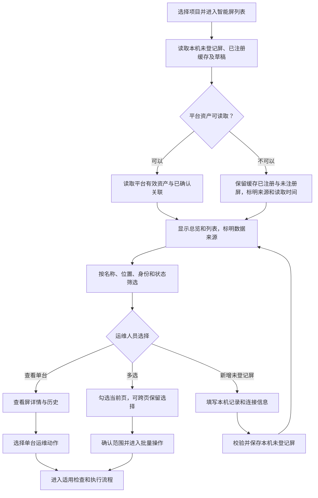
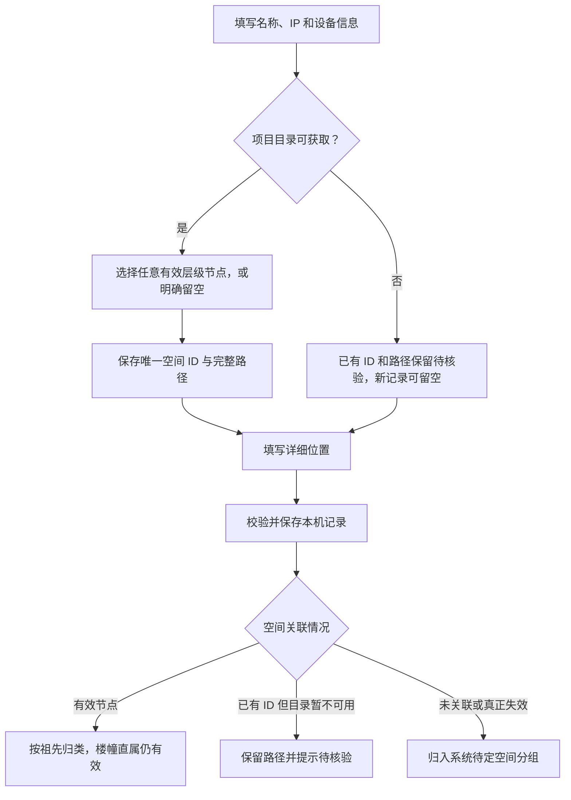
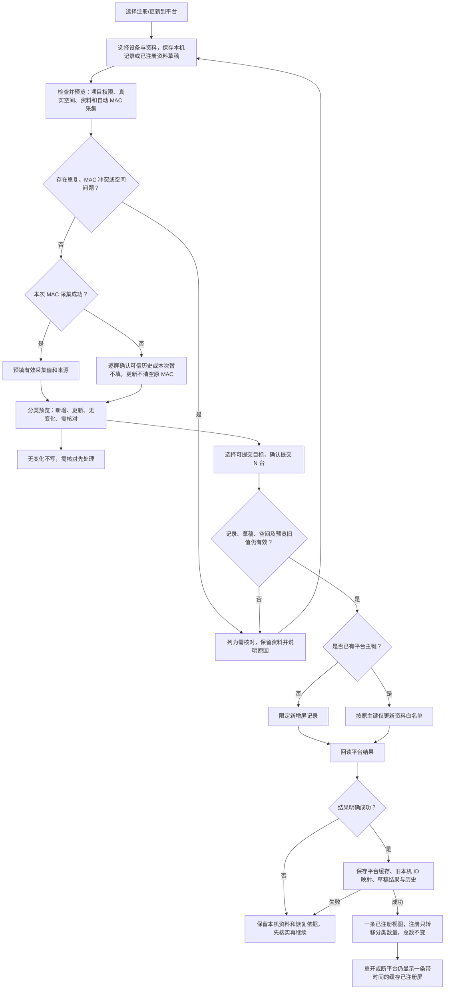
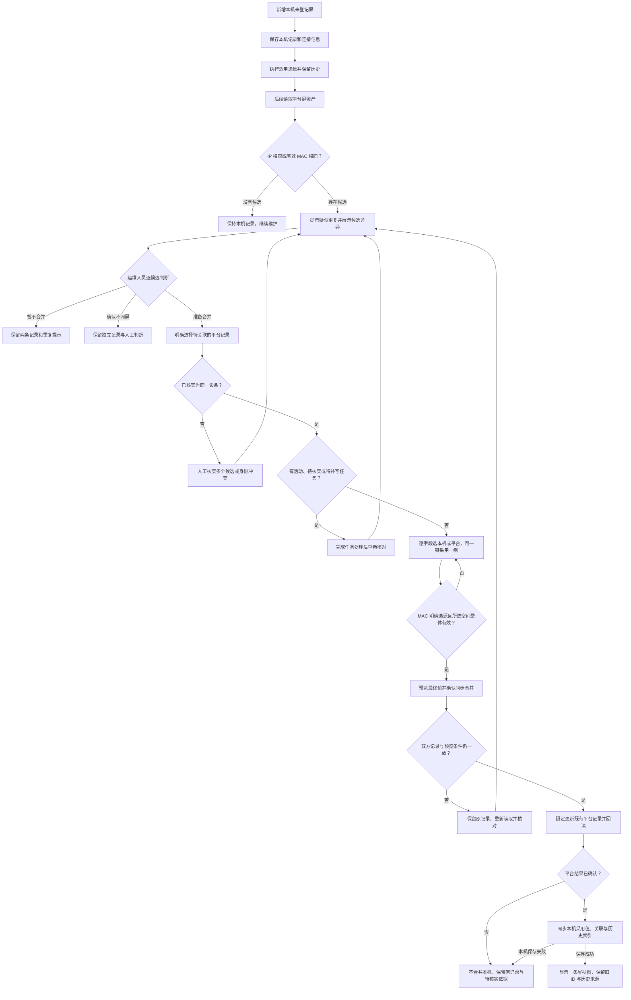
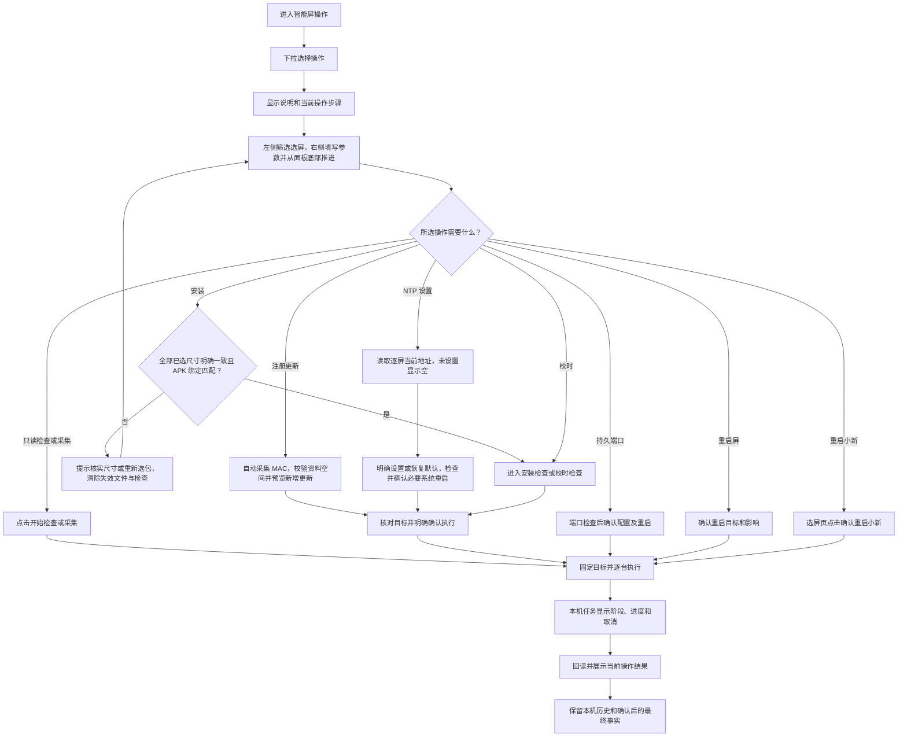
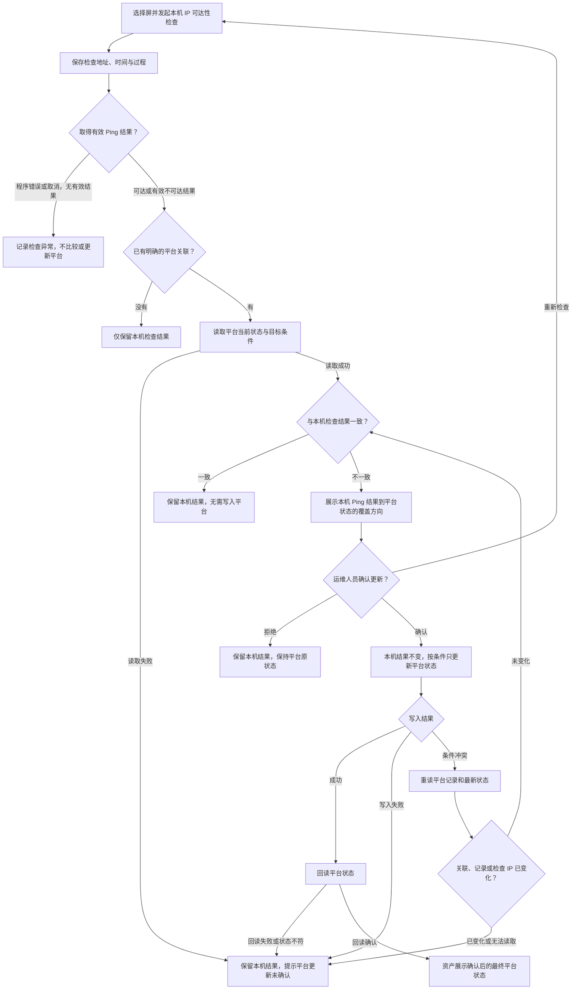
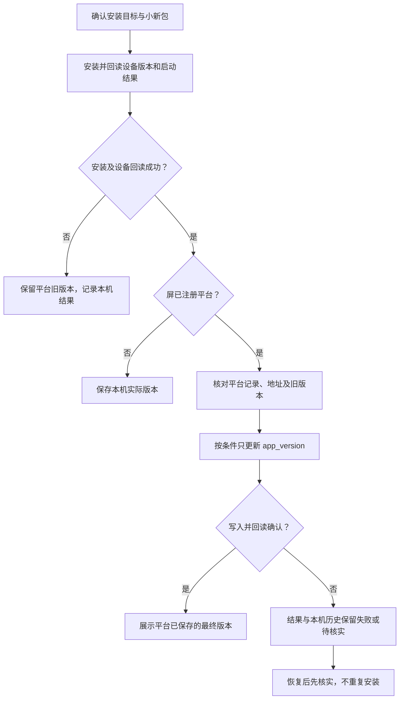
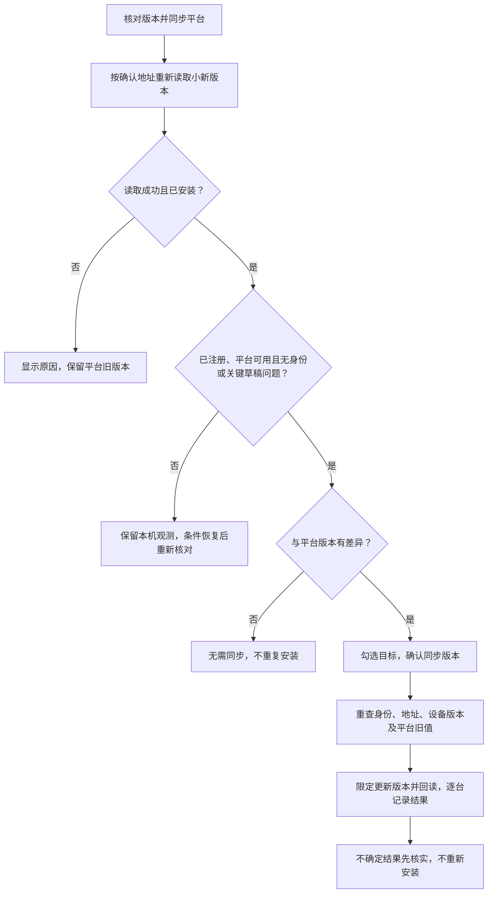

# 屏管理界面逻辑流程图

> 状态：当前正式工作台的业务流程；真实数据库和设备能力已接入。具体已验证范围及限制见[开发计划](06-智能屏开发与验收计划.md)，图表本身不作为验收证据。
>
> 更新日期：2026-10-10。适用对象：在项目现场使用工作台的实施与维护人员。
>
> 关联文档：[智能屏运维管理需求设计](01-智能屏运维管理需求设计.md)、[跨业务扩展技术债与实施顺序](../20-跨业务扩展技术债与实施顺序.md)。

运维人员在当前电脑选择项目，管理平台已有屏和本机先行登记的屏，资料齐备后注册新屏或更新原平台记录。平台暂时不可用时，保留带读取时间的缓存已注册屏和资料草稿，并可对具备连接信息和所需设备能力的本机未登记屏执行适用运维；缓存不表示实时平台状态或完整平台清单。

安装升级仅针对小新屏端应用。小新配置管理已作为独立操作接入，不是其他基础运维操作的前置条件。以下使用 Mermaid（图表描述语言）说明列表、位置选择、注册更新、关联合并、操作步骤及最终状态和版本更新。

正式界面不设正常项目、平台不可用、执行失败等场景选择器。资产呈现注册属性和最终业务状态；执行阶段与失败原因放在本机任务、日志和结果中，不保存为平台资产或项目中间状态。独立演示原型仍使用模拟数据，其边界见[原型说明](04-交互原型使用与验证.md)。

## 1. 进入项目屏列表并选择操作

列表在一个界面呈现两类来源，运维人员通过总览和筛选找到目标，再进入详情、批量操作或新增本机未登记屏。已确认关联的同一屏展示为一条视图；尚未确认的疑似重复保留独立记录与提示。

- 总览分别说明平台资产和本机未登记屏数量，不能将本机记录当成平台已经登记的资产。平台读取失败时，平台统计显示不可用或带读取时间的已有数据。
- 筛选支持名称、位置、IP、MAC、楼幢楼层、尺寸和状态。表格的“符合条件数量”与项目总览分别显示。更改筛选条件清空选择；同一筛选条件下翻页可保留选择，执行前固定实际目标。
- 表格底部分页栏左侧依次显示“当前显示 N / M 条”、竖分隔线、“已选 X 台”和“批量操作”，分页控件位于右侧。人员勾选目标后从该处进入批量操作；筛选栏只提供筛选与重置。
- 新增本机记录不立即创建平台行；资料和真实空间齐备后可进入“注册/更新到平台”。后续读到已存在的候选平台记录时，另行疑似重复核对。
- 已注册屏的资料编辑形成绑定原平台主键的本机草稿，平台确认值不变；不新增未注册行，也不进入疑似重复合并。
- 平台不可用时，可查看缓存已注册屏及编辑草稿；平台注册更新、关联确认或状态写入暂不可用。本机未注册屏的设备操作仍按连接、权限及适用性决定。
- 两类屏的只读设备检查均可独立执行并保留本机结果，本机任务互斥仍生效。已注册屏的设备写操作以及平台注册、资料更新、状态覆盖和版本同步，仍要求平台连接、登录及对应共享保护。
- 平台完整刷新后确认记录已删除时，清理对应本机资料、关联、草稿及检查缓存，保留操作历史和未确认写入的核实依据；不转为未注册屏、不自动重新注册。网络错误或记录移到其他项目不视为删除。
- 同一项目登录完成后自动重新读取平台，更新提示、列表和统计，保留原筛选、选中项及页面位置；切换项目后的旧请求不能覆盖新项目。

### 本机新增时选择目录

新建/编辑使用一个“空间选择”完整树，可选择楼幢、楼层、区域或更深的任意有效节点，保存唯一实际空间 ID，详细位置另填。列表筛选只展示楼幢/楼层，但包含自身及全部后代；直接挂楼幢是有效关联，不归待定。未关联或真正失效归入“待定空间”，目录暂不可用时保留已有 ID/路径并提示待核验。

导入使用当前项目的完整“空间路径”，以 `/` 连接且分隔符两侧不添加空格，如 `A座/2F/东区/会议室`；兼容旧输入的分隔符两侧空白，保留名称内部空格，任意深度都须唯一匹配。空路径明确表示待定空间。可先复制/导出项目路径清单，预览中通过空间树修正单行或为选中行批量分配。默认全选含错误行，任何选中行无匹配、存在歧义或有其他错误时都不能提交；人员须修正或主动取消，不自动创建节点或静默降级。提交前重校验目录与项目，变化后重新预览确认，迟到异步结果不应用到新项目。

## 2. 注册或更新到平台，保留同一屏的历史

实施人员在操作页选择“注册/更新到平台”，按三步完成资料、检查预览和结果。新屏登记及已绑定屏资料更新使用同一操作，系统逐屏区分新增、更新、无变化和需核对；已绑定平台主键的屏始终更新原行。设备真实操作、状态覆盖及应用版本写入不附带执行。

- 本机记录可以暂不选空间，注册更新必须选中当前项目真实有效的节点；待定分组、目录待核验或失效节点均不能提交。
- MAC 采集是预检的一部分，失败不强迫来回切换操作。逐屏确认历史或留空只解决缺失情况，不能绕过真实冲突或重复；本次暂不填不清空已注册屏现有 MAC。
- 新注册或地址、MAC 变化时自动尝试采集；已绑定且地址、MAC 未变的纯资料更新可沿用已确认身份，不强制连接设备，也不将沿用值显示为新采集。
- 4 寸按已验证固件固定读取有线接口 `eth0`；10 寸接受唯一有效有线网卡，多候选时提示核实，不按 ADB 连接所走网卡推断。
- 资料更新仅包含名称、IP、经核实的 MAC、尺寸、所在空间、详细位置，不附带修改平台在线状态、小新版本或空间配置。空间可独立修改；校验有效性、项目归属和资料是否变化，布点坐标和空间配置保持原值，由用户在平台另行调整。
- 新增回读成功后，未注册数减一、已注册数加一，总数不变；旧本机 ID、历史、原观测和缓存保留。已注册资料更新不产生本机新行，不走下一节的疑似重复合并。
- 新增超时或回读失败不等于没有创建；更新超时不等于没有保存。先查询当前事实并确认目标，再补齐关联或结果，禁止直接再次插入。恢复依据只保存在本机结果和历史中，不新增平台中间状态。
- 真实数据库限定新增、条件更新、回读及 ADB 已接通；平台登记成功不表示设备当前已经实测在线。

## 3. 本机先维护，后核对已存在的平台记录并合并

现场尚未完成平台登记时，运维人员先保存本机记录并维护设备。后续读到已存在的平台记录且本机记录尚未绑定平台主键时，由人员逐候选核实是否为同一台屏，再选择每个字段采用本机值或平台值，预览确认后同步两侧采用值并建立关联。本流程不处理已绑定屏的资料草稿差异。

- 相同 IP 或有效 MAC 只用于提示疑似重复，不是自动合并的充分条件。空值、占位值及无法确认有效的 MAC 不用于匹配。
- 多个候选逐个展示，不自动取第一条。MAC 冲突不自动合并，核实为同一设备并明确选择保留哪侧 MAC 后可确认；未核实或确认是不同屏时不强行关联。
- 合并包含名称、IP、MAC、尺寸、所在空间、详细位置和小新版本七项；每项从本机或平台已有值二选一，可整侧选择后调整。所在空间按同一侧的 ID 与完整路径整体采用，验证节点和项目有效性，不拼接楼幢楼层或自由手填；版本选源只同步记录，不代表安装或新观测。
- 确认后先限定更新既有平台记录并回读，再将本机对应字段同步为相同值及保存关联。不新建或删除平台行，平台主键不变；平台失败、回读未确认或预览条件并发变化时不合并本机、不丢原记录。平台可能已更新而本机保存失败时，先核实当前值再恢复，不盲目重放写入。
- 历史操作保留原始来源、执行对象信息、时间和结果。合并不重放操作，不抹掉失败或未完成事实。
- 涉及活动任务、结果待核实或待补写任务时延期合并。任务处理完成后，重新核对并由人员确认，不能自动执行等候中的合并。
- 正式工作台按限定字段写入、回读和本机关联保存执行；失败后先核实，不直接重放平台写入或设备动作。

## 4. 单台与批量运维执行

“智能屏操作”页沿用一体机布局：标题最右是历史按钮，点击打开抽屉；上方为操作下拉框、单行优先且最多两行的说明和随操作变化的步骤。步骤下方左侧用筛选表格选屏，支持树状空间、注册属性、尺寸与关键词；右侧填写操作参数，首步主操作位于右参数面板底部，不设跨栏底部操作条。后续检查和结果页保留必要的返回、确认及后续动作。页面不设新建/历史标签页和左侧操作卡片。界面动作名称及简述见[需求设计第 4.5 节](01-智能屏运维管理需求设计.md)。

运维页筛选只缩小候选，不清空已选设备；分别显示已选和匹配数量，支持选择全部匹配、清空已选。切换操作保留选屏并重置检查及步骤，再按新操作检查适用性。此规则与第 1 节屏列表改筛选时清选择的浏览行为分别适用。

| 操作 | 页面步骤 | 进入执行的按钮 |
| --- | --- | --- |
| 安装/升级小新 | 选屏与安装包 → 安装检查 → 安装结果 | 确认安装 |
| 注册/更新到平台 | 选择设备与资料 → 检查并预览 → 提交结果 | 检查并预览，随后确认提交 N 台 |
| 修改小新配置 | 选择智能屏 → 配置修改 → 修改结果 | 读取配置、检查修改内容，随后确认修改 |
| 校准时间 | 选屏与校时 → 校时检查 → 校时结果 | 确认校准 |
| 设置NTP服务器 | 选择智能屏 → NTP 设置 → 设置结果 | 读取设置、检查目标，确认设置或验证授时及必要重启 |
| IP、设备、MAC、诊断只读检查 | 选屏检查 → 检查结果 | 开始检查或开始采集 |
| 10 寸持久 5555 | 选屏 → 端口检查 → 重启确认 → 恢复验证 | 确认配置并重启 |
| 重启屏 | 选屏 → 重启确认 → 恢复结果 | 确认重启屏 |
| 重启小新 | 选屏 → 启动结果 | 确认重启小新 |

- 必要检查包含连接、权限、身份、适用性及安装包兼容性；无可执行目标时显示原因并允许调整，不为只读动作增加修改确认页。
- 安装首步只填写智能小新应用、本机 APK 文件、同版本覆盖和并发台数；包名、版本、系统及架构由工作台原生解析，签名兼容性由 Android 实际安装结果判定，不手选版本或从文件名猜测。
- 一个 APK 的安装批次只允许全部为明确的 4 寸或 10 寸，校验包含筛选外已选目标；不按处理器架构推断尺寸，也不自动取消目标。混选时在文件标题后显示“一批只能操作同规格尺寸屏”，未知尺寸提示先确认，均禁用选包及安装检查，并清除已选包和旧检查；恢复后重新选包。零目标可先选包，首次明确尺寸时绑定；更换已绑定尺寸同样要求重选。适配器预检和执行须重复校验，其他操作仍按能力支持混尺寸。
- 持久端口先做只读检查，用户确认后才写持久配置并重启；重启小新在选屏页用明确按钮确认，不额外增加无关步骤。
- 确认后固定目标并限制并发，单台设备失败可继续其他独立目标；取消只停止后续派发。含已注册屏的写入批次在平台条件不满足时整批不执行，提示可另选未注册屏单独处理。
- 并发台数是同时处理上限，其余设备排队；选中数量汇总不重复展示并发上限。安装失败重试或从历史再次发起时重新选择本机 APK，任务中的文件名、大小和修改时间不代表文件内容仍可用。
- 成功以回读为准。失败和待核实结果保留在结果界面与本机历史；不把中间阶段保存为资产状态或项目状态。设备已经执行但平台记录失败时先核实，不重复执行设备动作。
- 标题最右侧打开历史抽屉，“本机记录”和“平台结果记录”分别表示本机过程和项目工作台专用库摘要；关闭后保留原步骤与输入。
- 结果采用每屏一行的紧凑表格，概览、按钮、表头和分页固定，仅设备行滚动；日志统一进入“任务与日志面板”。IP、设备及 MAC 检查的结果行提供“查看屏详情”，详情读取本机最新记录，关闭后保留结果页位置。
- “修改小新配置”位于“注册/更新到平台”之后。配置页为双列三行，直接输入，选择环境即纳入切换；未编辑字段保留逐屏原值，差异在紧凑列表查看，保存、重启和回读同表展示。完整规则见需求第 6 章。
- 操作列表及屏详情使用“修改小新配置 → 校准时间 → 设置NTP服务器”的连续顺序。
- 校准时间同时设置系统时间和已验证的启动硬件时钟，两项回读均不超过 15 秒才成功。保留时区及自动校时设置；4 寸完全断电丢时限制明确提示。
- 设置 NTP 先读取每屏当前系统地址，未设置显示空，保存启用自动时间并保留时区。缓存地址按需通过系统重启生效；逐屏分别显示保存、生效和授时，不以地址回读代替实际取时，规则见需求第 5.3.1 节。

打开编辑、读取和检查预览不加共享操作锁。真正提交遇到其他电脑占用时，当前页面显示谁在操作；用户“接手并继续”后解除已确认的锁、重新读取并检查，再继续本次操作。取消不解锁、不执行；原电脑不能继续后续写入，但已经发到设备的命令不承诺撤销。

## 5. 本机检查 IP 与平台状态更新

运维人员通过界面动作“检查屏在离线”主动发起 IP 可达性检查，操作说明为“检查屏IP连通性”，采用主需求约定的 PingIP 检查口径；它与管理端口可连接、取得管理授权以及小新应用健康是不同结果。

当前结果及本机历史按当次有效 Ping 结果显示“在线”“离线”；程序异常、旧任务缺少有效结果或地址不一致时显示“未知”，原因放在实际结果列。不能把任务运行成功直接显示为在线，也不使用当前资产状态替代历史检查结果。

没有平台关联的屏只保存本机结果。有平台关联时，对比平台当前状态；一致则不写入，不一致则按“本机 Ping 结果 → 平台状态”展示差异，由运维人员确认后才直接更新限定的状态字段。本机检查结果保持不变，需要新观测时重新进入 IP 检查，再比较并确认覆盖。

- 检查正常结束后的超时或无响应属于有效的不可达结果，可以进入状态对比。程序错误、检查取消或无法形成有效结果时，只记录本机检查异常，不据此要求覆盖平台状态。
- 平台数据库字段 `status` 表示平台在线状态。写入只针对明确关联的有效屏记录及允许的状态字段，不修改名称、IP、MAC、空间、布局和其他平台业务数据。
- 条件更新使用用户确认时的目标和旧状态等必要条件，防止覆盖同时发生的修改。条件冲突后重新读取：若状态已一致则无需写入；仍有差异则重新展示并再次确认，不能自动重试写入。
- 关联、记录有效性或检查 IP 已变化时停止写入，提示重新选择、检查和确认。不能把旧地址的检查结果写给新地址或另一条平台记录。
- 平台读取、写入或回读失败，与本机检查结果分别显示。用户拒绝更新时平台保持原状；回读未确认时不得显示“平台更新成功”。失败和待核实仅保留结果界面与本机历史，不把拟覆盖值或失败阶段写成平台资产状态。
- 该状态字段更新属于专门设计的受限能力，不代表开放平台业务库的任意写入权限。具体条件、连接权限与验证落实顺序见[跨业务扩展技术债与实施顺序](../20-跨业务扩展技术债与实施顺序.md)。

### 关键资料草稿与实际目标

预检显示本次实际连接 IP。存在 IP、MAC、尺寸待提交修改时，该屏的安装、校时、端口设置及重启暂不可执行，先核对更新平台或放弃修改；名称、空间、安装位置草稿不阻断。只读检查仍使用确认地址，并明确与待提交地址的区别。提交和派发前目标变化则重新检查，不静默改用草稿地址。

## 6. 安装结果与独立核对平台小新版本

正式安装已接通原生 APK 解析、设备安装及平台限定写入。安装过程与平台最终版本分开处理：仅已注册屏在安装升级成功、设备版本及启动检查通过后，进入平台版本字段更新；没有平台记录的屏只保存本机版本。

无论设备安装失败还是平台记录失败，都不能提前将目标包版本当作平台成功结果。`app_version`（平台已具备的小新应用版本数据库字段）与 `status`（已有在线状态字段）由不同用例更新，权限与条件明确限定；不随任务阶段改动其他资产字段。已有数据库字段 `version` 保留为 H5 样式版本，不在此流程中更新或用来补齐应用版本。

独立版本核对用于先安装后注册、同版本跳过和平台版本缺失等情况，从屏详情或安装、注册、检查结果发起。以下流程不重新安装应用；平台不可用时仍保留本机读取结果。

